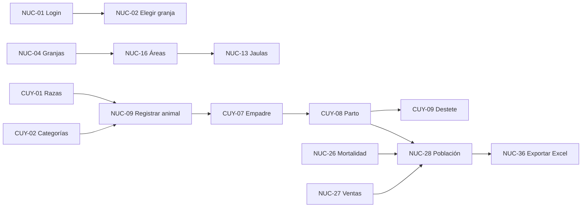

# Azure DevOps - Configuración del Proyecto

**Fecha:** 2026-08-19
**Propósito:** Estructura completa para crear en Azure DevOps basada en las 65 historias de usuario
**Documento de referencia:** [historias-de-usuario.md](historias-de-usuario.md) · [backlog.md](backlog.md)

---

## 1. Estructura Jerárquica

```
📦 Sistema-Control-Animales (Proyecto)
│
├── 🎯 Epic 1: Acceso y Contexto de Trabajo
│   ├── 📋 Feature F-01: Autenticación
│   │   ├── NUC-01: Iniciar sesión
│   │   └── NUC-02: Elegir especie y granja activa
│   └── 📋 Feature F-02: Gestión de Usuarios
│       ├── NUC-06: Superadmin crea cuentas de Admin
│       ├── NUC-07: Admin crea cuentas operativas
│       └── NUC-08: Impedir escalada de permisos
│
├── 🎯 Epic 2: Gestión de Granjas
│   ├── 📋 Feature F-03: Administrar Granjas
│   │   ├── NUC-04: Administrar granjas
│   │   └── NUC-05: Asignar granjas a usuarios
│   └── 📋 Feature F-04: Panel de la Granja
│       └── NUC-03: Dashboard de la granja
│
├── 🎯 Epic 3: Ficha de Animal
│   ├── 📋 Feature F-05: Registro y Búsqueda
│   │   ├── NUC-09: Registrar un animal
│   │   ├── NUC-10: Actualizar estado y particularidades
│   │   ├── NUC-11: Buscar animal por código
│   │   └── NUC-12: Listar y filtrar animales
│   └── 📋 Feature F-06: Confiabilidad de Datos
│       ├── NUC-38: Guardado sin pérdida
│       ├── NUC-39: Validar datos obligatorios
│       ├── NUC-40: Códigos únicos sin variantes
│       └── NUC-41: Trazabilidad de registros
│
├── 🎯 Epic 4: Áreas, Jaulas y Movimientos
│   ├── 📋 Feature F-07: Áreas y Jaulas
│   │   ├── NUC-13: Administrar jaulas
│   │   ├── NUC-16: Definir áreas
│   │   ├── NUC-17: Ver granja por áreas
│   │   ├── NUC-18: Controlar capacidad de jaulas
│   │   └── NUC-19: Avisar animal fuera de área
│   └── 📋 Feature F-08: Traslados y Transferencias
│       ├── NUC-14: Traslado dentro de la granja
│       ├── NUC-15: Historial de movimientos
│       └── NUC-20: Transferir entre granjas
│
├── 🎯 Epic 5: Pesaje
│   ├── 📋 Feature F-09: Registro de Pesos
│   │   ├── NUC-21: Registrar peso individual
│   │   └── NUC-22: Pesaje por lote
│   └── 📋 Feature F-10: Evolución de Peso
│       ├── CUY-16: Rangos y controles de peso del cuy
│       └── NUC-23: Ver evolución del peso
│
├── 🎯 Epic 6: Sanidad
│   ├── 📋 Feature F-11: Tratamientos
│   │   └── NUC-24: Registrar tratamiento
│   └── 📋 Feature F-12: Historial Sanitario
│       └── NUC-25: Consultar historial sanitario
│
├── 🎯 Epic 7: Mortalidad y Ventas
│   ├── 📋 Feature F-13: Registro de Bajas
│   │   ├── NUC-26: Registrar mortalidad
│   │   └── NUC-27: Registrar venta
│   └── 📋 Feature F-14: Inventario y Población
│       ├── NUC-28: Ver población actual
│       ├── NUC-29: Ver resumen mensual
│       ├── NUC-30: Consolidado por especie
│       ├── NUC-31: Población por área/jaula
│       └── NUC-32: Consolidado institucional
│
├── 🎯 Epic 8: Alertas
│   ├── 📋 Feature F-15: Gestión de Alertas
│   │   ├── NUC-33: Ver alertas pendientes
│   │   ├── NUC-34: Atender o descartar alerta
│   │   └── NUC-35: Configurar plazos de alertas
│   └── 📋 Feature F-16: Alertas del Cuy
│       ├── CUY-17: Plazos del ciclo del cuy
│       └── CUY-18: Alertas del ciclo del cuy
│
├── 🎯 Epic 9: Reportes y Exportación
│   ├── 📋 Feature F-17: Exportación Excel
│   │   ├── NUC-36: Exportar a Excel formato facultad
│   │   └── NUC-37: Elegir alcance de exportación
│   └── 📋 Feature F-18: Plantillas Cuyes
│       ├── CUY-22: Exportar Registro Hembras
│       ├── CUY-23: Exportar Registro Machos
│       └── CUY-24: Exportar Inventario mensual
│
├── 🎯 Epic 10: Configuración del Módulo Cuyes
│   ├── 📋 Feature F-19: Catálogos
│   │   ├── CUY-01: Catálogo de razas y líneas
│   │   ├── CUY-02: Categorías del cuy
│   │   └── CUY-03: Jaulas como ubicación
│   └── 📋 Feature F-20: Áreas del Criadero
│       ├── CUY-04: Áreas del criadero de cuyes
│       └── CUY-05: Correspondencia categoría-área
│
├── 🎯 Epic 11: Reproductoras (Hembras)
│   ├── 📋 Feature F-21: Alta y Ciclo
│   │   ├── CUY-06: Registrar hembra reproductora
│   │   ├── CUY-07: Registrar empadre de hembra
│   │   ├── CUY-08: Registrar parto
│   │   ├── CUY-09: Registrar destete
│   │   └── CUY-10: Registrar vacía/aborto/particularidad
│   └── 📋 Feature F-22: Ficha Reproductora
│       └── CUY-11: Ver ficha completa de reproductora
│
├── 🎯 Epic 12: Reproductores (Machos)
│   ├── 📋 Feature F-23: Alta y Empadre
│   │   ├── CUY-12: Registrar macho reproductor
│   │   ├── CUY-13: Registrar empadre de macho
│   │   └── CUY-15: Empadre por jaula
│   └── 📋 Feature F-24: Ficha Macho
│       └── CUY-14: Ver resultados reproductivos del macho
│
└── 🎯 Epic 13: Reproductores Élite
    ├── 📋 Feature F-25: Ranking
    │   ├── CUY-19: Ranking de reproductores
    │   └── CUY-20: Configurar ponderación del ranking
    └── 📋 Feature F-26: Acciones desde Ranking
        └── CUY-21: Marcar descarte/reemplazo desde ranking
```

---

## 2. Resumen por Épica

| # | Epic | Features | PBIs | Entrega |
|---|------|----------|------|---------|
| 1 | Acceso y Contexto | 2 | 5 | Entrega 1 |
| 2 | Gestión de Granjas | 2 | 3 | Entrega 1 |
| 3 | Ficha de Animal | 2 | 8 | Entrega 1 |
| 4 | Áreas, Jaulas y Movimientos | 2 | 8 | Entrega 1-2 |
| 5 | Pesaje | 2 | 4 | Entrega 2 |
| 6 | Sanidad | 2 | 2 | Entrega 2 |
| 7 | Mortalidad y Ventas | 2 | 7 | Entrega 1-2 |
| 8 | Alertas | 2 | 5 | Entrega 3 |
| 9 | Reportes y Exportación | 2 | 5 | Entrega 1-2 |
| 10 | Configuración Módulo Cuyes | 2 | 5 | Entrega 1 |
| 11 | Reproductoras (Hembras) | 2 | 6 | Entrega 1 |
| 12 | Reproductores (Machos) | 2 | 4 | Entrega 1 |
| 13 | Reproductores Élite | 2 | 3 | Entrega 3 |
| **Total** | | **26** | **65** | |

---

## 3. Mapeo por Entrega (Backlog Priorizado)

### Entrega 1 — P1: Reemplazar registro en papel (37 PBIs)

| ID | Historia | Epic |
|----|----------|------|
| NUC-01 | Iniciar sesión | 1 |
| NUC-02 | Elegir especie y granja activa | 1 |
| NUC-06 | Superadmin crea cuentas de Admin | 1 |
| NUC-07 | Admin crea cuentas operativas | 1 |
| NUC-08 | Impedir escalada de permisos | 1 |
| NUC-04 | Administrar granjas | 2 |
| NUC-05 | Asignar granjas a usuarios | 2 |
| NUC-16 | Definir áreas | 4 |
| NUC-17 | Ver granja por áreas | 4 |
| NUC-09 | Registrar un animal | 3 |
| NUC-10 | Actualizar estado y particularidades | 3 |
| NUC-11 | Buscar animal por código | 3 |
| NUC-12 | Listar y filtrar animales | 3 |
| NUC-13 | Administrar jaulas | 4 |
| NUC-26 | Registrar mortalidad | 7 |
| NUC-27 | Registrar venta | 7 |
| NUC-28 | Ver población actual | 7 |
| NUC-29 | Ver resumen mensual | 7 |
| NUC-36 | Exportar a Excel formato facultad | 9 |
| NUC-38 | Guardado sin pérdida | 3 |
| NUC-39 | Validar datos obligatorios | 3 |
| NUC-40 | Códigos únicos sin variantes | 3 |
| CUY-01 | Catálogo de razas y líneas | 10 |
| CUY-02 | Categorías del cuy | 10 |
| CUY-03 | Jaulas como ubicación | 10 |
| CUY-04 | Áreas del criadero de cuyes | 10 |
| CUY-06 | Registrar hembra reproductora | 11 |
| CUY-07 | Registrar empadre de hembra | 11 |
| CUY-08 | Registrar parto | 11 |
| CUY-09 | Registrar destete | 11 |
| CUY-10 | Registrar vacía/aborto/particularidad | 11 |
| CUY-11 | Ver ficha completa de reproductora | 11 |
| CUY-12 | Registrar macho reproductor | 12 |
| CUY-13 | Registrar empadre de macho | 12 |
| CUY-22 | Exportar Registro Hembras | 9 |
| CUY-23 | Exportar Registro Machos | 9 |
| CUY-24 | Exportar Inventario mensual | 9 |

### Entrega 2 — P2: Control diario, áreas y varias granjas (20 PBIs)

| ID | Historia | Epic |
|----|----------|------|
| NUC-03 | Dashboard de la granja | 2 |
| NUC-14 | Traslado dentro de la granja | 4 |
| NUC-15 | Historial de movimientos | 4 |
| NUC-18 | Controlar capacidad de jaulas | 4 |
| NUC-19 | Avisar animal fuera de área | 4 |
| NUC-20 | Transferir entre granjas | 4 |
| NUC-21 | Registrar peso individual | 5 |
| NUC-22 | Pesaje por lote | 5 |
| NUC-23 | Ver evolución del peso | 5 |
| NUC-24 | Registrar tratamiento | 6 |
| NUC-25 | Consultar historial sanitario | 6 |
| NUC-30 | Consolidado por especie | 7 |
| NUC-31 | Población por área/jaula | 7 |
| NUC-32 | Consolidado institucional | 7 |
| NUC-37 | Elegir alcance de exportación | 9 |
| NUC-41 | Trazabilidad de registros | 3 |
| CUY-05 | Correspondencia categoría-área | 10 |
| CUY-14 | Ver resultados reproductivos del macho | 12 |
| CUY-15 | Empadre por jaula | 12 |
| CUY-16 | Rangos y controles de peso del cuy | 5 |

### Entrega 3 — P3: Alertas y decisiones de mejoramiento (8 PBIs)

| ID | Historia | Epic |
|----|----------|------|
| NUC-33 | Ver alertas pendientes | 8 |
| NUC-34 | Atender o descartar alerta | 8 |
| NUC-35 | Configurar plazos de alertas | 8 |
| CUY-17 | Plazos del ciclo del cuy | 8 |
| CUY-18 | Alertas del ciclo del cuy | 8 |
| CUY-19 | Ranking de reproductores | 13 |
| CUY-20 | Configurar ponderación del ranking | 13 |
| CUY-21 | Marcar descarte/reemplazo desde ranking | 13 |

---

## 4. Planificación de Sprints (12 Sprints de 2 semanas)

### Fase 1: Entrega 1 (Sprints 1-6)

| Sprint | Objetivo | PBIs | Entregable |
|--------|----------|------|------------|
| **Sprint 1** | Fundación técnica | NUC-01, NUC-02, NUC-06, NUC-07, NUC-08 | Login + Gestión de usuarios |
| **Sprint 2** | Granjas y estructura | NUC-04, NUC-05, NUC-16, NUC-17, NUC-13 | Granjas, áreas y jaulas |
| **Sprint 3** | Ficha de animal | NUC-09, NUC-10, NUC-11, NUC-12, CUY-01, CUY-02 | CRUD animales + catálogos |
| **Sprint 4** | Configuración cuyes | CUY-03, CUY-04, CUY-06, CUY-12 | Ubicación + registro hembras/machos |
| **Sprint 5** | Ciclo reproductivo | CUY-07, CUY-08, CUY-09, CUY-10, CUY-11 | Empadre → parto → destete |
| **Sprint 6** | Inventario y exportación | NUC-26, NUC-27, NUC-28, NUC-29, CUY-22, CUY-23, CUY-24 | Mortalidad/ventas + Excel |

### Fase 2: Entrega 2 (Sprints 7-9)

| Sprint | Objetivo | PBIs | Entregable |
|--------|----------|------|------------|
| **Sprint 7** | Movimientos y capacidad | NUC-14, NUC-15, NUC-18, NUC-19, NUC-20 | Traslados + control jaulas |
| **Sprint 8** | Pesaje y sanidad | NUC-21, NUC-22, NUC-23, NUC-24, NUC-25, CUY-16 | Pesos + tratamientos |
| **Sprint 9** | Consolidados | NUC-03, NUC-30, NUC-31, NUC-32, NUC-37, NUC-41 | Dashboard + reportes avanzados |

### Fase 3: Entrega 3 (Sprints 10-12)

| Sprint | Objetivo | PBIs | Entregable |
|--------|----------|------|------------|
| **Sprint 10** | Alertas base | NUC-33, NUC-34, NUC-35, CUY-17, CUY-18 | Sistema de alertas |
| **Sprint 11** | Ranking | CUY-19, CUY-20, CUY-21 | Reproductores élite |
| **Sprint 12** | Cierre | CUY-05, CUY-14, CUY-15 | Ajustes finales + QA |

---

## 5. Convenciones de Nomenclatura

| Elemento | Formato | Ejemplo |
|----------|---------|---------|
| Epic | Epic + número + nombre | Epic 1: Acceso y Contexto |
| Feature | F-XX + nombre | F-01: Autenticación |
| PBI | ID del SRS + descripción | NUC-01: Iniciar sesión |
| Task | T-ID.X + descripción | T-NUC-01.1: Crear tabla usuarios |
| Rama | feature/ID-nombre-corto | feature/NUC-01-login |
| PR | ID del PBI | NUC-01 |

---

## 6. Dependencias Principales



---

**Fin del Documento.**
