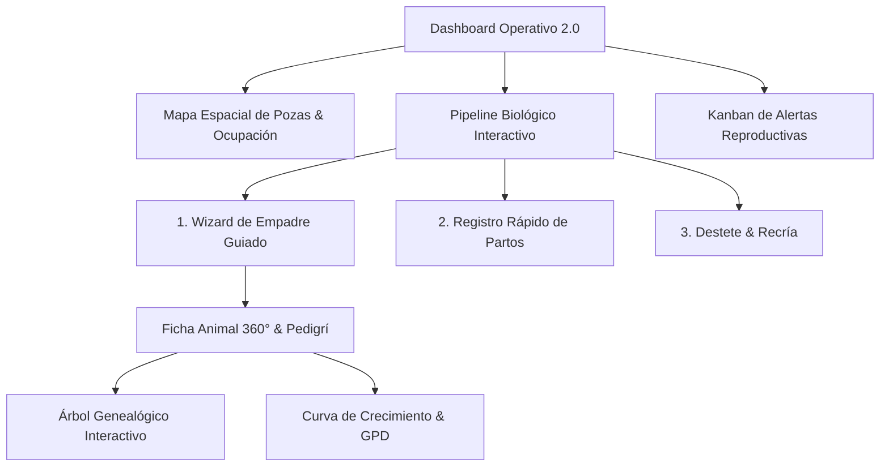

# 📐 Rediseño Integral de UI/UX — Sistema de Control Zootécnico (Cuy-System)

> **Facultad de Zootecnia — Universidad Nacional Agraria de la Selva (UNAS)**  
> **Entregable:** Diagnóstico Heurístico, Arquitectura UX y Prototipo High-Fidelity Navegable e Interactivo.

---

## 1. 🔍 Diagnóstico de la Pantalla Actual y sus Problemas

### 1.1 Identificación de las Pantallas Analizadas
- **Hub de Eventos:** [`EventosHub.js`](file:///c:/UNAS/Cuy-system/frontend/src/pages/EventosHub.js)
- **Formularios de Registro:** [`Empadres.js`](file:///c:/UNAS/Cuy-system/frontend/src/pages/Empadres.js), [`Partos.js`](file:///c:/UNAS/Cuy-system/frontend/src/pages/Partos.js), [`Destetes.js`](file:///c:/UNAS/Cuy-system/frontend/src/pages/Destetes.js)
- **Navegación y Shell:** [`Layout.js`](file:///c:/UNAS/Cuy-system/frontend/src/components/Layout.js)
- **Ficha de Animales:** [`Animales.js`](file:///c:/UNAS/Cuy-system/frontend/src/pages/Animales.js)
- **Dashboard Actual:** [`Dashboard.js`](file:///c:/UNAS/Cuy-system/frontend/src/pages/Dashboard.js)

---

### 1.2 Principales Problemas de Usabilidad y Experiencia (UX Debt)

| # | Problema Detectado | Impacto en el Usuario (Docente / Operario / Alumno) | Severidad |
|---|---|---|:---:|
| **1** | **Ausencia de un Pipeline Biológico Visual** | El criadero funciona mediante un ciclo biológico estricto (*Monta → Gestación 68d → Parto → Lactancia 14-21d → Destete → Recría → Selección*). En la UI actual, los eventos se presentan como una lista plana de tarjetas aisladas sin relación cronológica. | **Alta (Bloqueante)** |
| **2** | **Formularios Rústicos y Poco Ergonómicos** | En pantallas operativas como `Empadres.js`, el operario debe marcar checkboxes de IDs sin ver el peso actual de la hembra, estado reproductivo previo ni compatibilidad genética. El botón de confirmación se bloquea sin explicación contextual. | **Alta** |
| **3** | **Uso Invasivo de Diálogos Nativos (`window.prompt`)** | Para acciones críticas como *“Cerrar empadre y devolver macho (CUY-15)”*, el sistema lanza un `window.prompt()` del navegador que rompe la estética, no tiene validaciones y causa pérdida de foco. | **Media-Alta** |
| **4** | **Carencia de Telemetría Espacial (Mapa de Jaulas / Heatmap)** | En granja real, el operario piensa en términos de *“Galpón A, Poza 3, Poza 4”*. La UI actual no ofrece una vista espacial del galpón, dificultando detectar sobrecupo o pozas vacías. | **Media-Alta** |
| **5** | **Alertas Reproductivas Desconectadas del Flujo de Trabajo** | Las alertas de partos inminentes o destetes atrasados solo se listan en texto, obligando al usuario a salir de la pantalla para realizar el registro en otro formulario. | **Alta** |

---

## 2. 🎨 Propuesta de Solución & Arquitectura Rediseñada (v2.0)

### 2.1 Innovaciones Clave en el Rediseño

1. **Pipeline Biológico Interactivo (Lifecycle Stepper):**  
   Muestra en la parte superior el estado de toda la población según su fase biológica con conteos en tiempo real y acceso directo a cada etapa.
2. **Nursery Heatmap (Mapa Espacial de Galpones y Pozas):**  
   Visualización gráfica del estado de cada poza (Óptimo, Límite de capacidad, Sobrecupo) con código de color accesible (WCAG AA).
3. **Wizard Guiado de 3 Pasos para Empadres:**  
   - **Paso 1:** Selección de Jaula y Macho Reproductor Élite.
   - **Paso 2:** Selección visual de hembras mediante chips con datos de peso, raza y número de partos anteriores.
   - **Paso 3:** Proyección automática de fecha de parto (+68 días) y recordatorio en calendario.
4. **Ficha Técnica 360° con Pedigrí Visual:**  
   Árbol genealógico interactivo (Padres, Abuelos) con métricas de fertilidad, ganancia de peso diaria (GPD) y trazabilidad médica.
5. **Kanban de Alertas con Resolución en 1 Clic:**  
   Permite al operario resolver tareas urgentes (*“Ejecutar Destete”*, *“Confirmar Nacimiento”*) directamente sin cambiar de pantalla.

---

## 3. 🚀 Prototipo High-Fidelity Navegable & Interactivo

Hemos creado una **herramienta y prototipo de diseño interactivo completo** ubicado en:

📂 **Ruta Local:** [`mockup-ux/index.html`](file:///c:/UNAS/Cuy-system/mockup-ux/index.html)  
🌐 **Acceso Web Dev:** Disponible también en [`frontend/public/mockup.html`](file:///c:/UNAS/Cuy-system/frontend/public/mockup.html)

### ¿Cómo puede usarlo un diseñador UX/UI?

1. **Abrir en el Navegador:**  
   Hacer doble clic sobre [`mockup-ux/index.html`](file:///c:/UNAS/Cuy-system/mockup-ux/index.html) o abrirlo en Chrome / Edge / Firefox.
2. **Navegación entre Pantallas:**  
   En la barra superior interactiva, hacer clic en cualquiera de las 5 pantallas rediseñadas (*Dashboard 2.0, Hub de Eventos, Wizard de Empadre, Animal 360°, Alertas & Kanban*).
3. **Simulador de Dispositivos (Responsive Viewports):**  
   Seleccionar entre **Desktop (1440px)**, **Laptop (1180px)**, **Tablet (860px)** o **Móvil Campo (400px)** para validar la ergonomía en tabletas de granja.
4. **Selector de Tema Visual:**  
   Alternar entre **UNAS Institucional (Guindo & Crema)**, **Modo Granja / Esmeralda** o **Dark Studio Pro**.
5. **Modo Diseñador UX & Live Tokens:**  
   Hacer clic en `Modo Diseñador UX` para abrir el panel lateral donde se pueden ajustar variables CSS en tiempo real (colores, bordes) y revisar los comentarios de diseño anclados en los Pines de la pantalla.
6. **Exportación de Feedback:**  
   Pulsar `Exportar Feedback & Tokens JSON` para descargar las notas y especificaciones para el equipo de desarrollo.

---

## 4. 🧭 Rediseño de Navegación & Shell (Segunda Iteración — Aprobado)

### 4.1 Menú Principal Real (7 Apartados)
La navegación global se unificó en un **sidebar réplica fiel** del `Layout.js` del sistema, con 7 apartados (icono + activo por `matchPaths`):

| Apartado | Ruta | Pantalla de referencia |
|---|---|---|
| **Dashboard General** | `/dashboard` | Dashboard Operativo 2.0 (ahora página de inicio por defecto) |
| **Eventos** | `/eventos` | Hub de Eventos & Ciclo |
| **Buscar** | `/buscar` | Overlay de Búsqueda Global |
| **Ventas** | `/ventas` | Ventas y Descartes |
| **Registro** | `/registro` | Ficha Animal 360° & Pedigrí |
| **Granjas** | `/granjas-panel` | Granjas, Áreas, Jaulas, Inventario |
| **Configuración** | `/configuracion` | Catálogos, Usuarios, Auditoría |

Las 4 secciones antiguas (*Gestión Reproductiva / Crecimiento & Control / Inteligencia & Análisis / Administración*) se unificaron en este Menú Principal. Los 22 flujos operativos siguen accesibles desde la toolbar superior del mockup (botones `ux-nav-btn`).

### 4.2 Shell Rediseñado (`Layout.js`)
- **Sidebar colapsable a rail de iconos (76px):** botón toggle circular flotante en el borde, estado persistido en `localStorage`, auto-colapso en ventanas < 960px.
- **Ítem activo como píldora crema** con gradiente, sombra, borde y **barra de acento guindo** a la izquierda; estados hover y foco accesibles (`title`/`aria-label`).
- **Tarjeta de Granja Activa** con efecto vidrio (`backdrop-filter`); en modo rail se reduce a un *badge* con la inicial de la especie.
- **Footer:** versión `Control Animales · v2.0 · FZ UNAS`, avatar con iniciales del usuario y botón de cierre de sesión más prominente.
- **Rutas:** `/` redirige a `/dashboard`; `matchPaths` de Granjas ya no incluye `/dashboard`.

### 4.3 Historial & Botón "Atrás" en el Mockup
Se agregó navegación con historial (`navBackStack`) y un **botón `Atrás`** en el breadcrumb superior del mockup: aparece al navegar entre pantallas desde el menú y vuelve a la pantalla anterior; se oculta cuando no hay historial.

### 4.4 Pins de Feedback (Eliminados)
Los 6 pins numerados flotantes (`ux-comment-pin`) que decoraban cada pantalla fueron **retirados por solicitud** para no interferir con la visualización de los menús. Los comentarios de diseño (comm1–comm6) permanecen consultables en el **Inspector UX** (panel lateral del mockup).
