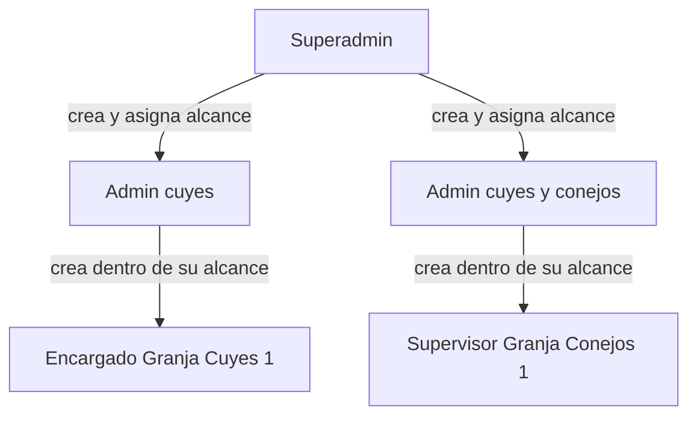

# Actores y permisos

Sistema de Control de Animales — Facultad de Zootecnia, UNAS.

Los permisos se organizan en **tres capas**: un rol base, un **alcance** (granjas y especies) y las **acciones** permitidas. Nadie puede dar a otro usuario más acceso del que tiene.

---

## 1. Modelo de permisos

Cada usuario tiene:

| Capa | Qué define | Ejemplo |
|---|---|---|
| **Rol** | Qué tipo de tareas puede hacer | Superadmin, Admin, Encargado, Supervisor |
| **Alcance** | Qué especies y qué granjas puede ver | Cuyes → Granja Cuyes 1 y 2; Conejos → Granja Conejos 1 |
| **Acciones** | Qué operaciones concretas puede ejecutar | Registrar, consultar, exportar, configurar, crear usuarios |

**Regla de no escalada:** quien crea una cuenta solo puede asignar granjas (y por tanto especies) que **ya tiene**. Un admin de granjas de cuyes no puede crear usuarios para granjas de conejos.

**Regla de granja monoespecie:** cada granja pertenece a **una sola especie**. Al asignar granjas a un usuario, se determina automáticamente a qué especies tiene acceso.

---

## 2. Roles del sistema

### 2.1 Superadmin

Rol único de la institución. Configura el sistema completo.

- Crea cuentas de **Admin** y, si lo necesita, de **Encargado** o **Supervisor** con cualquier alcance.
- Crea granjas indicando **la especie** de cada una (cada granja es de un solo animal).
- Define los roles operativos disponibles (encargado, supervisor, y los que se agreguen).
- Ve y administra todas las granjas, especies y usuarios.
- Puede hacer todo lo que un Admin puede, sin restricción de alcance.

Normalmente lo usa el responsable de informática o el jefe máximo de la facultad.

### 2.2 Admin

Administrador con **alcance limitado** a ciertas granjas. Como cada granja es de una sola especie, el alcance del admin se expresa en granjas y eso implica qué animales maneja.

Ejemplos:
- Admin de **cuyes**: Granja Cuyes 1 y Granja Cuyes 2. Configura y crea usuarios solo para granjas de cuyes.
- Admin de **cuyes y conejos**: Granja Cuyes 1, Granja Cuyes 2 y Granja Conejos 1. Puede crear un encargado solo para granjas de cuyes, solo para conejos, o para ambas.
- Admin de **solo Granja Cuyes 1**: no ve ni administra Granja Cuyes 2 ni ninguna granja de conejos.

Puede:
- Configurar áreas, jaulas y catálogos de las granjas y especies de su alcance.
- Crear cuentas de **Encargado**, **Supervisor** u otros roles operativos, asignándoles granjas de su alcance.
- Al crear un usuario, asignarle **granjas concretas** (cada una ya implica la especie).
- Consultar inventario, reportes y usuarios de su alcance.

No puede:
- Crear otros Superadmin ni otros Admin (solo el Superadmin crea Admins).
- Asignar granjas que no tiene.
- Ver ni modificar datos fuera de su alcance.

### 2.3 Encargado

Rol operativo principal. Registra el día a día del criadero en las granjas y especies asignadas.

- Registra empadre, parto, destete, pesaje, sanidad, mortalidad, venta y traslados.
- Crea y actualiza fichas de animales.
- Consulta inventario y exporta Excel de su granja.
- Atiende alertas del panel.

No crea usuarios ni configura granjas, áreas ni catálogos.

Contexto de uso: entra en **fechas clave**, no todos los días.

### 2.4 Supervisor

Rol de **consulta y supervisión** dentro del alcance asignado. Los nombres finales se confirmarán con la unidad; aquí "Supervisor" es el rol de ejemplo para quien revisa sin registrar todo el ciclo.

- Consulta fichas, inventario, resumen mensual y estadísticas.
- Exporta Excel para reportes.
- Autoriza transferencias de animales entre granjas (si se le asigna esa acción).
- Puede ver alertas pero no necesariamente registrarlas.

No registra eventos del ciclo ni crea usuarios, salvo que se le asignen acciones puntuales.

> Los roles operativos (Encargado, Supervisor, Auxiliar, etc.) son **configurables**: el Superadmin define qué acciones incluye cada uno. Lo importante es que el alcance se asigna como **lista de granjas** (cada granja ya implica la especie).

### 2.5 Auxiliar / practicante (opcional)

Rol operativo restringido, creado por un Admin dentro de su alcance.

- Registra pesajes, tratamientos y traslados.
- No elimina registros, no vende, no configura nada.

> Pendiente de confirmar con la unidad si se implementa desde el inicio.

---

## 3. Alcance: especie → granja

El alcance se asigna como **lista de granjas**. Cada granja tiene **una sola especie**, así que las especies a las que accede un usuario se deducen de sus granjas.

| Usuario | Granjas asignadas | Especies (implícitas) | Puede crear usuarios con |
|---|---|---|---|
| Superadmin | Todas | Todas | Cualquier granja |
| Admin Ana | Granja Cuyes 1, Granja Cuyes 2 | Cuyes | Granjas de cuyes de su lista |
| Admin Luis | Granja Cuyes 2 | Cuyes | Solo Granja Cuyes 2 |
| Admin Pedro | Granja Cuyes 1, Granja Conejos 1 | Cuyes y conejos | Granja Cuyes 1 y/o Granja Conejos 1 |
| Encargado (creado por Ana) | Granja Cuyes 1 | Cuyes | No crea usuarios |

**Flujo al entrar (NUC-02):** primero elijo **especie** (animal), luego **granja** entre las de esa especie que tengo asignadas. Si solo tengo una especie y una granja, el sistema las elige solas.

---

## 4. Matriz de permisos por rol

Leyenda: **C** crear · **L** leer · **E** editar · **X** eliminar/anular · **–** sin acceso · **alc.** solo dentro del alcance asignado

| Funcionalidad | Superadmin | Admin | Encargado | Supervisor | Auxiliar |
|---|---|---|---|---|---|
| Ficha de animal | C L E X | C L E X (alc.) | C L E X (alc.) | L (alc.) | L (alc.) |
| Empadre / parto / destete | C L E X | C L E X (alc.) | C L E X (alc.) | L (alc.) | L (alc.) |
| Pesaje | C L E | C L E (alc.) | C L E (alc.) | L (alc.) | C L (alc.) |
| Sanidad y tratamientos | C L E | C L E (alc.) | C L E (alc.) | L (alc.) | C L (alc.) |
| Traslados entre jaulas | C L E | C L E (alc.) | C L E (alc.) | L (alc.) | C L (alc.) |
| Transferencia entre granjas | C L + autoriza | C L (alc.) | C L (alc.) | L + autoriza (alc.) | – |
| Mortalidad | C L E X | C L E X (alc.) | C L E X (alc.) | L (alc.) | L (alc.) |
| Ventas | C L E X | C L E X (alc.) | C L E X (alc.) | L (alc.) | – |
| Inventario y resumen mensual | L | L (alc.) | L (alc.) | L (alc.) | L (alc.) |
| Consolidado institucional | L | L (alc.) | – | L (alc.) | – |
| Exportación a Excel | L | L (alc.) | L (alc.) | L (alc.) | – |
| Alertas (ver / atender) | L E | L E (alc.) | L E (alc.) | L (alc.) | L (alc.) |
| Catálogos: razas y categorías | C L E X | C L E X (alc.) | L (alc.) | L (alc.) | L (alc.) |
| Áreas y jaulas | C L E X | C L E X (alc.) | L (alc.) | L (alc.) | L (alc.) |
| Granjas | C L E X | L (alc.) | – | – | – |
| Crear cuentas Admin | C L E X | – | – | – | – |
| Crear cuentas operativas | C L E X | C L E X (alc.) | – | – | – |
| Asignar alcance a usuarios | C L E X | C L E (alc., sin escalar) | – | – | – |

---

## 5. Reglas transversales

- **Superadmin crea Admins; Admin crea Encargados y Supervisores.** Nadie más crea cuentas.
- **Al crear un usuario, solo se asignan granjas del alcance del creador** (regla de no escalada; NUC-08).
- **Cada granja es de una sola especie.** No se elige especie y granja por separado al asignar alcance: la especie viene dada por la granja.
- Al entrar, el flujo es **especie → granja** (NUC-02).
- Un usuario con granjas de varias especies **elige primero la especie**, luego la granja.
- Las áreas y jaulas visibles son las de la **granja activa** (que ya implica la especie).
- **Nada se elimina en silencio:** anular un registro deja constancia de quién lo hizo y cuándo (NUC-41).
- Todo registro guarda **autor y fecha**, para trazabilidad.

---

## 6. Ejemplo completo

1. El **Superadmin** crea **Granja Cuyes 1** (especie: cuyes) y **Granja Conejos 1** (especie: conejos).
2. Crea **Granja Cuyes 2** (especie: cuyes).
3. Crea **Admin Ana** con alcance: Granja Cuyes 1 y Granja Cuyes 2.
4. Crea **Admin Pedro** con alcance: Granja Cuyes 1 y Granja Conejos 1.
5. **Admin Ana** crea **Encargado Marco** con alcance: Granja Cuyes 1 → entra eligiendo **Cuyes → Granja Cuyes 1**.
6. **Admin Pedro** crea **Supervisor Rosa** con alcance: Granja Conejos 1 → entra eligiendo **Conejos → Granja Conejos 1**.
7. **Admin Ana** intenta asignar Granja Conejos 1 a Marco → el sistema lo **rechaza** (no tiene granjas de conejos).
8. **Admin Pedro** crea **Encargado Luis** con alcance: Granja Cuyes 1 y Granja Conejos 1 → válido; Luis elige especie al entrar y ve la granja correspondiente.
9. **Admin Ana** intenta ampliarse el alcance a Granja Conejos 1 → el sistema lo **rechaza** (solo el superadmin cambia el alcance de un admin).
