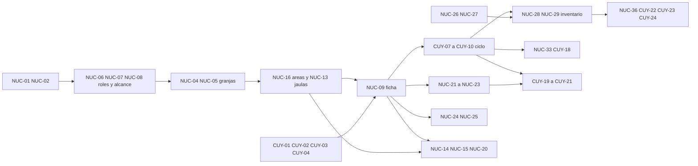

# Backlog priorizado

Índice completo de las historias de la fase de requisitos: **41 del núcleo** (`NUC`) y **24 del módulo cuyes** (`CUY`), 65 en total. Detalle y criterios de aceptación en [historias-de-usuario.md](historias-de-usuario.md).

La prioridad responde a un criterio: **primero lo que elimina el doble registro papel → Excel**, que es el problema que originó el proyecto. Todo lo demás viene después.

- **P1 — Imprescindible:** sin esto el encargado no puede dejar el papel.
- **P2 — Importante:** mejora el control y ya estaba pedido, pero el sistema sirve sin ello un tiempo.
- **P3 — Deseable:** aporta valor de gestión y análisis.

---

## Entrega 1 (P1) — Reemplazar el registro en papel

Objetivo: que el encargado registre el ciclo completo del cuy en el sistema y entregue el Excel oficial sin transcribir nada.

| ID | Historia |
|---|---|
| NUC-01 | Iniciar sesión |
| NUC-02 | Elegir especie y granja activa |
| NUC-06 | Superadmin crea cuentas de Admin |
| NUC-07 | Admin crea cuentas operativas |
| NUC-08 | Impedir que un usuario otorgue más permisos de los suyos |
| NUC-04 | Administrar granjas |
| NUC-05 | Asignar granjas a un usuario |
| NUC-16 | Definir las áreas de una granja |
| NUC-17 | Ver la granja por áreas |
| NUC-09 | Registrar un animal |
| NUC-10 | Actualizar estado y particularidades sin perder historial |
| NUC-11 | Buscar un animal por su código |
| NUC-12 | Listar y filtrar animales |
| NUC-13 | Administrar las jaulas de la granja |
| NUC-26 | Registrar una mortalidad |
| NUC-27 | Registrar una venta |
| NUC-28 | Ver la población actual |
| NUC-29 | Ver el resumen mensual |
| NUC-36 | Exportar a Excel con el formato de la facultad |
| NUC-38 | Guardado sin pérdida de información |
| NUC-39 | Validar los datos obligatorios y sus formatos |
| NUC-40 | Códigos únicos y sin variantes |
| CUY-01 | Catálogo de razas y líneas |
| CUY-02 | Categorías del cuy |
| CUY-03 | Jaulas como ubicación |
| CUY-04 | Áreas del criadero de cuyes |
| CUY-06 | Registrar una hembra reproductora |
| CUY-07 | Registrar el empadre de una hembra |
| CUY-08 | Registrar el parto |
| CUY-09 | Registrar el destete |
| CUY-10 | Registrar hembra vacía, aborto u otra particularidad |
| CUY-11 | Ver la ficha completa de una reproductora |
| CUY-12 | Registrar un macho reproductor |
| CUY-13 | Registrar un evento de empadre de un macho |
| CUY-22 | Exportar el Registro Individual de Hembras |
| CUY-23 | Exportar el Registro Individual de Machos |
| CUY-24 | Exportar el Inventario mensual |

**Criterio de cierre de la entrega 1:** el encargado registra un mes completo de trabajo sin usar papel y el Excel entregado a la facultad sale del sistema. Aunque al inicio exista una sola granja, esta entrega ya la modela como granja con sus áreas, para no rehacer los datos cuando se sume la segunda.

## Entrega 2 (P2) — Control diario, áreas y varias granjas

| ID | Historia |
|---|---|
| NUC-03 | Panel de la granja (dashboard) |
| NUC-14 | Registrar un traslado dentro de la granja |
| NUC-15 | Consultar historial de movimientos y ocupación |
| NUC-18 | Controlar la capacidad de las jaulas |
| NUC-19 | Avisar cuando un animal no corresponde al área |
| NUC-20 | Transferir animales entre granjas |
| NUC-31 | Ver la población por área y por jaula |
| NUC-32 | Comparar granjas y ver el consolidado institucional |
| NUC-21 | Registrar el peso de un animal |
| NUC-22 | Registrar un pesaje por lote |
| NUC-23 | Ver la evolución del peso |
| NUC-24 | Registrar un tratamiento |
| NUC-25 | Consultar el historial sanitario |
| NUC-30 | Ver el consolidado de la granja por especie |
| NUC-37 | Elegir el alcance de la exportación |
| NUC-41 | Trazabilidad de los registros |
| CUY-14 | Ver los resultados reproductivos del macho |
| CUY-16 | Rangos y controles de peso del cuy |
| CUY-05 | Correspondencia entre categoría del cuy y propósito del área |
| CUY-15 | Empadre por jaula |

## Entrega 3 (P3) — Alertas y decisiones de mejoramiento

| ID | Historia |
|---|---|
| NUC-33 | Ver las alertas pendientes |
| NUC-34 | Atender o descartar una alerta |
| NUC-35 | Configurar los plazos de las alertas |
| CUY-17 | Plazos del ciclo del cuy |
| CUY-18 | Alertas del ciclo del cuy |
| CUY-19 | Ranking de reproductores |
| CUY-20 | Configurar la ponderación del ranking |
| CUY-21 | Marcar para descarte o reemplazo desde el ranking |

---

## Dependencias principales

Reglas que se desprenden del diagrama:

- La gestión de usuarios (NUC-06 a NUC-08) va **antes** que cualquier operación: sin alcance definido, nadie debería registrar animales.
- La granja y sus áreas (NUC-04, NUC-16) van **antes** que las jaulas, y las jaulas antes que las fichas.
- Los catálogos del módulo (CUY-01 a CUY-03, CUY-04) van **antes** que cualquier ficha, o se repiten los problemas de texto libre del Excel actual.
- El Excel oficial depende del inventario, y el inventario depende del ciclo y de mortalidad/ventas: no se puede adelantar la exportación.
- El ranking de reproductores necesita ciclo y pesos ya registrados; sin ellos no tiene datos que ordenar.

## Puntos a confirmar con la unidad

Deben resolverse antes de pasar a diseño e implementación:

1. ¿Cuántas granjas hay hoy y cuáles se sumarán? ¿Qué áreas tiene cada una y qué jaulas van en cada área?
2. ¿Cuántos Superadmin habrá y quién crea los primeros Admin?
3. ¿Los nombres finales de los roles operativos serán Encargado y Supervisor, u otros? (ver [02-actores.md](02-actores.md))
4. ¿Un Admin puede tener varias granjas, o uno por granja?
5. ¿Existe el rol de auxiliar/practicante o solo encargado y supervisor?
6. ¿El reporte a la facultad se entrega por granja, consolidado, o ambos?
7. Plazos reales del manejo: gestación, días al destete, edad de empadre, edad de paso a recría (CUY-17).
8. Rangos de peso aceptables por categoría (CUY-16) y capacidad máxima por jaula (NUC-18).
9. ¿Se migra el historial de los Excel actuales y desde qué fecha? (ver [05-modulos-futuros.md](05-modulos-futuros.md))
10. ¿Los conejos se registran individualmente o solo en el conteo mensual del inventario?
11. Confirmar que las plantillas Excel entregadas son las vigentes para el año en curso.

## Trazabilidad general

| Documento | Contenido |
|---|---|
| [01-vision.md](01-vision.md) | Problema, estructura especie/granja/área/jaula, alcance, comparación con Quwi, restricciones técnicas |
| [02-actores.md](02-actores.md) | Actores y matriz de permisos |
| [historias-de-usuario.md](historias-de-usuario.md) | NUC-01 a NUC-41 y CUY-01 a CUY-24 |
| [05-modulos-futuros.md](05-modulos-futuros.md) | Cómo agregar conejos, chanchos u otra especie |
| [06-backlog.md](06-backlog.md) | Este documento |
