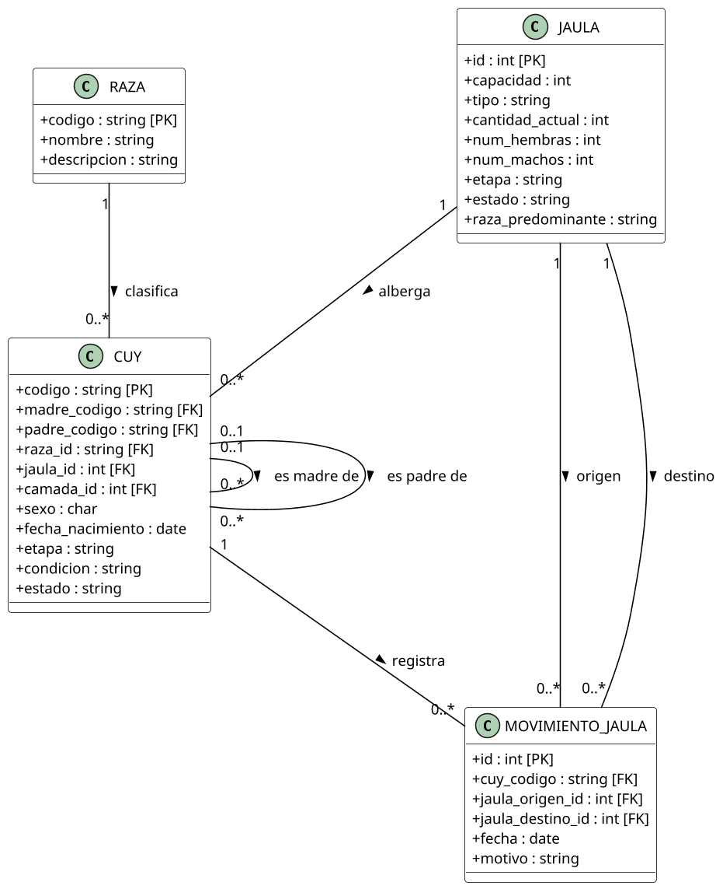
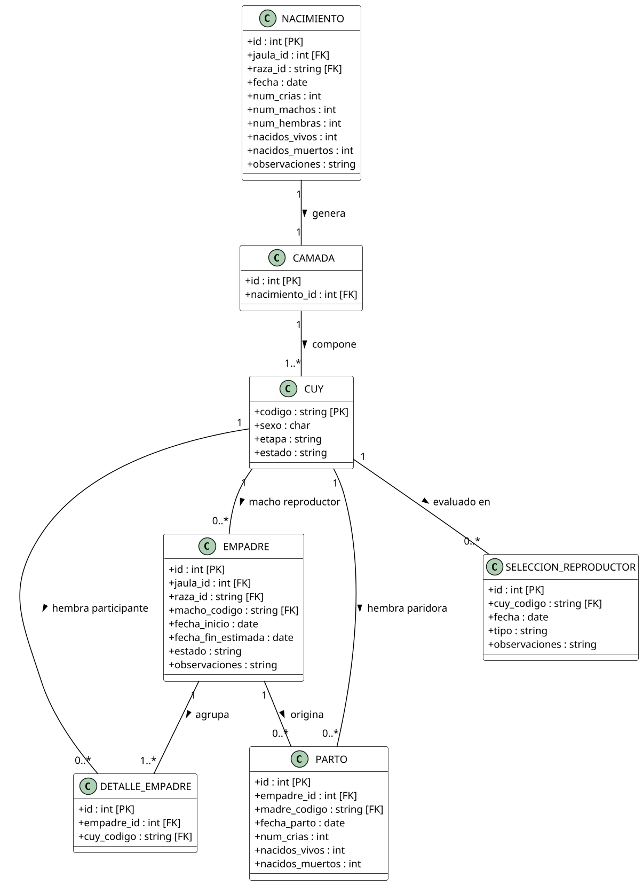
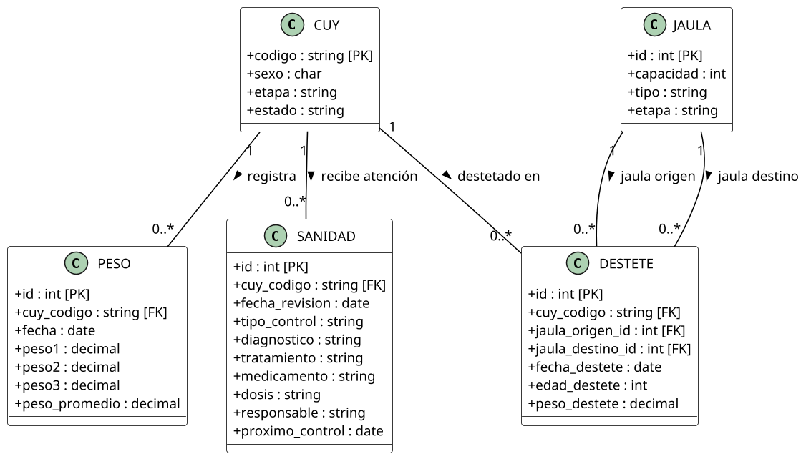
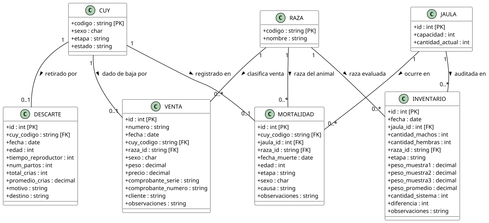

# 4. Modelo conceptual del dominio

El modelo conceptual representa **qué entidades existen en el dominio de crianza y producción de cuyes del criadero de la UNAS, cuáles son sus atributos y cómo se relacionan entre sí**, prescindiendo de operaciones o métodos de implementación, los cuales se describen en los casos de uso (capítulo 6) y en la especificación de interfaces (capítulo 11).

Este modelo ha sido estructurado a partir del levantamiento de información y modelado formal del dominio plasmado en el diseño conceptual del criadero (`Cuysitos.drawio.pdf`), aplicando estrategias de **abstracción**, **modularidad** y **cohesión conceptual**. Para facilitar su análisis y lectura técnica, el modelo se presenta organizado en cuatro vistas temáticas complementarias, seguidas de su diccionario formal de datos.

## 4.1. Diagramas del modelo conceptual

### 4.1.1. Estructura de alojamiento, razas e identificación

Representa la clasificación zootécnica de los cuyes, las jaulas donde se albergan y la trazabilidad de los movimientos de jaula dentro del criadero.

### 4.1.2. Reproducción, camadas y genealogía

Modela la gestión reproductiva integral: la conformación de lotes de empadre (un macho reproductor con múltiples hembras), los partos registrados, los nacimientos de camadas y la selección de reproductores de reemplazo.

### 4.1.3. Crecimiento biométrico, destete y sanidad

Registra el control del destete de los gazapos hacia jaulas de recría, los pesajes muestrales e individuales para evaluar la ganancia de peso y el historial sanitario (tratamientos, diagnósticos y dosis).

### 4.1.4. Salidas del criadero y control de inventario

Modela la desincorporación formal de cuyes por venta (asociando serie y número de comprobante de pago externo), descarte zootécnico y mortalidad, así como las conciliaciones periódicas de inventario físico.

## 4.2. Diccionario de conceptos y atributos del dominio

A continuación se detalla la definición formal y el propósito de cada una de las 17 entidades identificadas en el modelo conceptual (`Cuysitos.drawio.pdf`):

| Entidad | Clave Primaria | Claves Foráneas | Atributos Propios | Descripción en el Negocio |
|---|---|---|---|---|
| **CUY** | `codigo` | `madre_codigo`, `padre_codigo`, `raza_id`, `jaula_id`, `camada_id` | `sexo`, `fecha_nacimiento`, `etapa`, `condicion`, `estado` | Unidad fundamental del sistema. Registra la identidad, filiación genealógica, ubicación y estado zootécnico del animal. |
| **RAZA** | `codigo` | — | `nombre`, `descripcion` | Catálogo zootécnico de razas puras o líneas mejoradas (Perú, Andina, Inti, Criollo). |
| **JAULA** | `id` | — | `capacidad`, `tipo`, `cantidad_actual`, `num_hembras`, `num_machos`, `etapa`, `estado`, `raza_predominante` | Recinto físico o poza de alojamiento. Controla la densidad poblacional y restringe el sobrecupo. |
| **NACIMIENTO** | `id` | `jaula_id`, `raza_id` | `fecha`, `num_crias`, `num_machos`, `num_hembras`, `nacidos_vivos`, `nacidos_muertos`, `observaciones` | Evento zootécnico de alumbramiento que cuantifica la prolificidad y supervivencia de gazapos. |
| **CAMADA** | `id` | `nacimiento_id` | — | Agrupación biológica de las crías nacidas en un mismo evento de nacimiento de una hembra. |
| **PESO** | `id` | `cuy_codigo` | `fecha`, `peso1`, `peso2`, `peso3`, `peso_promedio` | Registro biométrico individual o muestral repetido para el cálculo de ganancias de peso corporal. |
| **DESTETE** | `id` | `cuy_codigo`, `jaula_origen_id`, `jaula_destino_id` | `fecha_destete`, `edad_destete`, `peso_destete` | Transición del gazapo a la alimentación sólida independiente, implicando cambio de jaula y pesaje. |
| **MOVIMIENTO_JAULA** | `id` | `cuy_codigo`, `jaula_origen_id`, `jaula_destino_id` | `fecha`, `motivo` | Registro de trazabilidad física que documenta traslados entre jaulas por cambio de etapa o manejo. |
| **SANIDAD** | `id` | `cuy_codigo` | `fecha_revision`, `tipo_control`, `diagnostico`, `tratamiento`, `medicamento`, `dosis`, `responsable`, `proximo_control` | Control veterinario preventivo (desparasitación) o curativo (fármacos, posología y diagnóstico). |
| **EMPADRE** | `id` | `jaula_id`, `raza_id`, `macho_codigo` | `fecha_inicio`, `fecha_fin_estimada`, `estado`, `observaciones` | Lote de apareamiento reproductivo compuesto por un reproductor macho y un grupo de reproductoras hembras. |
| **DETALLE_EMPADRE** | `id` | `empadre_id`, `cuy_codigo` | — | Relación que vincula individualmente a cada hembra reproductora dentro del lote de empadre activo. |
| **PARTO** | `id` | `empadre_id`, `madre_codigo` | `fecha_parto`, `num_crias`, `nacidos_vivos`, `nacidos_muertos` | Culminación exitosa del período de gestación de una hembra asociada a un empadre. |
| **MORTALIDAD** | `id` | `cuy_codigo`, `jaula_id`, `raza_id` | `fecha_muerte`, `edad`, `etapa`, `sexo`, `causa`, `observaciones` | Baja zootécnica por deceso natural o patológico del ejemplar, retirándolo del inventario activo. |
| **DESCARTE** | `id` | `cuy_codigo` | `fecha`, `edad`, `tiempo_reproductor`, `num_partos`, `total_crias`, `promedio_crias`, `motivo`, `destino` | Retiro planificado de animales que han culminado su vida reproductiva útil o presentan fallas de fertilidad. |
| **SELECCION_REPRODUCTOR** | `id` | `cuy_codigo` | `fecha`, `tipo`, `observaciones` | Calificación fenotípica y genealógica de gazapos o recrías destacados para incorporarse al plantel de reproductores. |
| **VENTA** | `id` | `cuy_codigo`, `raza_id` | `numero`, `fecha`, `sexo`, `peso`, `precio`, `comprobante_serie`, `comprobante_numero`, `cliente`, `observaciones` | Transacción de comercialización física respaldada mandatoriamente por el comprobante emitido por caja externa. |
| **INVENTARIO** | `id` | `jaula_id`, `raza_id` | `fecha`, `cantidad_machos`, `cantidad_hembras`, `etapa`, `peso_muestra1`, `peso_muestra2`, `peso_muestra3`, `peso_promedio`, `cantidad_sistema`, `diferencia`, `observaciones` | Conteo físico y auditoría muestral en campo contrastada contra los registros lógicos del sistema. |