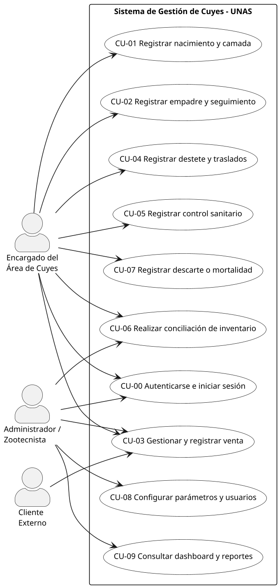
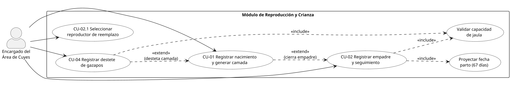
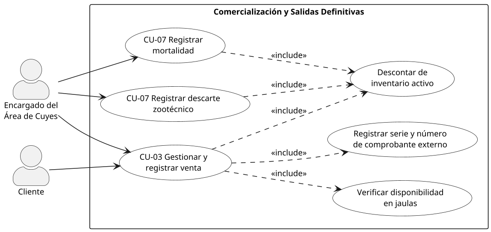
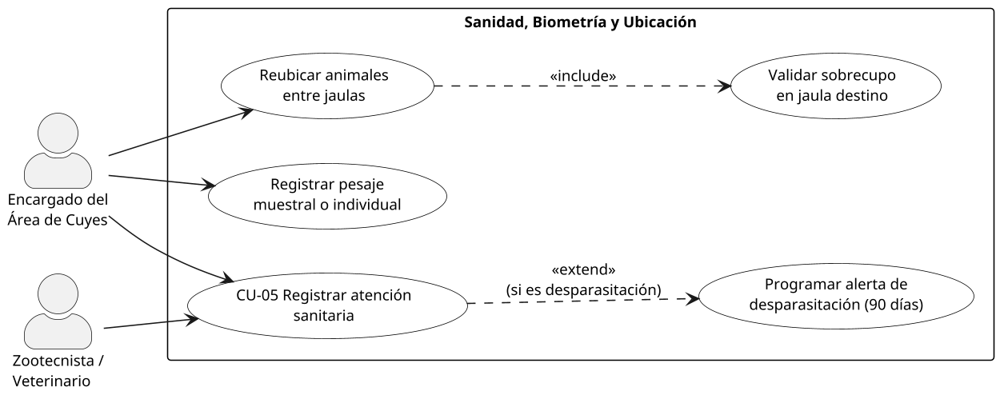
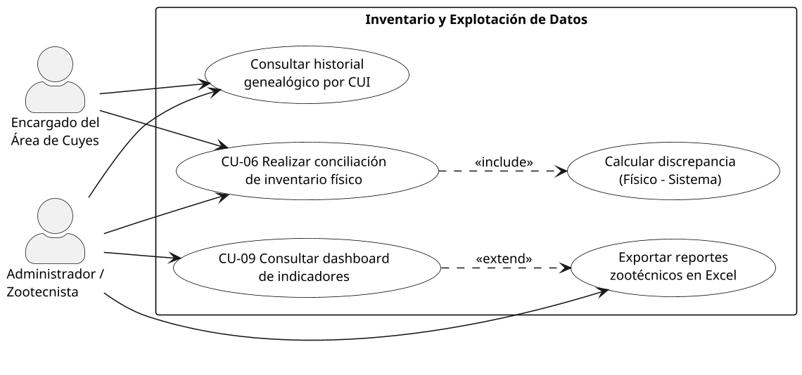
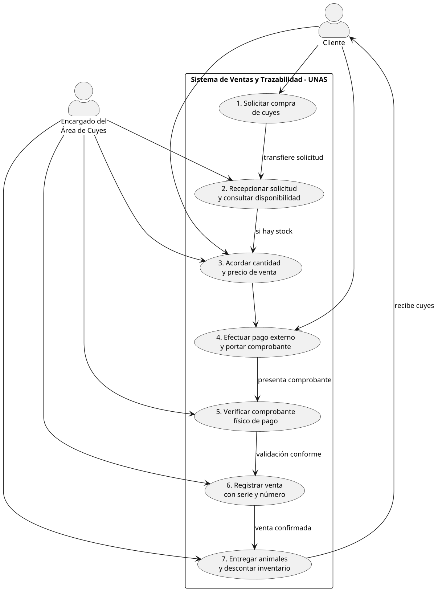

# 7. Diagrama de casos de uso

El modelo de casos de uso ilustra los límites funcionales del sistema, identificando los **actores** humanos y externos que interactúan con la plataforma, los **casos de uso** que satisfacen sus necesidades operativas y las relaciones de dependencia (`<<include>>` y `<<extend>>`) entre ellos.

Para garantizar claridad conceptual y alineación con los procesos de negocio *AS-IS* analizados (proceso general de crianza y flujo específico de ventas), el modelo se organiza en seis diagramas temáticos complementarios.

## 7.1. Diagrama general de casos de uso y actores del sistema

Presenta los tres actores principales del entorno: el **Encargado del área de cuyes** (operador primario del criadero), el **Administrador / Zootecnista** (responsable técnico y de gestión) y el **Cliente externo** (adquirente en el proceso comercial).

## 7.2. Casos de uso del ciclo productivo y reproductivo

Detalla las operaciones de campo vinculadas a la reproducción, gestación, parto y selección zootécnica de reproductores de reemplazo.

## 7.3. Casos de uso del proceso de ventas y salidas definitivas

Modela la interacción comercial formal, la verificación física del animal, la exigencia del comprobante externo de pago y las bajas por mortalidad o descarte.

## 7.4. Casos de uso de biometría, sanidad y manejo de jaulas

Representa el control sanitario periódico, las alertas de desparasitación trimestral, los pesajes muestrales y el traslado de animales entre pozas del laboratorio.

## 7.5. Casos de uso de control de inventario, dashboard y reportes

Engloba las auditorías físicas de piara, la comparación con el stock lógico, la emisión de tableros con indicadores de producción y la exportación de reportes tabulares a Microsoft Excel.

## 7.6. Diagrama de caso de uso detallado para el flujo del proceso de ventas

Detalla los pasos de interacción del caso de uso **CU-03 Gestionar y registrar venta de cuyes**, reflejando con fidelidad la secuencia operativa del diagrama de proceso *AS-IS* provisto por el área de zootecnia:

