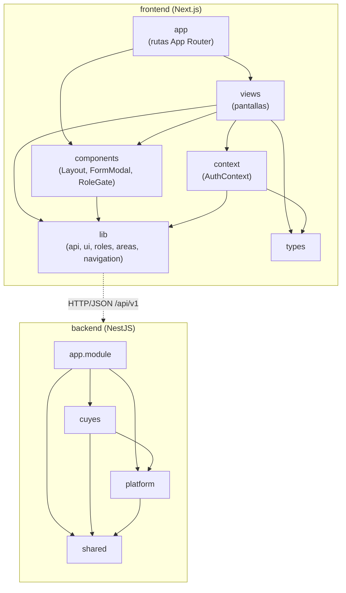
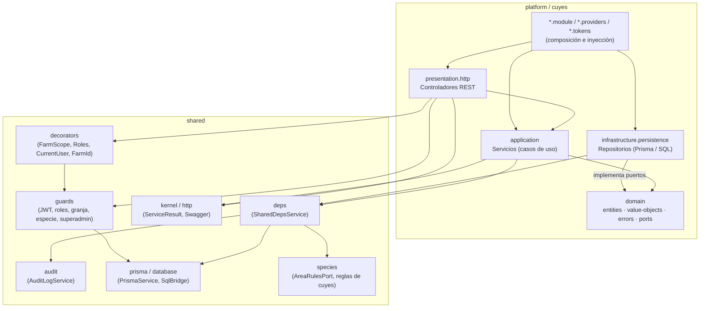

# 9. Diagrama de paquetes

Organización lógica del código y dependencias entre paquetes. Las flechas indican "depende de".

## Vista general del sistema

## Vista interna de un módulo del backend

`platform` y `cuyes` tienen la misma estructura interna.

## Descripción de los paquetes

### Frontend

| Paquete | Contenido | Depende de |
|---|---|---|
| `app` | Rutas de Next.js: `login`, `seleccionar-granja` y el grupo `(app)` con las páginas protegidas. | `views`, `components` |
| `views` | Pantallas del sistema: Animales, Jaulas, Áreas, Empadres, Partos, Destetes, Pesajes, Sanidad, Ventas, Usuarios, Granjas y otras. | `components`, `context`, `lib`, `types` |
| `components` | Componentes reutilizables: `Layout` (sidebar), `FormModal` (modales, `SelectField`, `ChoiceChips`) y `RoleGate`. | `lib` |
| `context` | `AuthContext`: usuario, granjas y granja activa. | `lib`, `types` |
| `lib` | Cliente HTTP (`api`), tema visual (`ui`), roles, utilidades de áreas y navegación. | — |
| `types` | Tipos TypeScript compartidos (usuario, rol). | — |

### Backend

| Paquete | Contenido | Depende de |
|---|---|---|
| `app.module` | Composición raíz: importa los módulos y registra los guards globales (throttler y superadmin). | `platform`, `cuyes`, `shared` |
| `platform` | Auth, usuarios, granjas, especies, áreas, jaulas, animales, pesajes, tratamientos, mortalidad y auditoría. | `shared` |
| `cuyes` | Catálogos, empadres, partos, destetes, movimientos, ventas, inventario, alertas, ranking y reportes. | `platform`, `shared` |
| `shared` | Guards, decoradores, Prisma, puente SQL, auditoría, `ServiceResult`, Swagger y reglas de área por especie. | — |
| `*/presentation/http` | Controladores REST. | `application` (por token), `shared` |
| `*/application` | Servicios con los casos de uso. | `domain`, `shared` |
| `*/domain` | Entidades (`NewAnimal`), value objects (`NormalizedCode`, `PastDate`), errores de dominio y puertos de repositorio. | — |
| `*/infrastructure/persistence` | Repositorios que implementan los puertos. | `domain`, `shared` |

## Reglas de dependencia

1. `domain` no depende de ningún otro paquete: ni NestJS ni Prisma.
2. `application` depende de `domain`, nunca de `infrastructure`.
3. `infrastructure` depende de `domain`, porque implementa sus puertos.
4. `presentation` accede a `application` mediante tokens de inyección.
5. `cuyes` puede depender de `platform`; `platform` nunca depende de `cuyes`.
