# 10. Diagrama de componentes

Descomposición física del sistema: componentes ejecutables, sus interfaces y cómo se conectan.

```mermaid
flowchart LR
  subgraph CLIENTE["Equipo del usuario"]
    browser["Navegador web<br/>(Chrome, Edge, Firefox)"]
  end

  subgraph SFE["Servidor Frontend · Node.js · puerto 3000"]
    next["Aplicación Next.js 15<br/>(React 18, App Router)"]
    apiClient["Cliente HTTP<br/>(axios + interceptor JWT / x-farm-id / x-species-id)"]
    next --> apiClient
  end

  subgraph SBE["Servidor API · Node.js · puerto 3001"]
    direction TB
    pipeline["Pipeline HTTP<br/>Helmet · CORS · Throttler · ValidationPipe"]
    security["Seguridad<br/>JwtAuthGuard · LoadUserFarmsGuard · FarmAccessGuard<br/>SpeciesGuard · RolesGuard · SuperadminScopeGuard"]
    platformC["Módulo Platform<br/>auth · users · farms · species · areas · recintos<br/>animals · weighings · treatments · mortality · audit"]
    cuyesC["Módulo Cuyes<br/>catalogs · breedings · births · weanings · movements<br/>sales · inventory · alerts · ranking · reports"]
    sharedC["Shared Kernel<br/>PrismaService · SqlBridge · AuditLogService · AreaRules"]
    swagger["Swagger UI<br/>/api-docs (solo desarrollo)"]
    excel["Generador Excel<br/>(exceljs)"]

    pipeline --> security
    security --> platformC
    security --> cuyesC
    cuyesC --> platformC
    platformC --> sharedC
    cuyesC --> sharedC
    cuyesC --> excel
  end

  subgraph SDB["Servidor de Base de Datos · puerto 5432"]
    pg[("PostgreSQL<br/>esquema cuy-system")]
  end

  browser -- "HTTPS (HTML/JS)" --> next
  apiClient -- "REST JSON /api/v1<br/>Bearer JWT" --> pipeline
  browser -. "descarga .xlsx" .-> excel
  sharedC -- "TCP · Prisma Client / pg" --> pg
```

## Componentes

| Componente | Tipo | Responsabilidad | Interfaces que ofrece | Interfaces que usa |
|---|---|---|---|---|
| Navegador web | Cliente | Ejecuta la interfaz de usuario. | — | HTTP hacia el frontend |
| Aplicación Next.js | Servidor web | Renderiza las pantallas, controla rutas y roles en el cliente, mantiene la sesión (`AuthContext`). | Páginas web en el puerto 3000 | API REST del backend |
| Cliente HTTP (axios) | Librería del frontend | Centraliza las llamadas a la API y agrega el token JWT, la granja activa y la especie. | `api.get/post/patch/put` | REST `/api/v1` |
| Pipeline HTTP | Middleware NestJS | Cabeceras de seguridad (Helmet), CORS, límite de peticiones (100 cada 15 min) y validación. | — | — |
| Seguridad (guards) | Componente NestJS | Autenticación JWT, carga de granjas del usuario, acceso a la granja, especie y roles. | Decoradores `@FarmScope()`, `@Roles()` | PrismaService |
| Módulo Platform | Módulo de negocio | Funciones comunes a todas las especies. | Endpoints `/auth`, `/users`, `/farms`, `/species`, `/areas`, `/recintos`, `/animals`, `/weighings`, `/treatments`, `/mortality`, `/audit`. Exporta `RECINTOS_SERVICE`. | Shared Kernel |
| Módulo Cuyes | Módulo de negocio | Procesos productivos y reproductivos de cuyes. | Endpoints `/cuyes/*` | Módulo Platform, Shared Kernel, exceljs |
| Shared Kernel | Componente transversal | Acceso a datos (Prisma y SQL), auditoría y reglas de área por especie. | `PrismaService`, `SqlBridge`, `AuditLogService.write()`, `AreaRulesPort` | PostgreSQL |
| Generador Excel | Librería | Genera reportes `.xlsx` (hembras, machos, inventario mensual, animales, consolidado). | `GET /cuyes/reports/*` | — |
| Swagger UI | Documentación | Documenta y permite probar la API (solo en desarrollo). | `/api-docs` | — |
| PostgreSQL | Base de datos | Persistencia relacional, transacciones y restricciones de integridad. | Puerto 5432 | — |

## Despliegue

| Nodo | Software | Puerto |
|---|---|---|
| Servidor frontend | Node.js + Next.js (`npm run start`) | 3000 |
| Servidor API | Node.js + NestJS (`npm start`, `NODE_ENV=production`) | 3001 |
| Servidor de base de datos | PostgreSQL | 5432 |

Los tres nodos pueden ejecutarse en una misma máquina o en máquinas separadas. La configuración se hace por variables de entorno:

- **Backend:** `DATABASE_URL`, `JWT_SECRET`, `JWT_EXPIRES_IN`, `PORT` y `CORS_ORIGIN`.
- **Frontend:** `NEXT_PUBLIC_API_URL`.
