# Entregable 1 — Unidad I: Fundamentos y Estrategias de Diseño

**Título:** Modelo del Dominio, Casos de Uso y Diseño de Aplicación Preliminar

**Institución:** UNIVERSIDAD NACIONAL AGRARIA DE LA SELVA — FACULTAD DE INGENIERÍA EN INFORMÁTICA Y SISTEMAS
**Entorno de aplicación:** Laboratorio de crianza de cuyes — Facultad de Zootecnia (UNAS)

**Autores:**
- Dávila Isidro, Cristopher Leandro
- Guevara Cuchilla, Juan Alfredo
- Díaz Guzmán, Nicole Geraldine
- Vasquez Serafin, Nicol Angely
- Lopez Gonzalez, Lourdes Xiomara

**Docente:** Acevedo Aliaga, Alberto Lucio · **Fecha:** Octubre de 2026

---
## 1. Descripción del caso de negocio

El sistema tiene como propósito gestionar y garantizar la trazabilidad integral del ciclo productivo de los cuyes (*Cavia porcellus*) en el Laboratorio de Crianza de la Facultad de Zootecnia de la Universidad Nacional Agraria de la Selva (UNAS), en Tingo María. Actualmente, el control de las actividades operativas (crianza, reproducción, pesajes, sanidad y movimientos) se realiza de forma manual en cuadernos de campo y hojas de cálculo aisladas, lo que ocasiona duplicidad de registros, retrasos en la consolidación de datos, pérdida de trazabilidad genealógica y discrepancias frecuentes entre el inventario físico y las existencias reales.

Para resolver esta problemática, se desarrolla una plataforma web modular que digitaliza y centralice el ciclo productivo completo: desde el nacimiento, destete y recría hasta las salidas definitivas por venta, descarte o mortalidad. En el flujo operativo, el sistema soporta la toma de decisiones sobre el destino del cuy (reproducción con retorno de crías al ciclo de crianza, o pase a venta) y automatiza el proceso de ventas verificando la disponibilidad en jaulas, validando la serie y número del comprobante de pago emitido por caja externa, y descontando de forma inmediata los ejemplares del inventario activo, optimizando la gestión zootécnica y la toma de decisiones.

### 1.1. Estructura de procesos de negocio AS-IS

El funcionamiento actual del criadero se modela a partir de un flujo principal de macroprocesos (Nivel 0) y sus correspondientes subprocesos operativos (Nivel 1):

```text
[Flujo Principal Nivel 0]
Inicio ──► [Crianza y control de cuyes] ──► ¿Destino?
                 ▲                              │
                 │ (Nuevas crías y              ├─► [Reproducción] ──► [Ventas] ──► Fin
                 │  reproductores seguimiento)  │          │
                 └──────────────────────────────┴──────────┴─► [Ventas] ──► Fin
```

#### 1.1.1. Flujo de proceso principal (Nivel 0: AS-IS CUY)
El macroproceso inicia con la **Crianza y control de cuyes**, fase donde se gestiona el desarrollo de los animales y se bifurca según su destino zootécnico:
- **Reproducción:** Los animales aptos pasan a lotes de empadre, gestación y parto. Las nuevas crías y los reproductores en seguimiento se reincorporan a la fase de crianza y control, mientras que los reproductores al finalizar su vida reproductiva útil son derivados a ventas o descarte.
- **Animal destinado a venta:** Los ejemplares de saca, engorde o excedentes productivos se dirigen directamente al macroproceso de **Ventas**, culminando con la salida del animal.

#### 1.1.2. Subproceso de Nivel 1: Crianza y control de cuyes (cuyeyos.bpm)
Modelado formalmente en Bizagi Modeler con dos carriles de responsabilidad funcional:

1. **Carril: Encargada del criadero (Responsable operativa):**
   - **Nacimiento y viabilidad:** Registra el nacimiento del cuy y evalúa su viabilidad (*¿Está vivo?*). Si nace muerto, registra la mortalidad en el cuaderno, actualiza la cantidad en la jaula y transcribe a Excel (finalizando el flujo para esa cría). Si está vivo, registra al animal, lo ubica en la jaula con su madre, realiza la sanidad inicial abriendo su historial clínico, transcribe los datos al cuaderno y lo mantiene en lactancia.
   - **Destete (15 días):** Verifica si el gazapo cumplió los 15 días (*¿Cumplió 15 días?*). Si no los cumplió, continúa su cuidado junto a la madre. Si cumplió el plazo, desteta al gazapo definiendo su jaula de recría, realiza el traslado físico, registra la etapa de destete, actualiza el aforo de las jaulas y transcribe la información a Excel.
   - **Pase a engorde:** Tras culminar la etapa de recría (*¿Terminó la etapa de recría?*), registra el paso a la etapa de engorde. Si requiere cambio de jaula, define la nueva jaula, traslada al cuy, anota el traslado actualizando el aforo y transcribe a Excel; de lo contrario, lo mantiene en su jaula actual.
   - **Selección de reproductores:** Evalúa la salud y antecedentes productivos del cuy (*¿Se selecciona para reproducción?*). Si es seleccionado, registra la etapa de reproductor; si no es seleccionado, registra su permanencia en engorde o su condición de descarte, anotando los cambios en el cuaderno. Si requiere cambio de poza, traslada al animal anotando fecha, origen, destino y motivo, y actualiza la ocupación de ambas jaulas.
   - **Sanidad e inventarios:** Aplica los controles sanitarios preventivos/curativos y anota las atenciones en el historial. Posteriormente, efectúa la revisión física e inventario de jaulas y de cuyes, transcribiendo las cantidades observadas a las hojas de cálculo en Excel.
   - **Cierre mensual:** Elabora el reporte técnico de producción mensual y lo eleva a supervisión.

2. **Carril: Ingeniera (Responsable técnica / Zootecnista):**
   - **Revisión y toma de decisiones:** Recepciona y evalúa el reporte mensual emitido por la encargada, verificando indicadores de población, mortalidad y curvas de crecimiento para planificar empadres y lotes de venta.

#### 1.1.3. Subproceso de Nivel 1: Flujo de ventas
Involucra la interacción entre el **Cliente** y la **Encargada del criadero**:
- El cliente solicita la compra de cuyes.
- La encargada recepciona la solicitud y verifica la disponibilidad de ejemplares en las jaulas e inventario. De no haber disponibilidad, se informa al cliente y finaliza el proceso. De haber stock, se acuerda cantidad, peso y precio.
- El cliente se traslada al sector externo (Caja de recaudación de la UNAS), abona el importe y obtiene su comprobante de pago emitido formalmente.
- La encargada verifica la autenticidad del comprobante físico presentado, registra la venta en el sistema capturando serie y número de dicho documento, realiza la entrega de los animales y actualiza de inmediato el inventario, cerrando el ciclo.

## 2. Objetivos del sistema

### 2.1. Propósito general

Desarrollar e implementar una plataforma web modular para la gestión y trazabilidad integral del ciclo productivo de cuyes en el Laboratorio de Crianza de la Facultad de Zootecnia de la Universidad Nacional Agraria de la Selva (UNAS), controlando de forma digital y centralizada cada etapa del desarrollo biológico y zootécnico:

$$\text{Nacimiento / Gazapo} \longrightarrow \text{Destete / Recría} \longrightarrow \text{Engorde} \longrightarrow \text{Selección de Reproductor} \longrightarrow \text{Empadre / Gestación / Parto} \longrightarrow \text{Salida (Venta / Descarte / Mortalidad)}$$

El sistema busca optimizar el uso de los recursos del criadero, reducir los tiempos administrativos, asegurar la trazabilidad genealógica y biométrica, y proveer información oportuna para la toma de decisiones técnicas y productivas.

### 2.2. Objetivos específicos

1. **Garantizar la identificación y trazabilidad individual y de camada:** Asignar un código único por cuy y registrar su árbol genealógico (padre, madre, raza, camada de procedencia, fecha de nacimiento y características biométricas iniciales).
2. **Controlar el ciclo reproductivo y de empadre:** Registrar la apertura de empadres en jaulas colectivas o individuales, calcular automáticamente las fechas probables de parto (período de gestación de 67 días), monitorizar camadas y registrar nacimientos (crías vivas, muertas y pesos al nacer).
3. **Monitorear el destete, desarrollo y pesaje:** Registrar oportunamente la fecha de destete, la edad en días y el peso alcanzado, así como los pesajes periódicos muestrales o individuales, calculando promedios y curvas de crecimiento por raza y etapa.
4. **Administrar la distribución física y capacidad de jaulas:** Controlar el inventario de jaulas según su tipo, etapa y capacidad máxima, registrando el historial de movimientos de animales y alertando sobre condiciones de sobrecupo.
5. **Gestionar el registro y seguimiento sanitario:** Documentar revisiones sanitarias, diagnósticos, aplicaciones preventivas (vacunas, vitaminas) y tratamientos terapéuticos (medicamentos, dosis y responsables), programando recordatorios trimestrales para desparasitaciones.
6. **Optimizar el proceso de comercialización y salida de animales:** Registrar las ventas de ejemplares verificando la disponibilidad física previa y vinculando la transacción a la serie y número del comprobante de pago emitido externamente, así como gestionar formalmente las causas de descarte y mortalidad.
7. **Conciliar el inventario físico con el sistema:** Proveer herramientas de toma de inventario físico por jaula y etapa, calculando automáticamente las diferencias con el inventario lógico para identificar de forma oportuna pérdidas o anomalías.
8. **Generar paneles de control e indicadores técnicos:** Ofrecer un cuadro de mando con métricas de productividad (tamaño de camada promedio, tasa de mortalidad, fertilidad de reproductores, distribución de población por etapa) y permitir la exportación de reportes tabulares en formato Microsoft Excel para análisis académico y técnico.

## 3. Alcance y limitaciones del sistema

### 3.1. Alcance del sistema (Lo que incluye)

El sistema comprende la gestión operativa, productiva, reproductiva, sanitaria y comercial del criadero de la Facultad de Zootecnia de la UNAS:

- **Identificación y genealogía:** Registro por código único normalizado, sexo, raza, fecha de nacimiento, etapa biológica, condición y filiación de progenitores y camada.
- **Gestión de jaulas y recintos:** Control de capacidad nominal, ocupación por sexo, etapa permitida y registro de movimientos de jaula con prevención de sobrecupo.
- **Ciclo reproductivo:** Lotes de empadre, cálculo automático de fecha probable de parto (67 días), registro de partos, camadas (crías vivas y muertas) y selección de reproductores.
- **Destete y biometría:** Registro formal del destete (edad, peso y jaula destino de recría) y pesajes periódicos muestrales o individuales.
- **Control sanitario:** Historial clínico de atenciones preventivas y curativas (diagnóstico, medicamento, dosis y responsable) con alertas trimestrales de desparasitación.
- **Ventas y comercialización:** Consulta de disponibilidad física, registro de venta asociando serie y número de comprobante de pago externo, entrega y baja automática de inventario.
- **Bajas y salidas:** Registro formal de mortalidades (causa patológica) y descartes zootécnicos (edad, tiempo reproductor y motivo).
- **Inventario y conciliación:** Conteo físico periódico por jaula con pesos muestrales y cálculo automatizado de discrepancias contra el sistema.
- **Seguridad y auditoría:** Autenticación por tokens JWT, control de acceso por roles (Admin, Encargado, Auxiliar) y bitácora inmutable de eventos.
- **Dashboard y reportes:** Tablero de indicadores zootécnicos y exportación de reportes tabulares a Microsoft Excel (.xlsx).

### 3.2. Limitaciones del sistema (Lo que no incluye)

Para focalizar el desarrollo en las prioridades del criadero, se excluyen de la primera entrega:

- **Sin pasarela de pagos en línea:** El cobro se realiza en la caja central externa de la UNAS; el sistema solo verifica y almacena los datos del comprobante físico presentado.
- **Sin facturación electrónica tributaria (SUNAT):** La emisión de comprobantes fiscales depende de los sistemas administrativos de la universidad.
- **Sin inventario de insumos agrícolas:** No administra compras, almacenamiento ni consumo de forraje, concentrado balanceado ni botiquín veterinario.
- **Sin contabilidad financiera global:** No calcula costos operativos de mano de obra, depreciación de infraestructura ni estados financieros contables.
- **Sin aplicación móvil nativa:** Se accede mediante interfaz web adaptativa (*responsive*) optimizada para móviles, tabletas y computadoras.
- **Especie zootécnica exclusiva:** Diseñado específicamente para cuyes (*Cavia porcellus*), sin soporte para otras especies en la versión preliminar.

## 4. Modelo conceptual del dominio

El modelo conceptual representa **qué entidades existen en el dominio de crianza y producción de cuyes del criadero de la UNAS, cuáles son sus atributos y cómo se relacionan entre sí**, prescindiendo de operaciones o métodos de implementación, los cuales se describen en los casos de uso (capítulo 6) y en la especificación de interfaces (capítulo 11).

Este modelo ha sido estructurado a partir del levantamiento de información y modelado formal del dominio plasmado en el diseño conceptual del criadero (`Cuysitos.drawio.pdf`), aplicando estrategias de **abstracción**, **modularidad** y **cohesión conceptual**. Para facilitar su análisis y lectura técnica, el modelo se presenta organizado en cuatro vistas temáticas complementarias, seguidas de su diccionario formal de datos.

### 4.1. Diagramas del modelo conceptual

#### 4.1.1. Estructura de alojamiento, razas e identificación

Representa la clasificación zootécnica de los cuyes, las jaulas donde se albergan y la trazabilidad de los movimientos de jaula dentro del criadero.

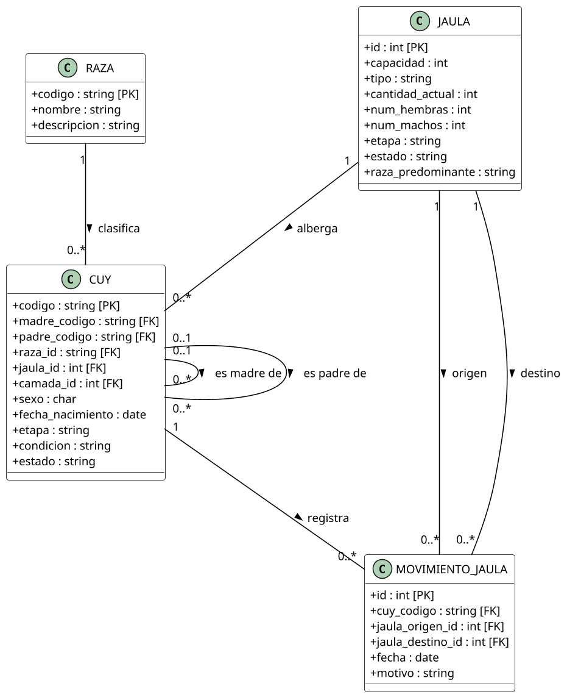

#### 4.1.2. Reproducción, camadas y genealogía

Modela la gestión reproductiva integral: la conformación de lotes de empadre (un macho reproductor con múltiples hembras), los partos registrados, los nacimientos de camadas y la selección de reproductores de reemplazo.

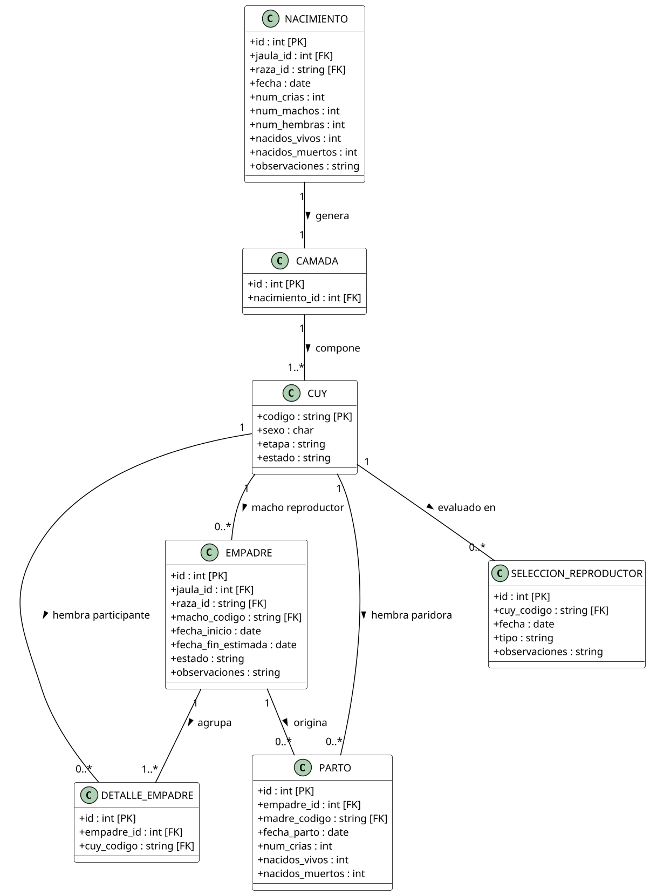

#### 4.1.3. Crecimiento biométrico, destete y sanidad

Registra el control del destete de los gazapos hacia jaulas de recría, los pesajes muestrales e individuales para evaluar la ganancia de peso y el historial sanitario (tratamientos, diagnósticos y dosis).

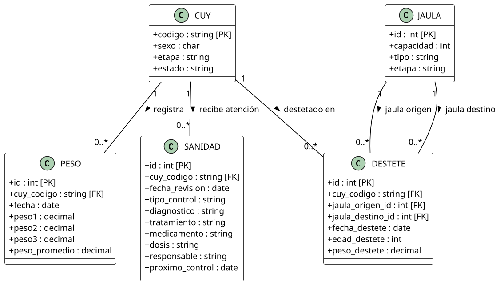

#### 4.1.4. Salidas del criadero y control de inventario

Modela la desincorporación formal de cuyes por venta (asociando serie y número de comprobante de pago externo), descarte zootécnico y mortalidad, así como las conciliaciones periódicas de inventario físico.

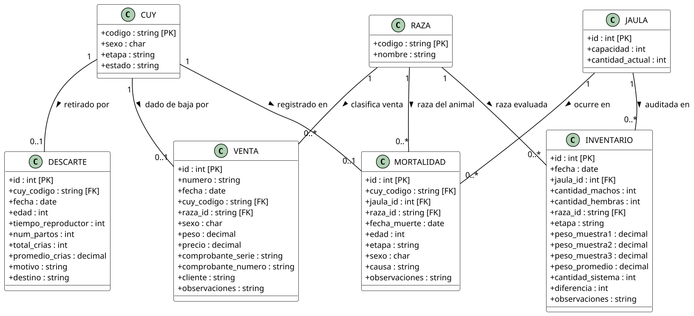

### 4.2. Diccionario de conceptos y atributos del dominio

A continuación se detalla la definición formal y el propósito de cada una de las 17 entidades identificadas en el modelo conceptual (`Cuysitos.drawio.pdf`):

| Entidad | Clave Primaria | Claves Foráneas | Atributos Propios | Descripción en el Negocio |
|---|---|---|---|---|
| **CUY** | `codigo` | `madre_codigo`, `padre_codigo`, `raza_id`, `jaula_id`, `camada_id` | `sexo`, `fecha_nacimiento`, `etapa`, `condicion`, `estado` | Unidad fundamental del sistema. Registra la identidad, filiación genealógica, ubicación y estado zootécnico del animal. |
| **RAZA** | `codigo` | — | `nombre`, `descripcion` | Catálogo zootécnico de razas puras o líneas mejoradas (Perú, Andina, Inti, Criollo). |
| **JAULA** | `id` | — | `capacidad`, `tipo`, `cantidad_actual`, `num_hembras`, `num_machos`, `etapa`, `estado`, `raza_predominante` | Recinto físico o poza de alojamiento. Controla la densidad poblacional y restringe el sobrecupo. |
| **NACIMIENTO** | `id` | `jaula_id`, `raza_id` | `fecha`, `num_crias`, `num_machos`, `num_hembras`, `nacidos_vivos`, `nacidos_muertos`, `observaciones` | Evento zootécnico de alumbramiento que cuantifica la prolificidad y supervivencia de gazapos. |
| **CAMADA** | `id` | `nacimiento_id` | — | Agrupación biológica de las crías nacidas en un mismo evento de nacimiento de una hembra. |
| **PESO** | `id` | `cuy_codigo` | `fecha`, `peso1`, `peso2`, `peso3`, `peso_promedio` | Registro biométrico individual o muestral repetido para el cálculo de ganancias de peso corporal. |
| **DESTETE** | `id` | `cuy_codigo`, `jaula_origen_id`, `jaula_destino_id` | `fecha_destete`, `edad_destete`, `peso_destete` | Transición del gazapo a la alimentación sólida independiente, implicando cambio de jaula y pesaje. |
| **MOVIMIENTO_JAULA** | `id` | `cuy_codigo`, `jaula_origen_id`, `jaula_destino_id` | `fecha`, `motivo` | Registro de trazabilidad física que documenta traslados entre jaulas por cambio de etapa o manejo. |
| **SANIDAD** | `id` | `cuy_codigo` | `fecha_revision`, `tipo_control`, `diagnostico`, `tratamiento`, `medicamento`, `dosis`, `responsable`, `proximo_control` | Control veterinario preventivo (desparasitación) o curativo (fármacos, posología y diagnóstico). |
| **EMPADRE** | `id` | `jaula_id`, `raza_id`, `macho_codigo` | `fecha_inicio`, `fecha_fin_estimada`, `estado`, `observaciones` | Lote de apareamiento reproductivo compuesto por un reproductor macho y un grupo de reproductoras hembras. |
| **DETALLE_EMPADRE** | `id` | `empadre_id`, `cuy_codigo` | — | Relación que vincula individualmente a cada hembra reproductora dentro del lote de empadre activo. |
| **PARTO** | `id` | `empadre_id`, `madre_codigo` | `fecha_parto`, `num_crias`, `nacidos_vivos`, `nacidos_muertos` | Culminación exitosa del período de gestación de una hembra asociada a un empadre. |
| **MORTALIDAD** | `id` | `cuy_codigo`, `jaula_id`, `raza_id` | `fecha_muerte`, `edad`, `etapa`, `sexo`, `causa`, `observaciones` | Baja zootécnica por deceso natural o patológico del ejemplar, retirándolo del inventario activo. |
| **DESCARTE** | `id` | `cuy_codigo` | `fecha`, `edad`, `tiempo_reproductor`, `num_partos`, `total_crias`, `promedio_crias`, `motivo`, `destino` | Retiro planificado de animales que han culminado su vida reproductiva útil o presentan fallas de fertilidad. |
| **SELECCION_REPRODUCTOR** | `id` | `cuy_codigo` | `fecha`, `tipo`, `observaciones` | Calificación fenotípica y genealógica de gazapos o recrías destacados para incorporarse al plantel de reproductores. |
| **VENTA** | `id` | `cuy_codigo`, `raza_id` | `numero`, `fecha`, `sexo`, `peso`, `precio`, `comprobante_serie`, `comprobante_numero`, `cliente`, `observaciones` | Transacción de comercialización física respaldada mandatoriamente por el comprobante emitido por caja externa. |
| **INVENTARIO** | `id` | `jaula_id`, `raza_id` | `fecha`, `cantidad_machos`, `cantidad_hembras`, `etapa`, `peso_muestra1`, `peso_muestra2`, `peso_muestra3`, `peso_promedio`, `cantidad_sistema`, `diferencia`, `observaciones` | Conteo físico y auditoría muestral en campo contrastada contra los registros lógicos del sistema. |

## 5. Glosario de términos

El presente glosario estandariza el vocabulario técnico y conceptual empleado en la documentación del sistema. Se estructura en tres tablas complementarias: los **términos del dominio zootécnico y del negocio** (utilizados en el criadero del laboratorio de la Facultad de Zootecnia de la UNAS) y los **términos técnicos y arquitectónicos del sistema de información**.

### 5.1. Términos del dominio del negocio (Zootecnia)

| Término | Definición formal en el dominio |
|---|---|
| **Cuy (*Cavia porcellus*)** | Mamífero roedor histricomorfo doméstico autóctono de los Andes, criado en el Laboratorio de la UNAS con fines de investigación, mejoramiento genético y producción de carne. Constituye la entidad central de trazabilidad del sistema. |
| **Encargada del criadero** | Rol operativo responsable del manejo directo en pozas: registro de nacimientos, sanidad inicial, control de lactancia, destete a los 15 días, traslados entre jaulas, inventario físico, atención de ventas y elaboración del reporte mensual. |
| **Ingeniera / Zootecnista** | Rol técnico y de supervisión de la Facultad de Zootecnia encargado de la revisión y validación de los reportes mensuales de producción, análisis de indicadores de piara y toma de decisiones reproductivas y comerciales. |
| **Raza** | Grupo homogéneo de cuyes que comparten características morfológicas, zootécnicas y productivas fijadas por selección. En el criadero destacan las razas Perú (alta velocidad de crecimiento y conformación cárnica), Andina (alta prolificidad), Inti (adaptabilidad intermedia) y Criollo. |
| **Jaula / Poza** | Unidad física de alojamiento y confinamiento del criadero. Cuenta con parámetros de capacidad máxima, clasificación por etapa (maternidad, recría, engorde, empadre) y control de población por sexo. |
| **Gazapo / Cría** | Cuy en su primera etapa de desarrollo biológico, desde el nacimiento hasta el momento de su separación de la madre (destete). |
| **Camada** | Conjunto biológico de crías nacidas de una misma hembra reproductora en un único evento de parto o alumbramiento. |
| **Nacimiento** | Evento biológico y zootécnico en el que se registra la llegada de una camada, cuantificando nacidos vivos, nacidos muertos y desglose por sexo. |
| **Destete** | Separación física y nutricional de los gazapos respecto a la madre lactante una vez que adquieren capacidad de consumir forraje y concentrado (típicamente entre los 14 y 21 días de edad). Se registran pesos y edad en días. |
| **Recría** | Etapa de desarrollo zootécnico que abarca desde el destete hasta que los animales alcanzan la madurez para la selección como reproductores o el pase a engorde. |
| **Engorde** | Fase productiva final de alimentación intensiva orientada a que los animales alcancen el peso comercial óptimo para su destino a venta cárnica. |
| **Empadre** | Práctica zootécnica de apareamiento en la que se reúne a un macho reproductor selecto con un lote definido de hembras aptas (generalmente en una relación de 1 macho por 5 a 8 hembras) en una poza asignada. |
| **Detalle de empadre** | Registro individualizado que vincula a cada una de las hembras reproductoras con el lote de empadre activo al que fueron asignadas. |
| **Gestación** | Período de desarrollo embrionario en el vientre materno, cuyo valor promedio estándar configurable en cuyes es de **67 días**. |
| **Parto** | Evento de culminación de la gestación donde la hembra expulsa a las crías viables o no viables. Alimenta el registro genealógico de descendencia. |
| **Selección de reproductor** | Proceso de evaluación técnica fenotípica y genealógica mediante el cual se eligen los mejores ejemplares machos o hembras de recría para reemplazar reproductores de descarte. |
| **Reproductor / Reproductora** | Ejemplar adulto destinado exclusivamente a la multiplicación de la piara y mejoramiento genético en los lotes de empadre. |
| **Movimiento de jaula** | Acción física y registro digital del traslado de uno o varios animales desde una jaula de origen hacia una jaula de destino, motivado por cambio de etapa, empadre, separación o cuarentena. |
| **Pesaje muestral / individual** | Registro biométrico del peso en gramos de un animal o promedio de una muestra de ejemplares de una poza, utilizado para evaluar la ganancia media diaria y la curva de crecimiento. |
| **Sanidad / Control sanitario** | Actividad preventiva o curativa de medicina veterinaria aplicada a los animales (limpieza, desinfección, dosificación de antiparasitarios o administración de antibióticos). |
| **Desparasitación programada** | Manejo profiláctico periódico calendarizado cada 3 meses para el control de ectoparásitos (pulgas, piojos, ácaros) y endoparásitos en el criadero. |
| **Mortalidad** | Registro de baja zootécnica definitiva por muerte del animal, documentando fecha, jaula, edad, etapa, sexo y presunta causa del deceso. |
| **Descarte** | Salida definitiva de animales reproductores que han dejado de ser productivamente viables por edad avanzada, baja fertilidad, bajo tamaño de camada o problemas sanitarios. |
| **Venta** | Operación de comercialización de cuyes (vivos o beneficiados) a clientes externos, respaldada obligatoriamente por el comprobante de pago emitido por el sector administrativo de la universidad. |
| **Comprobante de pago (Serie y Número)** | Documento físico oficial emitido por la caja de recaudación externa de la institución que acredita el pago económico del cliente, cuyos datos se asocian obligatoriamente a la venta para formalizar la salida del inventario. |
| **Inventario físico** | Conteo directo y presencial de los animales albergados en cada una de las jaulas del criadero durante un ciclo de auditoría. |
| **Inventario del sistema** | Balance lógico de animales activos calculado automáticamente por el sistema sumando nacimientos e ingresos, y restando ventas, descartes y muertes. |
| **Diferencia de inventario** | Desviación aritmética entre el conteo físico y el balance lógico del sistema ($Inventario\,F\acute{\imath}sico - Inventario\,Sistema$). |
| **Sobrecupo** | Condición en la cual la cantidad de cuyes en una jaula supera la capacidad máxima zootécnica permitida, requiriendo confirmación o reubicación. |
| **Trazabilidad** | Capacidad técnica de reconstruir todo el historial de vida de un cuy: genealogía paterna/materna, jaulas ocupadas, pesajes, controles sanitarios y evento final de egreso. |

| **Alerta** | Aviso generado por el sistema cuando se acerca una fecha relevante (desparasitación, separación del empadre, parto estimado). |
| **Área** | Nivel de la jerarquía organizativa ubicado entre la granja y la jaula. |
| **Código único** | Identificador exclusivo de cada cuy (ej. `CUY-00157`) que permite rastrear su historial completo. |
| **Condición** | Situación particular de un cuy dentro de su etapa: normal, futura reproductora, reemplazo, empadrado, gestante, en tratamiento, descarte, vendido o muerto. |
| **Cuy** | Animal individual gestionado por el sistema; cuenta con ficha propia, código único e historial de eventos. |
| **Desparasitación** | Control sanitario que se realiza aproximadamente cada 3 meses; el sistema calcula la próxima fecha y alerta. |
| **Especie** | Módulo funcional (cuyes, conejos, etc.) que define catálogos, ciclo reproductivo y reglas propias. |
| **Estado** | Situación general del registro de un cuy (ej. `Activo`, `Descartado`, `Vendido`, `Muerto`). |
| **Etapa** | Fase del ciclo productivo del cuy: Gazapo, Recría, Engorde o Reproductor. |
| **Ficha individual** | Registro único de cada cuy con sus datos generales (sexo, raza, nacimiento, madre, padre, etapa, estado, jaula actual) y su historial de eventos. |
| **Futura reproductora** | Hembra en engorde seleccionada para reproducción, generalmente hija de una madre con buena productividad. |
| **Gazapo** | Cría recién nacida, desde el nacimiento hasta el destete. |
| **Genealogía** | Relación de parentesco del cuy (madre y padre) que permite conocer su origen. |
| **Granja** | Unidad de crianza; pertenece a una sola especie. |
| **Historial individual** | Registro cronológico de todos los eventos de un cuy: nacimiento, vacunas, destete, cambios de etapa y de jaula, selección, empadres y partos. |
| **Inventario** | Cantidad y distribución actual de cuyes, generada a partir de los movimientos registrados. |
| **Jaula** | Espacio de alojamiento con tipo, capacidad, sexo permitido, etapa y cantidad actual de animales. |
| **Jerarquía** | Estructura organizativa del sistema: especie → granja → área → jaula → animal. |
| **Peso promedio** | Promedio de las muestras de peso registradas: `(Peso 1 + Peso 2 + Peso 3) / 3`. |
| **Reemplazo** | Macho o hembra seleccionado para sustituir a reproductores descartados. |
| **Reproductor** | Cuy en etapa reproductiva que participa en empadres. |
| **Sanidad** | Proceso de control de salud: vacunación, desparasitación, tratamientos, enfermedades, lesiones y controles rutinarios. |
| **Selección reproductiva** | Proceso de elegir, según el historial reproductivo de la madre, qué animales serán futuros reproductores o reemplazos. |
| **Tasa de mortalidad** | Indicador: `(Número de cuyes muertos / Población evaluada) × 100`; puede obtenerse por mes, año, raza, jaula, etapa o sexo. |
| **Vacunación inicial** | Tratamientos aplicados al nacimiento: vacuna contra salmonelosis y complejo B; se almacenan en el historial sanitario del animal. |

### 5.2. Términos técnicos y arquitectónicos

| Término | Definición técnica en el sistema |
|---|---|
| **Actor** | Rol o entidad externa que interactúa directamente con los casos de uso del sistema (Encargado del área de cuyes, Administrador/Zootecnista, Cliente externo). |
| **Caso de uso** | Unidad funcional de interacción que describe los pasos e intercambios de mensajes entre un actor y el sistema para lograr un objetivo de negocio. |
| **Monolito modular** | Enfoque de arquitectura donde toda la solución se compila y ejecuta en una única unidad de despliegue, pero sus componentes internos están fuertemente desacoplados en módulos de negocio con límites explícitos. |
| **Arquitectura Limpia / Puertos y Adaptadores (Hexagonal)** | Patrón arquitectónico donde la lógica de negocio central (Dominio y Aplicación) es completamente independiente de frameworks, bases de datos y protocolos de transporte. |
| **Puerto (*Port*)** | Interfaz o clase abstracta en la capa de Dominio que define el contrato de operaciones que requiere la capa de aplicación, sin especificar cómo se implementan. |
| **Adaptador (*Adapter*)** | Componente concreto en la capa de Infraestructura o Presentación que implementa un puerto específico (por ejemplo, un repositorio Prisma para PostgreSQL o un controlador REST). |
| **Inversión de dependencias (DIP)** | Principio SOLID que establece que los módulos de alto nivel no deben depender de módulos de bajo nivel, sino de abstracciones. |
| **Controlador REST** | Adaptador de entrada que intercepta peticiones HTTP (GET, POST, PATCH, DELETE), procesa cabeceras y delega la ejecución al caso de uso correspondiente. |
| **JWT (*JSON Web Token*)** | Estándar de seguridad para la transmisión compacta y autónoma de identidad del usuario autenticado en las cabeceras HTTP (`Authorization: Bearer`). |
| **Guard** | Componente interceptor de NestJS que evalúa condiciones de seguridad (autenticación válida, rol permitido, granja autorizada) antes de permitir el acceso al controlador. |
| **Borrado lógico (*Soft delete*)** | Mecanismo de persistencia mediante el cual los registros no se destruyen físicamente en la base de datos, sino que se marcan como inactivos para preservar la integridad histórica y la auditoría. |
| **Bitácora de auditoría (*Audit Log*)** | Registro histórico inmutable de eventos de escritura del sistema que almacena el usuario ejecutor, fecha/hora, acción realizada y los estados anterior y posterior del registro. |
| **BPMN (*Business Process Model and Notation*)** | Notación gráfica estandarizada para el modelado visual de flujos de procesos de negocio, utilizada para representar los procesos AS-IS de crianza y ventas del criadero. |

| **Contexto de sesión** | Selección que se realiza tras el login: elegir especie → elegir granja → operar. |
| **Dashboard** | Panel principal con indicadores: cuyes activos por etapa, próximos destetes y partos, desparasitaciones pendientes, mortalidad y candidatos a descarte. |
| **Multitenancy** | Cada request lleva `x-species-id` y `x-farm-id`; el backend valida el alcance por rol y granja. |

### 5.3. Siglas y acrónimos

| Sigla | Significado formal |
|---|---|
| **UNAS** | Universidad Nacional Agraria de la Selva (Tingo María, Perú). |
| **FIIS** | Facultad de Ingeniería en Informática y Sistemas. |
| **CUI** | Código Único de Identificación del animal dentro del laboratorio. |
| **API** | *Application Programming Interface* (Interfaz de Programación de Aplicaciones). |
| **REST** | *Representational State Transfer* (Transferencia de Estado Representacional). |
| **SOLID** | Acrónimo de los 5 principios de diseño orientado a objetos: SRP, OCP, LSP, ISP, DIP. |
| **ISO/IEC 25010** | Norma internacional para la evaluación de la calidad de productos de software. |
| **ORM** | *Object-Relational Mapping* (Mapeo Objeto-Relacional). |
| **BPMN** | *Business Process Model and Notation* (Modelo y Notación de Procesos de Negocio). |
| **CRUD** | *Create, Read, Update, Delete* (Crear, Leer, Actualizar y Eliminar). |

## 6. Casos de uso principales

Se documentan los **casos de uso principales** del sistema, los cuales abarcan el ciclo productivo integral modelado en el dominio y los procesos de negocio *AS-IS* del criadero (especialmente el proceso de crianza, reproducción y el flujo verificado del proceso de ventas). Cada especificación sigue el formato estándar formal mediante tablas: nombre, código, actor, precondiciones, postcondiciones, flujo principal de pasos estructurados y flujos alternativos o de excepción.

### 6.0. Cuadro resumen de casos de uso principales

| Código | Caso de uso | Actor principal | Objetivo del negocio |
|---|---|---|---|
| **CU-01** | Registrar nacimiento y generar camada | Encargado del área de cuyes | Registrar el parto/nacimiento de gazapos, asignando códigos únicos y vinculando la camada a los progenitores. |
| **CU-02** | Registrar empadre y seguimiento reproductivo | Encargado del área de cuyes | Conformar el lote de apareamiento (macho y hembras) y proyectar la fecha probable de parto (67 días). |
| **CU-03** | Gestionar y registrar venta de cuyes | Encargado del área de cuyes / Cliente | Ejecutar el flujo de ventas verificando disponibilidad física, comprobante de pago externo y descontando inventario. |
| **CU-04** | Registrar destete y movimiento entre jaulas | Encargado del área de cuyes | Trasladar gazapos a jaulas de recría al cumplir su ciclo de lactancia, validando la capacidad del recinto. |
| **CU-05** | Registrar atención y tratamiento sanitario | Encargado del área de cuyes / Zootecnista | Registrar tratamientos preventivos (desparasitaciones) o curativos (medicación, dosis y diagnóstico). |
| **CU-06** | Realizar toma y conciliación de inventario físico | Encargado del área de cuyes / Auditor | Realizar el conteo físico en jaulas, registrar pesos muestrales y contrastar discrepancias con el sistema. |
| **CU-07** | Registrar descarte zootécnico o mortalidad | Encargado del área de cuyes | Retirar animales de la piara activa por deceso o por haber culminado su ciclo reproductivo útil. |

---

### CU-01. Registrar nacimiento y generar camada

| Elemento | Descripción |
|---|---|
| **Nombre** | Registrar nacimiento y generar camada |
| **Código** | CU-01 |
| **Actor principal** | Encargado del área de cuyes |
| **Actores de apoyo** | Sistema de auditoría, motor de inventario |
| **Descripción** | Permite registrar el alumbramiento de una camada en una jaula de maternidad o empadre, cuantificando nacidos vivos y muertos por sexo, registrando los pesos al nacer de las crías y dando de alta individualmente a cada gazapo en el inventario con su código genealógico. |

| Elemento | Detalle |
|---|---|
| **Precondiciones** | 1. El usuario tiene sesión iniciada con rol `encargado` o `admin`.<br>2. Existe la jaula activa de maternidad/empadre registrada en el sistema.<br>3. Se encuentra registrada la madre reproductora y la raza predominante del lote. |
| **Postcondiciones** | 1. Se crea el registro de la entidad `NACIMIENTO` y su correspondiente `CAMADA`.<br>2. Se dan de alta los nuevos registros en la entidad `CUY` con estado `activo`, etapa `gazapo` y filiación con la madre y el padre.<br>3. El inventario de animales activos de la jaula se incrementa automáticamente.<br>4. Se registra el evento en la bitácora de auditoría. |

#### Flujo principal (CU-01)

| Paso | Actor | Sistema |
|---|---|---|
| 1 | El encargado ingresa a la sección **Reproducción / Nacimientos** y selecciona la opción **Registrar nuevo nacimiento**. | Despliega el formulario de registro solicitando fecha, jaula, madre reproductora, raza y datos de la camada. |
| 2 | Selecciona la jaula de origen y la madre reproductora (vinculada opcionalmente al empadre activo). | Carga automáticamente los datos de la raza y el macho reproductor asociado al empadre previo. |
| 3 | Ingresa la fecha del nacimiento, total de crías, nacidos vivos (desglosado en machos y hembras) y nacidos muertos. | Valida la consistencia aritmética: $nacidos\_vivos + nacidos\_muertos = total\_crias$. |
| 4 | Ingresa los pesos individuales al nacer de los gazapos viables y asigna o confirma los códigos únicos generados. | Valida que los códigos de los nuevos cuyes no existan previamente en el sistema. |
| 5 | Presiona el botón **Guardar nacimiento**. | Inicia una transacción atómica: registra el `NACIMIENTO`, crea la `CAMADA`, inserta cada `CUY` hijo y actualiza el contador de la `JAULA`. |
| 6 | — | Registra la operación en la bitácora de auditoría inmutable. |
| 7 | — | Muestra mensaje de confirmación: "Nacimiento y camada registrados exitosamente con [N] crías dadas de alta". |

#### Flujos alternativos (CU-01)

| Código | Condición de excepción | Respuesta del sistema |
|---|---|---|
| **FA-1.1** | La suma de crías vivas y muertas no coincide con el total de crías ingresado. | El sistema resalta el error en rojo, bloquea el botón guardar y emite el mensaje: "Inconsistencia numérica en el balance de crías nacidas". |
| **FA-1.2** | La fecha del nacimiento es futura o anterior a la fecha de inicio del empadre. | El sistema rechaza la fecha con error 400: "La fecha del parto no puede ser futura ni previa al empadre". |
| **FA-1.3** | Uno de los códigos generados para un gazapo ya existe en el sistema. | El sistema alerta de código duplicado (código 409) y propone el siguiente número correlativo disponible. |
| **FA-1.4** | La jaula no cuenta con espacio físico suficiente para albergar a los recién nacidos. | El sistema emite advertencia de sobrecupo solicitando confirmación expresa para continuar o programar traslado posterior. |

---

### CU-02. Registrar empadre y seguimiento reproductivo

| Elemento | Descripción |
|---|---|
| **Nombre** | Registrar empadre y seguimiento reproductivo |
| **Código** | CU-02 |
| **Actor principal** | Encargado del área de cuyes |
| **Actores de apoyo** | Sistema de alertas reproductivas |
| **Descripción** | Permite conformar un lote de reproducción en una jaula asignada, designando un reproductor macho y un grupo de hembras reproductoras aptas, estableciendo la fecha de inicio y proyectando automáticamente la fecha probable de parto calculada a 67 días de gestación. |

| Elemento | Detalle |
|---|---|
| **Precondiciones** | 1. Usuario autenticado con rol `encargado` o `admin`.<br>2. El macho seleccionado está clasificado en etapa `reproductor` y con estado `activo`.<br>3. Las hembras están activas, sin empadres concurrentes abiertos.<br>4. La jaula asignada cuenta con capacidad física para el grupo. |
| **Postcondiciones** | 1. Se registra la entidad `EMPADRE` con estado `en_curso` y fecha estimada de parto calculada.<br>2. Se crean los registros de `DETALLE_EMPADRE` vinculando a cada hembra.<br>3. Se programan alertas automáticas en el dashboard a los 60 días para preparación de parto.<br>4. Se audita la transacción. |

#### Flujo principal (CU-02)

| Paso | Actor | Sistema |
|---|---|---|
| 1 | El encargado accede al módulo de **Reproducción / Empadres** y pulsa **Nuevo lote de empadre**. | Presenta el formulario de configuración de empadre. |
| 2 | Selecciona la jaula donde se llevará a cabo el empadre y la raza zootécnica. | Valida que la jaula esté disponible o sea de tipo empadre y muestra su capacidad máxima. |
| 3 | Selecciona el macho reproductor asignado (CUI). | Valida que el macho sea de la raza correspondiente y no esté asignado a otro empadre activo. |
| 4 | Selecciona las hembras reproductoras a incorporar en el lote. | Verifica que las hembras no se encuentren ya en gestación activa y valida la relación hembra/macho admisible. |
| 5 | Ingresa la fecha de inicio del empadre (por defecto fecha actual). | Calcula automáticamente la fecha probable de parto sumando 67 días a la fecha de inicio. |
| 6 | Pulsa **Registrar empadre**. | Guarda el `EMPADRE`, inserta cada hembra en `DETALLE_EMPADRE` y actualiza la jaula actual de los animales. |
| 7 | — | Muestra mensaje de éxito con la fecha estimada de parto y programa los recordatorios automáticos. |

#### Flujos alternativos (CU-02)

| Código | Condición de excepción | Respuesta del sistema |
|---|---|---|
| **FA-2.1** | El macho seleccionado ya forma parte de un empadre activo no cerrado. | El sistema rechaza la selección emitiendo: "El reproductor seleccionado ya se encuentra en un empadre en curso". |
| **FA-2.2** | Alguna hembra seleccionada figura registrada en otro empadre activo. | El sistema excluye a la hembra de la lista y notifica: "La hembra [CUI] ya participa en un empadre activo". |
| **FA-2.3** | El número total de hembras supera la capacidad permitida de la jaula. | El sistema emite aviso de sobrecupo bloqueando el registro hasta ajustar la cantidad o seleccionar otra jaula. |

---

### CU-03. Gestionar y registrar venta de cuyes (Alineado al flujo BPMN de Ventas)

| Elemento | Descripción |
|---|---|
| **Nombre** | Gestionar y registrar venta de cuyes |
| **Código** | CU-03 |
| **Actor principal** | Encargado del área de cuyes |
| **Actores externos** | Cliente, Caja del sector externo de la institución |
| **Descripción** | Permite atender la solicitud de compra de un cliente según el flujo de negocio *AS-IS*: verificar la disponibilidad física de cuyes en las jaulas, acordar precio y cantidad, exigir el comprobante de pago emitido por caja externa, registrar la venta asociando serie y número de comprobante, entregar los animales y actualizar automáticamente el inventario activo. |

| Elemento | Detalle |
|---|---|
| **Precondiciones** | 1. El cliente presenta una solicitud formal de compra de cuyes.<br>2. El encargado tiene acceso al sistema con rol `encargado` o `admin`.<br>3. Existen animales activos en jaulas clasificados en etapa `engorde`, `recría` o `descarte`. |
| **Postcondiciones** | 1. Se registra la entidad `VENTA` con el número correlativo, cliente, raza, peso, precio y datos del comprobante externo.<br>2. El o los cuyes vendidos cambian su estado a `baja_venta` y se desvinculan de su jaula.<br>3. El inventario físico y lógico de la jaula se decrementa automáticamente.<br>4. Se genera el asiento en la bitácora de auditoría. |

#### Flujo principal (CU-03)

| Paso | Actor | Sistema |
|---|---|---|
| 1 | El Cliente se apersona al área de cuyes y solicita la compra de cuyes especificando cantidad, sexo y destino (consumo o cría). | — |
| 2 | El Encargado recepciona la solicitud del cliente y accede a la opción **Ventas / Consulta de disponibilidad**. | Muestra la disponibilidad de cuyes por jaula, raza, sexo, etapa y rango de peso. |
| 3 | El Encargado verifica las jaulas físicas y confirma en el sistema la existencia de los ejemplares solicitados. | El sistema valida que existan cuyes activos aptos para la venta. *(¿Hay cuyes disponibles? = Sí)*. |
| 4 | El Encargado y el Cliente acuerdan la cantidad, los ejemplares específicos (o lote) y el precio final de la venta. | — |
| 5 | El Encargado genera una pre-orden de liquidación con el monto exacto y deriva al Cliente al sector externo de pago. | — |
| 6 | El Cliente se traslada al sector externo (Caja central de la UNAS), abona el importe correspondiente y obtiene su comprobante de pago emitido formalmente. | — |
| 7 | El Cliente retorna al área de cuyes y entrega el comprobante de pago al Encargado. | — |
| 8 | El Encargado verifica visualmente la validez del comprobante (importe correcto, sello de caja y fecha vigente). | — |
| 9 | El Encargado accede a la opción **Registrar Venta**, selecciona los cuyes seleccionados, e ingresa obligatoriamente la **serie del comprobante**, el **número del comprobante**, los datos del **cliente**, el **peso** y el **precio acordado**. | Valida que los campos no estén vacíos, que la serie y número de comprobante no estén duplicados y que los cuyes sigan disponibles. |
| 10 | El Encargado pulsa **Confirmar venta**. | Registra la `VENTA`, marca el estado de los animales como `baja_venta`, retira los animales del inventario de la jaula y genera el registro en la bitácora de auditoría. |
| 11 | El Encargado realiza la entrega física de los cuyes al Cliente. | Muestra pantalla de confirmación: "Venta registrada con éxito y existencias descontadas del inventario". |

#### Flujos alternativos (CU-03)

| Código | Condición de excepción | Respuesta del sistema |
|---|---|---|
| **FA-3.1** | No hay cuyes disponibles del tipo o peso requerido en el inventario (*¿Hay cuyes disponibles? = No*). | El encargado informa al cliente la no disponibilidad. El proceso finaliza en este punto sin registrar venta ni cobrar al cliente. |
| **FA-3.2** | El comprobante de pago presentado por el cliente presenta enmendaduras o importe menor al pactado. | El encargado rechaza el comprobante y solicita la rectificación en caja externa antes de continuar con la venta. |
| **FA-3.3** | La serie y número de comprobante ingresados ya fueron registrados en una venta previa. | El sistema detecta duplicidad de comprobante (código 409) e impide guardar la venta para evitar reutilización fraudulenta de boletas. |
| **FA-3.4** | El cuy seleccionado fue dado de baja o trasladado por otro usuario durante el intervalo de pago. | El sistema notifica que el animal no está disponible, permitiendo al encargado seleccionar otro ejemplar equivalente de la misma jaula/peso. |

---

### CU-04. Registrar destete y movimiento entre jaulas

| Elemento | Descripción |
|---|---|
| **Nombre** | Registrar destete y movimiento entre jaulas |
| **Código** | CU-04 |
| **Actor principal** | Encargado del área de cuyes |
| **Actores de apoyo** | Sistema de control de capacidad de jaulas |
| **Descripción** | Permite registrar formalmente la separación de los gazapos de su madre lactante al cumplir la edad de destete (15 días según el proceso operativo), registrando su edad, peso individual en gramos, y trasladándolos a una jaula de recría previamente verificada en aforo y capacidad. |

| Elemento | Detalle |
|---|---|
| **Precondiciones** | 1. Usuario autenticado con rol `encargado`.<br>2. Existen crías en etapa `gazapo` vinculadas a una camada activa.<br>3. Existe una jaula de destino activa clasificada para etapa `recría`. |
| **Postcondiciones** | 1. Se crea el registro de `DESTETE` con fecha, edad y peso alcanzado.<br>2. Se crea un registro de `MOVIMIENTO_JAULA` detallando jaula origen y jaula destino.<br>3. Los animales actualizan su etapa biológica a `recría` y su ubicación física.<br>4. Se actualizan las cantidades en ambas jaulas y se audita la operación. |

#### Flujo principal (CU-04)

| Paso | Actor | Sistema |
|---|---|---|
| 1 | El encargado accede a **Manejo de recintos / Destetes** y selecciona la camada a destetar. | Muestra los gazapos integrantes de la camada con su fecha de nacimiento y madre. |
| 2 | Selecciona los gazapos a destetar y la **jaula de destino** (tipo recría). | Verifica la ocupación actual de la jaula destino y su capacidad máxima nominal. |
| 3 | Ingresa la fecha de destete (calculando automáticamente la edad en días) y el **peso al destete** en gramos de cada animal. | Valida que la fecha no sea anterior al nacimiento ni futura, y que el peso esté en el rango biológico admisible. |
| 4 | Pulsa el botón **Procesar destete y traslado**. | Realiza la transacción: inserta en `DESTETE`, crea los registros en `MOVIMIENTO_JAULA`, cambia la etapa a `recría` y descuenta/aumenta los contadores de las jaulas. |
| 5 | — | Emite confirmación de destete exitoso y actualiza el dashboard de recría. |

#### Flujos alternativos (CU-04)

| Código | Condición de excepción | Respuesta del sistema |
|---|---|---|
| **FA-4.1** | La jaula de destino superaría su capacidad física al recibir los gazapos. | El sistema advierte sobrecupo con código 409 (`requiere_confirmacion: capacidad`). El encargado puede seleccionar otra jaula o confirmar bajo justificación de manejo transitorio. |
| **FA-4.2** | El peso ingresado para el gazapo es anómalo (inferior a 150g o superior a 600g para destete). | El sistema solicita confirmación del valor ingresado para prevenir errores de digitación en la balanza. |

---

### CU-05. Registrar atención y tratamiento sanitario

| Elemento | Descripción |
|---|---|
| **Nombre** | Registrar atención y tratamiento sanitario |
| **Código** | CU-05 |
| **Actor principal** | Encargado del área de cuyes / Médico Veterinario / Zootecnista |
| **Actores de apoyo** | Sistema de alertas de sanidad |
| **Descripción** | Permite registrar los controles sanitarios preventivos o curativos aplicados a un cuy o lote de animales en una jaula, documentando la fecha de revisión, diagnóstico clínico, tratamiento, fármaco, posología, responsable y fecha programada de próximo control. |

| Elemento | Detalle |
|---|---|
| **Precondiciones** | 1. Usuario con permisos operativos en el área sanitaria.<br>2. El o los animales a intervenir se encuentran con estado `activo`. |
| **Postcondiciones** | 1. Se crea el registro en la entidad `SANIDAD`.<br>2. Si se trata de desparasitación, se agenda la próxima alerta a 90 días (trimestral).<br>3. El historial clínico del cuy queda actualizado para consultas zootécnicas. |

#### Flujo principal (CU-05)

| Paso | Actor | Sistema |
|---|---|---|
| 1 | El encargado ingresa a **Sanidad y Bioseguridad** y selecciona **Registrar atención sanitaria**. | Presenta el formulario clínico de registro. |
| 2 | Selecciona el cuy por código (o la jaula para tratamientos colectivos). | Recupera el historial sanitario previo del ejemplar o poza. |
| 3 | Selecciona el tipo de control (Preventivo, Desparasitación, Curativo, Cuarentena). | Ajusta los campos requeridos según el tipo seleccionado. |
| 4 | Ingresa diagnóstico clínico, medicamento prescrito, dosis aplicada y fecha de próximo control. | Valida completitud de datos y consistencia de fechas. |
| 5 | Presiona **Guardar atención sanitaria**. | Registra la entidad `SANIDAD`, programa alertas en caso de requerir re-evaluación y audita la acción. |
| 6 | — | Muestra mensaje: "Control sanitario registrado exitosamente". |

#### Flujos alternativos (CU-05)

| Código | Condición de excepción | Respuesta del sistema |
|---|---|---|
| **FA-5.1** | El animal seleccionado se encuentra dado de baja (muerto o vendido). | El sistema bloquea el registro indicando que no se pueden aplicar tratamientos a animales inactivos. |
| **FA-5.2** | La fecha del próximo control es anterior a la fecha de la revisión actual. | El sistema emite advertencia de validación impidiendo guardar hasta corregir la fecha futura de revisión. |

---

### CU-06. Realizar toma y conciliación de inventario físico

| Elemento | Descripción |
|---|---|
| **Nombre** | Realizar toma y conciliación de inventario físico |
| **Código** | CU-06 |
| **Actor principal** | Encargado del área de cuyes / Auditor |
| **Actores de apoyo** | Motor de inventario del sistema |
| **Descripción** | Permite registrar los resultados de las auditorías de conteo físico realizadas en las jaulas del criadero, capturando cantidad de machos, hembras, etapa, pesos muestrales ($peso_1, peso_2, peso_3$), contrastando con el inventario teórico del sistema y registrando la diferencia encontrada. |

| Elemento | Detalle |
|---|---|
| **Precondiciones** | 1. Usuario con rol `encargado`, `admin` o `auditor`.<br>2. Jaulas registradas en el sistema. |
| **Postcondiciones** | 1. Se crea el registro formal en la entidad `INVENTARIO`.<br>2. Se calculan automáticamente el peso promedio muestral y la diferencia aritmética ($F\acute{\imath}sico - Sistema$).<br>3. Se emiten reportes de auditoría en caso de discrepancias superiores a cero. |

#### Flujo principal (CU-06)

| Paso | Actor | Sistema |
|---|---|---|
| 1 | El encargado accede a **Control de Inventario / Toma física**. | Despliega la lista de jaulas agrupadas por área y etapa zootécnica. |
| 2 | Selecciona la jaula a auditar e ingresa la cantidad física observada de machos y de hembras. | Suma el total físico y consulta en la base de datos la cantidad lógica registrada para esa jaula (`cantidad_sistema`). |
| 3 | Ingresa tres pesajes representativos de la poza ($peso\_1, peso\_2, peso\_3$). | Calcula automáticamente el `peso_promedio` de la muestra. |
| 4 | — | Calcula en tiempo real la diferencia ($Total\_F\acute{\imath}sico - Cantidad\_Sistema$). |
| 5 | La encargada ingresa observaciones zootécnicas si existe discrepancia y pulsa **Guardar conciliación**. | Almacena el registro en `INVENTARIO`, consolida la información para el cierre de inventario y genera el reporte mensual de producción. |
| 6 | La Ingeniera accede al módulo de reportes y revisa el informe mensual consolidado. | Muestra el reporte mensual con balance poblacional, mortalidad, destetes y diferencias de inventario para su validación técnica. |

#### Flujos alternativos (CU-06)

| Código | Condición de excepción | Respuesta del sistema |
|---|---|---|
| **FA-6.1** | Existe diferencia negativa (menos animales físicos que los registrados en sistema). | El sistema exige obligatoriamente detallar la posible causa en observaciones (fuga, mortalidad no reportada o error de conteo). |
| **FA-6.2** | Algún valor de pesaje muestral es menor o igual a cero. | El sistema rechaza los valores negativos o nulos exigiendo cantidades decimales válidas en gramos. |

---

### CU-07. Registrar descarte zootécnico o mortalidad

| Elemento | Descripción |
|---|---|
| **Nombre** | Registrar descarte zootécnico o mortalidad |
| **Código** | CU-07 |
| **Actor principal** | Encargado del área de cuyes |
| **Actores de apoyo** | Sistema de inventario |
| **Descripción** | Permite dar de baja definitiva a un cuy del inventario activo debido a muerte natural/accidental (registrando causa patológica en `MORTALIDAD`) o por descarte técnico tras culminar su vida reproductiva útil o presentar fallas de fertilidad (registrando en `DESCARTE`). |

| Elemento | Detalle |
|---|---|
| **Precondiciones** | 1. Usuario con permisos operativos de encargado.<br>2. El animal se encuentra activo en el criadero. |
| **Postcondiciones** | 1. Se crea el registro en `MORTALIDAD` o `DESCARTE`.<br>2. El cuy cambia su estado a `muerto` o `descarte` y se descuenta del inventario activo de la jaula.<br>3. Se audita la transacción. |

#### Flujo principal (CU-07)

| Paso | Actor | Sistema |
|---|---|---|
| 1 | El encargado accede a **Bajas y Salidas** y selecciona el tipo de baja: **Mortalidad** o **Descarte**. | Presenta el formulario correspondiente según la causa de salida. |
| 2 | Busca y selecciona al cuy mediante su código identificador (CUI). | Carga automáticamente los datos del animal: jaula actual, sexo, raza, etapa, tiempo como reproductor y número de partos acumulados. |
| 3 | Si es **Mortalidad**, ingresa fecha de deceso, causa patológica observada y observaciones necroscópicas. | Valida que la fecha de muerte no sea anterior al nacimiento ni futura. |
| 4 | Si es **Descarte**, selecciona el motivo técnico (edad avanzada, baja fertilidad, prolapso, conformación), destino zootécnico y fecha. | Consolida el histórico reproductivo (total de crías, promedio de camada). |
| 5 | Presiona **Confirmar baja definitiva**. | Inicia transacción: registra la baja en `MORTALIDAD` o `DESCARTE`, actualiza el estado del `CUY` a inactivo, descuenta el animal de la `JAULA` y escribe en la bitácora de auditoría. |
| 6 | — | Muestra mensaje: "Baja registrada exitosamente. Animal retirado de la piara activa". |

#### Flujos alternativos (CU-07)

| Código | Condición de excepción | Respuesta del sistema |
|---|---|---|
| **FA-7.1** | El cuy seleccionado ya se encuentra dado de baja previamente. | El sistema bloquea la acción indicando que el animal ya figura con estado inactivo o dado de baja. |
| **FA-7.2** | El animal a descartar es una hembra que se encuentra actualmente en un lote de empadre activo. | El sistema notifica la condición y solicita retirar a la hembra del lote de empadre antes de formalizar el descarte definitivo. |

## 7. Diagrama de casos de uso

El modelo de casos de uso ilustra los límites funcionales del sistema, identificando los **actores** humanos y externos que interactúan con la plataforma, los **casos de uso** que satisfacen sus necesidades operativas y las relaciones de dependencia (`<<include>>` y `<<extend>>`) entre ellos.

Para garantizar claridad conceptual y alineación con los procesos de negocio *AS-IS* analizados (proceso general de crianza y flujo específico de ventas), el modelo se organiza en seis diagramas temáticos complementarios.

### 7.1. Diagrama general de casos de uso y actores del sistema

Presenta los tres actores principales del entorno: el **Encargado del área de cuyes** (operador primario del criadero), el **Administrador / Zootecnista** (responsable técnico y de gestión) y el **Cliente externo** (adquirente en el proceso comercial).

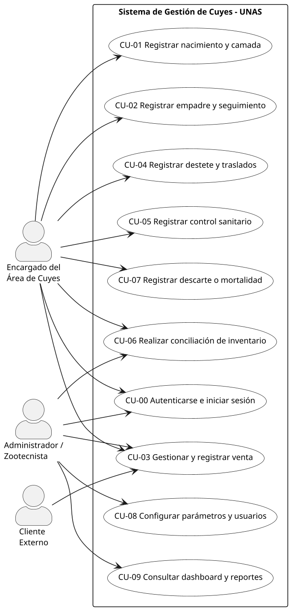

### 7.2. Casos de uso del ciclo productivo y reproductivo

Detalla las operaciones de campo vinculadas a la reproducción, gestación, parto y selección zootécnica de reproductores de reemplazo.

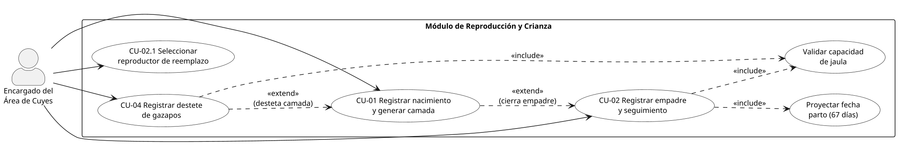

### 7.3. Casos de uso del proceso de ventas y salidas definitivas

Modela la interacción comercial formal, la verificación física del animal, la exigencia del comprobante externo de pago y las bajas por mortalidad o descarte.

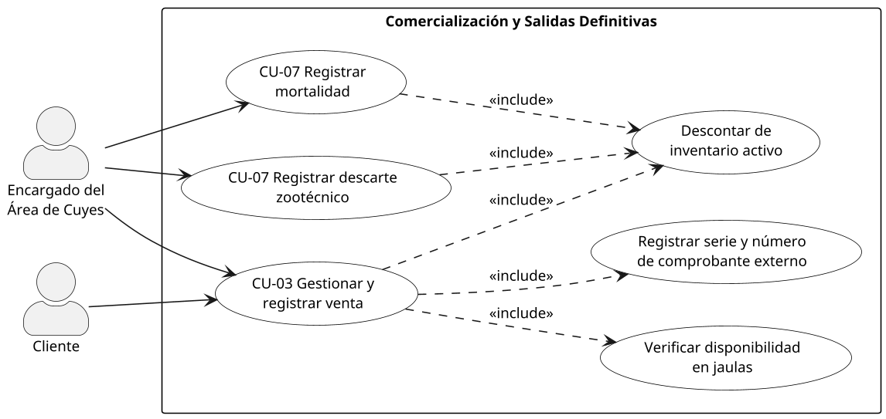

### 7.4. Casos de uso de biometría, sanidad y manejo de jaulas

Representa el control sanitario periódico, las alertas de desparasitación trimestral, los pesajes muestrales y el traslado de animales entre pozas del laboratorio.

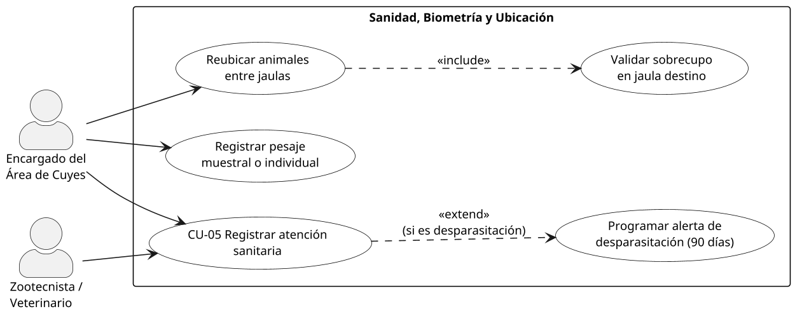

### 7.5. Casos de uso de control de inventario, dashboard y reportes

Engloba las auditorías físicas de piara, la comparación con el stock lógico, la emisión de tableros con indicadores de producción y la exportación de reportes tabulares a Microsoft Excel.

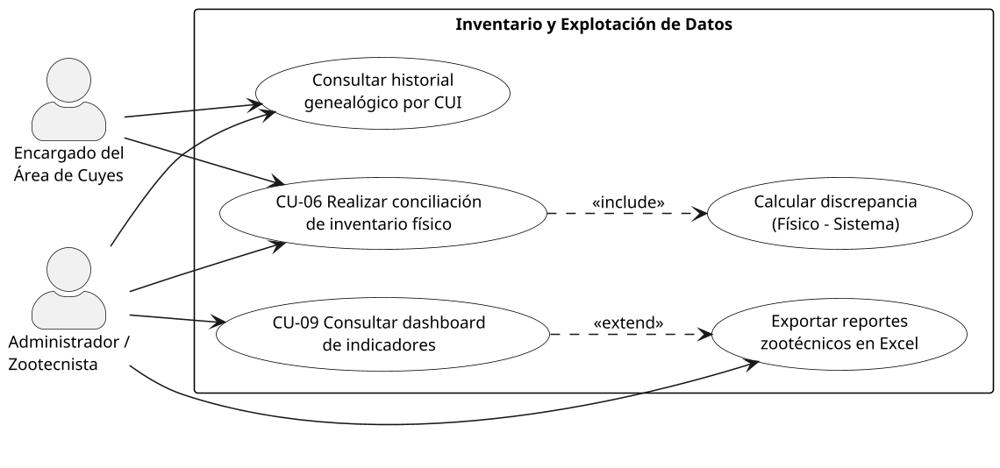

### 7.6. Diagrama de caso de uso detallado para el flujo del proceso de ventas

Detalla los pasos de interacción del caso de uso **CU-03 Gestionar y registrar venta de cuyes**, reflejando con fidelidad la secuencia operativa del diagrama de proceso *AS-IS* provisto por el área de zootecnia:

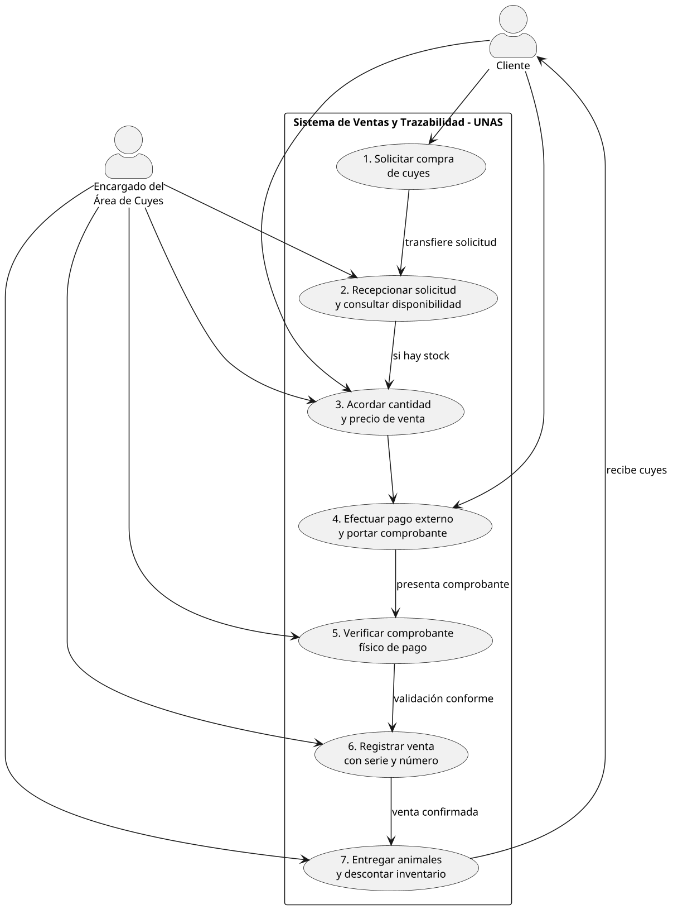

## 8. Estilo arquitectónico

### 8.1. Estilo elegido

Se ha seleccionado el estilo arquitectónico de **Monolito Modular con Clean Architecture (Puertos y Adaptadores / Arquitectura Hexagonal) en cada módulo**, estructurado sobre un esquema de despliegue **Cliente-Servidor de tres niveles**.

La arquitectura se articula y formaliza en tres dimensiones de granularidad:

| Nivel | Estilo arquitectónico | Propósito y delimitación técnica |
|---|---|---|
| **Sistema global** | Cliente-Servidor en 3 niveles | Separación física y lógica entre Frontend Web (Next.js 15) $\longleftrightarrow$ API REST Backend (NestJS 12) $\longleftrightarrow$ Base de Datos Relacional (PostgreSQL 16). |
| **Backend** | Monolito Modular | Una única unidad de despliegue y ejecución organizada internamente en módulos de negocio desacoplados con fronteras explícitas y responsabilidades únicas. |
| **Por cada módulo** | Clean Architecture (Puertos y Adaptadores) | Capas concéntricas con regla de dependencia unidireccional estricta hacia el centro (Dominio). |

### 8.2. Descripción detallada de niveles

#### 8.2.1. Nivel sistema: Cliente-Servidor

- **Capa de Presentación Web (Frontend):** Desarrollada en Next.js 15 (React 18 con App Router). Se encarga del renderizado de interfaces de usuario, gestión del estado de autenticación (JWT) y contexto del criadero activo, consumiendo la API backend mediante un cliente HTTP configurado con interceptores (`axios`).
- **Capa de Lógica de Aplicación (Backend):** Implementada como una API RESTful en NestJS 12 sobre Node.js, bajo el prefijo canónico `/api/v1`. Centraliza las reglas de negocio, la seguridad, la orquestación de casos de uso y la auditoría inmutable.
- **Capa de Persistencia de Datos:** Motor relacional PostgreSQL, garantizando transaccionalidad ACID para operaciones zootécnicas complejas, gestionado mediante Prisma ORM junto con un puente SQL optimizado para consultas de agregación analítica.

El protocolo de enlace es HTTP/HTTPS bajo el estándar JSON. En cada interacción protegida, el cliente transmite el token en cabecera `Authorization: Bearer <jwt>`, además de las cabeceras de contexto zootécnico `x-farm-id` y `x-species-id`.

#### 8.2.2. Nivel backend: Monolito modular

El servidor backend opera como una sola aplicación desplegable, subdividida lógicamente en tres módulos de negocio:

| Módulo | Responsabilidad y alcance de dominio |
|---|---|
| `platform` | Núcleo base administrativo y de infraestructura: autenticación, usuarios, roles, catálogo de granjas/criaderos, especies, áreas, jaulas (recintos), identificación base de animales, pesajes, tratamientos sanitarios, causas de mortalidad y motor de auditoría. |
| `cuyes` | Lógica especializada y propia de la crianza de cuyes (*Cavia porcellus*): razas zootécnicas (Perú, Andina, Inti, Criollo), conformación de lotes de empadre, partos, camadas, destetes, movimientos entre jaulas, proceso de ventas con comprobante externo, conciliación de inventario físico, alertas reproductivas (gestación de 67 días), ranking de reproductores y reportes zootécnicos en Excel. |
| `shared` | Núcleo compartido (*shared kernel*): conexión a base de datos (`PrismaService`), guards de seguridad, decoradores personalizados, serializadores de auditoría y reglas de validación espacial de áreas. |

**Reglas de acoplamiento inter-modular:**
1. `cuyes` depende de las abstracciones de `platform`, nunca a la inversa (`platform` desconoce las reglas particulares de la especie cuy).
2. Ambos módulos dependen exclusivamente del `shared kernel`.
3. La incorporación futura de otra especie zootécnica (ej. conejos) se efectúa como un módulo satélite independiente que reutiliza `platform` sin modificar una sola línea del núcleo existente.

#### 8.2.3. Nivel de módulo: Clean Architecture

Cada módulo interno implementa la separación estricta de responsabilidades en cuatro capas concéntricas:

```text
módulo/
├── presentation/http/         Controladores REST (adaptadores de entrada)
├── application/               Servicios de aplicación (casos de uso)
├── domain/                    Entidades de dominio, value objects y puertos
└── infrastructure/persistence Repositorios (adaptadores de salida con Prisma/SQL)
```

- **Presentación:** Recibe las solicitudes HTTP, aplica validaciones sintácticas iniciales (`ValidationPipe`), verifica permisos mediante *Guards* y delega en el caso de uso correspondiente.
- **Aplicación:** Orquesta la secuencia lógica del caso de uso, invoca las reglas de negocio, valida restricciones de capacidad y fecha, y despacha eventos a la auditoría.
- **Dominio:** Define los conceptos ontológicos del negocio, las reglas invariantes y los **puertos** (interfaces o clases abstractas que definen los contratos requeridos para interactuar con el exterior).
- **Infraestructura:** Provee las implementaciones tecnológicas concretas de los puertos de persistencia (repositorios Prisma/PostgreSQL).

**Regla de dependencias:** Las dependencias apuntan exclusivamente hacia adentro (hacia el Dominio). El Dominio jamás importa componentes de NestJS, Prisma ni librerías de infraestructura. La asociación entre interfaces de dominio y repositorios de infraestructura se resuelve en tiempo de arranque mediante el contenedor de **Inyección de Dependencias** de NestJS (`providers.ts`).

### 8.3. Justificación de decisiones arquitectónicas

#### 8.3.1. Por qué un monolito modular y no microservicios

1. **Escala del sistema y del equipo:** El sistema está diseñado para el laboratorio y criadero de la Facultad de Zootecnia de la UNAS (Tingo María), desarrollado por un equipo ágil de estudiantes de la FIIS. Una arquitectura de microservicios introduciría sobrecargas injustificadas de serialización en red, orquestación con Kubernetes, trazabilidad distribuida y complejidad devops desproporcionada.
2. **Atomicidad e integridad transaccional:** Procesos zootécnicos esenciales como el registro de un parto con camada, el destete de gazapos con traslado de jaula o la venta con baja de inventario involucran actualizaciones atómicas multi-tabla. Un monolito modular aprovecha las transacciones ACID de PostgreSQL (`BEGIN ... COMMIT / ROLLBACK`), evitando la complejidad de patrones de compensación distribuida (Saga).
3. **Optimización de recursos institucionales:** El monolito modular se ejecuta con alta eficiencia en un único entorno de servidor universitario, reduciendo el consumo de memoria y costos de mantenimiento operativo.

#### 8.3.2. Por qué Clean Architecture en cada módulo

1. **Aislamiento de reglas de negocio:** La lógica zootécnica (periodo gestacional de 67 días, verificación de no consanguinidad, control de capacidad en pozas y validación de comprobantes de pago) reside en servicios y entidades de dominio puros, inmunes a cambios de base de datos o librerías externas.
2. **Capacidad de prueba (Testabilidad):** Al comunicarse a través de puertos abstractos, los casos de uso pueden probarse unitariamente de forma aislada inyectando repositorios simulados (*mocks* o *stubs*) en memoria sin requerir una conexión activa a PostgreSQL.
3. **Evolución tecnológica:** Permite sustituir o actualizar el motor de base de datos o el ORM afectando exclusivamente la capa de infraestructura, manteniendo intacta la lógica de aplicación y dominio.

#### 8.3.3. Cuadro comparativo de alternativas evaluadas

| Alternativa evaluada | Ventajas identificadas | Motivos técnicos de descarte |
|---|---|---|
| **Monolito en capas tradicional** | Facilidad y rapidez inicial de codificación. | Alto acoplamiento; mezcla la lógica genérica con las reglas particulares de la especie, obstaculizando la extensibilidad y pruebas. |
| **Microservicios distribuidos** | Despliegue y escalamiento independiente por dominio. | Alta sobrecarga operativa, latencia de red innecesaria y pérdida de consistencia transaccional inmediata en inventario y partos. |
| **Arquitectura Hexagonal tradicional** | Desacoplamiento de puertos y adaptadores. | Carece de la guía explícita sobre la organización por módulos de negocio que provee el enfoque modular. |
| **Monolito Modular + Clean Architecture** | **Máximo equilibrio:** Cohesión modular interna, transacciones atómicas locales, bajo costo operativo y desacoplamiento limpio por capas. | **Arquitectura seleccionada para el proyecto.** |

## 9. Diagrama de paquetes

Organización lógica del código y dependencias entre paquetes. Las flechas indican "depende de". El modelo se presenta en cuatro figuras para mantener cada diagrama legible.

### 9.1. Paquetes del frontend

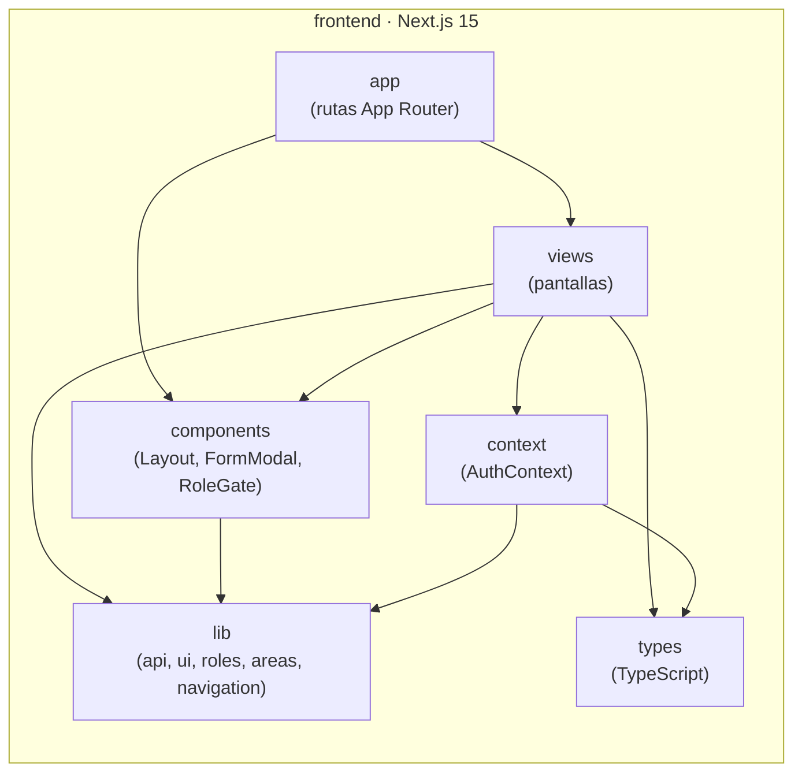

| Paquete | Contenido | Depende de |
|---|---|---|
| `app` | Rutas de Next.js: `login`, `seleccionar-granja` y el grupo `(app)` con las páginas protegidas. | `views`, `components` |
| `views` | Pantallas del sistema: Animales, Jaulas, Áreas, Empadres, Partos, Destetes, Pesajes, Sanidad, Ventas, Usuarios, Granjas y otras. | `components`, `context`, `lib`, `types` |
| `components` | Componentes reutilizables: `Layout` (sidebar), `FormModal` (modales, `SelectField`, `ChoiceChips`) y `RoleGate`. | `lib` |
| `context` | `AuthContext`: usuario, granjas y granja activa. | `lib`, `types` |
| `lib` | Cliente HTTP (`api`), tema visual (`ui`), roles, utilidades de áreas y navegación. | — |
| `types` | Tipos TypeScript compartidos (usuario, rol). | — |

### 9.2. Paquetes del backend

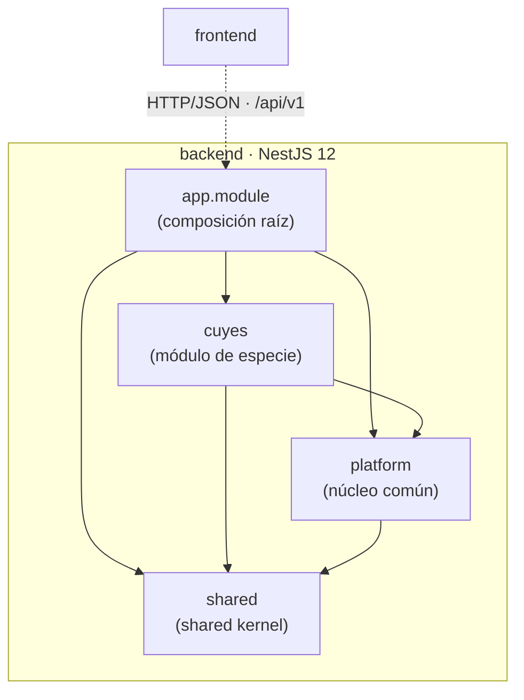

| Paquete | Contenido | Depende de |
|---|---|---|
| `app.module` | Composición raíz: importa los módulos y registra los guards globales (throttler y superadmin). | `platform`, `cuyes`, `shared` |
| `platform` | Auth, usuarios, granjas, especies, áreas, jaulas, animales, pesajes, tratamientos, mortalidad y auditoría. | `shared` |
| `cuyes` | Catálogos, empadres, partos, destetes, movimientos, ventas, inventario, alertas, ranking y reportes. | `platform`, `shared` |
| `shared` | Guards, decoradores, Prisma, puente SQL, auditoría, `ServiceResult`, Swagger y reglas de área por especie. | — |

### 9.3. Estructura interna de un módulo del backend

`platform` y `cuyes` tienen la misma estructura interna de cuatro capas.

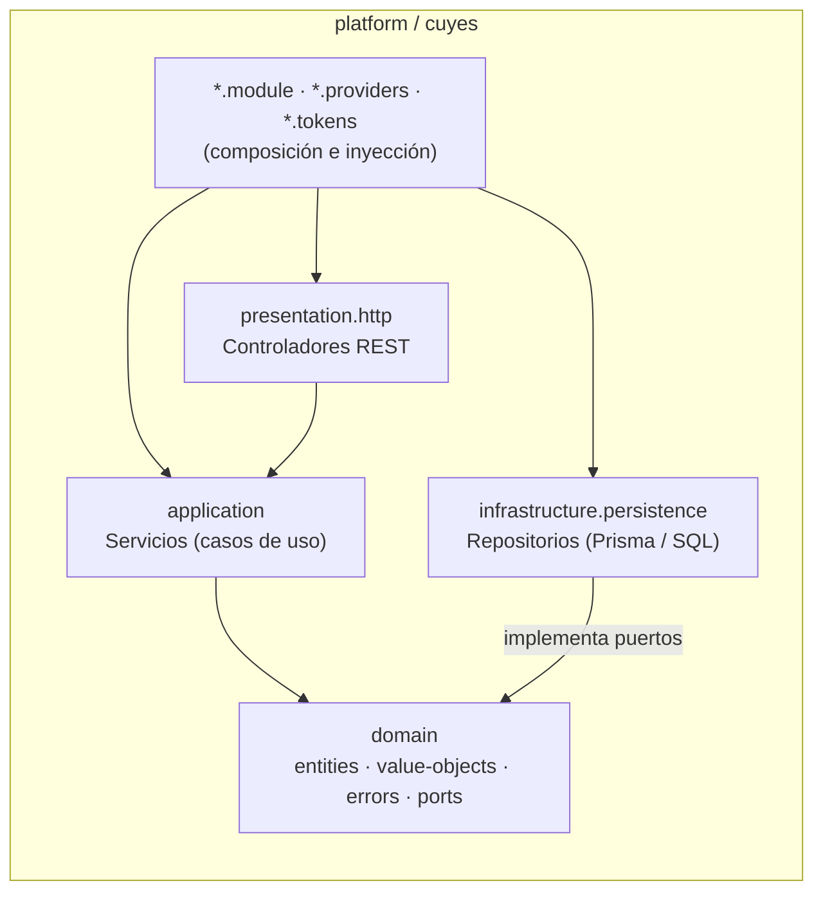

| Capa / paquete | Contenido | Depende de |
|---|---|---|
| `*/presentation/http` | Controladores REST. Traducen HTTP y delegan. | `application` (por token), `shared` |
| `*/application` | Servicios con los casos de uso. Aplican reglas de negocio. | `domain`, `shared` |
| `*/domain` | Entidades (`NewAnimal`), objetos de valor (`NormalizedCode`, `PastDate`), errores de dominio y puertos de repositorio. | — |
| `*/infrastructure/persistence` | Repositorios que implementan los puertos con Prisma o SQL. | `domain`, `shared` |

### 9.4. Núcleo compartido (`shared`)

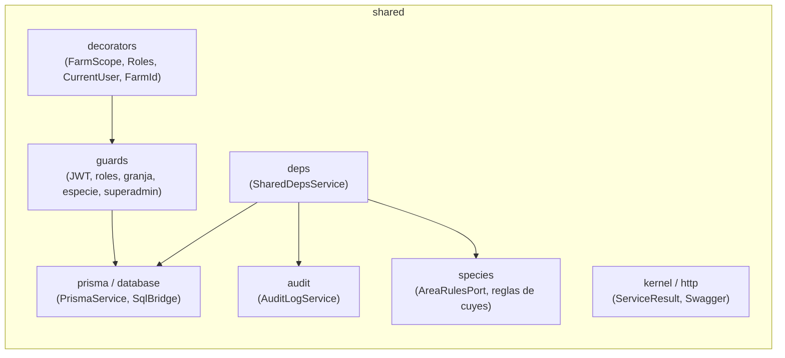

### 9.5. Reglas de dependencia

1. `domain` no depende de ningún otro paquete: ni NestJS ni Prisma.
2. `application` depende de `domain`, nunca de `infrastructure`.
3. `infrastructure` depende de `domain`, porque implementa sus puertos.
4. `presentation` accede a `application` mediante tokens de inyección.
5. `cuyes` puede depender de `platform`; `platform` nunca depende de `cuyes`.
6. `shared` no depende de ningún módulo de negocio; cualquier cosa que necesite un dato de negocio pasa por el puerto o servicio público del módulo correspondiente.

## 10. Diagrama de componentes

Descomposición física del sistema: componentes ejecutables, sus interfaces y cómo se conectan.

### 10.1. Componentes de presentación

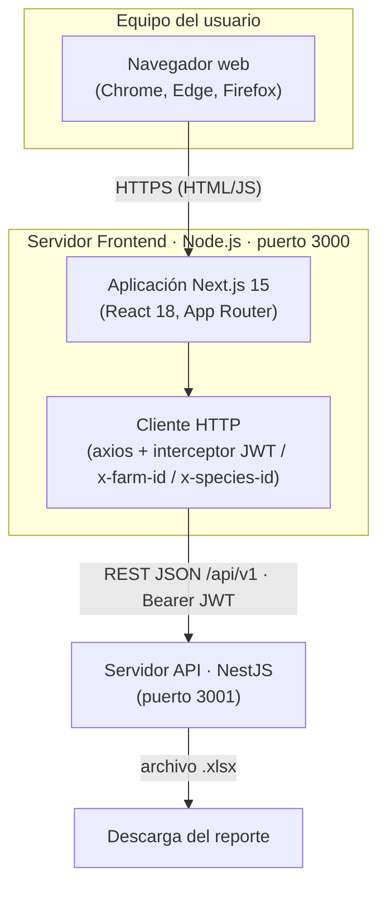

### 10.2. Componentes del servidor de API

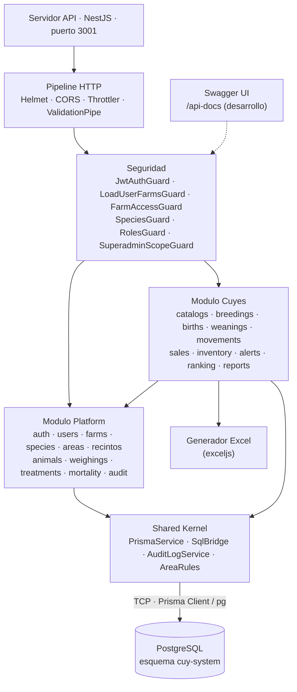

### 10.3. Componentes

| Componente | Tipo | Responsabilidad | Interfaces que ofrece | Interfaces que usa |
|---|---|---|---|---|
| Navegador web | Cliente | Ejecuta la interfaz de usuario. | — | HTTP hacia el frontend |
| Aplicación Next.js | Servidor web | Renderiza las pantallas, controla rutas y roles en el cliente, mantiene la sesión (`AuthContext`). | Páginas web en el puerto 3000 | API REST del backend |
| Cliente HTTP (axios) | Librería del frontend | Centraliza las llamadas a la API y agrega el token JWT, la granja activa y la especie. | `api.get/post/patch/put` | REST `/api/v1` |
| Pipeline HTTP | *Middleware* NestJS | Cabeceras de seguridad (Helmet), CORS, límite de peticiones (100 cada 15 min) y validación. | — | — |
| Seguridad (guards) | Componente NestJS | Autenticación JWT, carga de granjas del usuario, acceso a la granja, especie y roles. | Decoradores `@FarmScope()`, `@Roles()` | PrismaService |
| Módulo Platform | Módulo de negocio | Funciones comunes a todas las especies. | Endpoints `/auth`, `/users`, `/farms`, `/species`, `/areas`, `/recintos`, `/animals`, `/weighings`, `/treatments`, `/mortality`, `/audit`. Exporta `RECINTOS_SERVICE`. | Shared Kernel |
| Módulo Cuyes | Módulo de negocio | Procesos productivos y reproductivos de cuyes. | Endpoints `/cuyes/*` | Módulo Platform, Shared Kernel, exceljs |
| Shared Kernel | Componente transversal | Acceso a datos (Prisma y SQL), auditoría y reglas de área por especie. | `PrismaService`, `SqlBridge`, `AuditLogService.write()`, `AreaRulesPort` | PostgreSQL |
| Generador Excel | Librería | Genera reportes `.xlsx` (hembras, machos, inventario mensual, animales, consolidado). | `GET /cuyes/reports/*` | — |
| Swagger UI | Documentación | Documenta y permite probar la API (solo en desarrollo). | `/api-docs` | — |
| PostgreSQL | Base de datos | Persistencia relacional, transacciones y restricciones de integridad. | Puerto 5432 | — |

### 10.4. Despliegue

| Nodo | Software | Puerto |
|---|---|---|
| Servidor frontend | Node.js + Next.js (`npm run start`) | 3000 |
| Servidor API | Node.js + NestJS (`npm start`, `NODE_ENV=production`) | 3001 |
| Servidor de base de datos | PostgreSQL | 5432 |

Los tres nodos pueden ejecutarse en una misma máquina o en máquinas separadas. La configuración se hace por variables de entorno:

- **Backend:** `DATABASE_URL`, `JWT_SECRET`, `JWT_EXPIRES_IN`, `PORT` y `CORS_ORIGIN`.
- **Frontend:** `NEXT_PUBLIC_API_URL`.

## 11. Descripción de interfaces

El sistema tiene tres tipos de interfaces:

1. **Interfaz externa (API REST):** la que consume el frontend.
2. **Interfaces de aplicación (casos de uso):** los servicios que invocan los controladores.
3. **Puertos de dominio y servicios transversales:** contratos que la infraestructura implementa.

### 1. API REST

#### Convenciones

| Aspecto | Valor |
|---|---|
| URL base | `http://<servidor>:3001/api/v1` |
| Formato | JSON (excepto los reportes, que devuelven `.xlsx`) |
| Autenticación | `Authorization: Bearer <token JWT>` |
| Granja activa | Header `x-farm-id: <id>` (obligatorio en rutas de granja) |
| Especie | Header `x-species-id: <id>` (obligatorio en rutas de granja) |
| Respuesta correcta | Código 200 o 201 con los datos |
| Respuesta con error | Código 400, 401, 403, 404 o 409 con `{ "error": "mensaje", ...datos extra }` |
| Confirmaciones | Un 409 con `requiere_confirmacion` indica que el usuario debe confirmar (por ejemplo, capacidad excedida); se reenvía la petición con `confirmar_*: true` |
| Documentación | Swagger en `/api-docs` (entorno de desarrollo) |

#### Módulo Platform

| Método | Ruta | Parámetros principales | Descripción |
|---|---|---|---|
| POST | `/auth/login` | body: `email`, `password` | Inicia sesión y devuelve token, usuario y granjas. |
| POST | `/auth/logout` | — | Cierra sesión. |
| GET | `/auth/me` | — | Usuario autenticado y sus granjas. |
| GET | `/users` | — | Usuarios visibles para el rol actual. |
| POST | `/users` | body: `nombre`, `email`, `password`, `rol`, `granja_ids[]`, `especie_ids[]` | Crea un usuario (reactiva si el correo estaba dado de baja). |
| PATCH | `/users/:id` | body: `nombre`, `password`, `activo`, `granja_ids[]` | Edita o desactiva un usuario. |
| GET | `/farms` | — | Granjas accesibles para el usuario. |
| POST | `/farms` | body: `nombre`, `id_especie`, `ubicacion` | Crea una granja (solo superadmin). |
| PATCH | `/farms/:id` | body: `nombre`, `ubicacion` | Edita una granja (solo superadmin). |
| PATCH | `/farms/:id/deactivate` | path: `id` | Elimina una granja (borrado lógico). |
| PUT | `/farms/:id/users` | body: `usuario_ids[]` | Reemplaza los usuarios asignados a la granja. |
| GET | `/species` | — | Especies disponibles. |
| GET | `/areas` | — | Áreas de la granja con sus jaulas. |
| GET | `/areas/summary` | — | Ocupación por área. |
| POST | `/areas` | body: `nombre`, `proposito`, `jaula_ids[]` | Crea un área y le asigna jaulas libres. |
| PATCH | `/areas/:id` | body: `nombre`, `proposito`, `jaula_ids[]` | Edita un área y sus jaulas. |
| PATCH | `/areas/:id/deactivate` | path: `id` | Elimina un área (sus jaulas quedan sin área). |
| GET | `/recintos` | query: `id_area` | Jaulas de la granja. |
| GET | `/recintos/occupancy` | — | Ocupación y sobrecupo de jaulas. |
| GET | `/recintos/:id/animals` | path: `id` | Animales de una jaula. |
| POST | `/recintos` | body: `codigo`, `capacidad_maxima`, `id_area` | Crea una jaula (el área es opcional). |
| PATCH | `/recintos/:id` | body: `codigo`, `capacidad_maxima`, `id_area` | Edita una jaula (`id_area: null` la quita del área). |
| PATCH | `/recintos/:id/deactivate` | path: `id` | Elimina una jaula vacía (borrado lógico). |
| GET | `/animals` | query: filtros (estado, sexo, jaula, categoría…) | Lista animales. |
| GET | `/animals/search/:codigo` | path: `codigo` | Busca un animal por código. |
| POST | `/animals` | body: `codigo`, `sexo`, `id_jaula`, `id_raza`, `id_categoria`, `fecha_nacimiento`, `particularidad`, `confirmar_capacidad`, `confirmar_reuso` | Registra un animal. |
| PATCH | `/animals/:id` | body: `estado`, `motivo_baja`, `fecha_baja`, `id_categoria`, `id_jaula`, `particularidad` | Edita o da de baja un animal. |
| GET | `/weighings/ranges` | — | Rangos de peso por categoría. |
| PUT | `/weighings/ranges` | body: rangos | Actualiza los rangos de peso. |
| GET | `/weighings/average` | query | Peso promedio. |
| GET | `/weighings/animal/:id_animal` | path: `id_animal` | Evolución de peso de un animal. |
| POST | `/weighings` | body: `id_animal`, `fecha`, `peso_gramos`, `confirmar_fuera_rango` | Registra un pesaje individual. |
| POST | `/weighings/batch` | body: `fecha`, `pesajes[{id_animal, peso_gramos}]` | Registra pesajes por lote. |
| GET | `/treatments` | query | Historial de tratamientos. |
| GET | `/treatments/in-progress` | query | Tratamientos en curso. |
| POST | `/treatments` | body: `tipo`, `producto`, `dosis`, `via`, `fecha_inicio`, `duracion_dias`, `diagnostico`, `responsable`, `id_animal` / `ids_animales[]` / `id_jaula` / `id_area` | Registra un tratamiento. |
| PATCH | `/treatments/:id/complete` | body: `motivo_cierre` | Finaliza un tratamiento. |
| GET | `/mortality` | — | Registros de mortalidad. |
| POST | `/mortality` | body: `fecha`, `cantidad`, `id_animal`, `clasificacion`, `categoria`, `causa`, `id_jaula` | Registra mortalidad individual o por lote. |
| GET | `/audit` | query: filtros | Bitácora de auditoría. |
| POST | `/audit/void/mortality/:id` | path: `id` | Anula un registro de mortalidad. |
| POST | `/audit/void/sale/:id` | path: `id` | Anula una venta. |

#### Módulo Cuyes

| Método | Ruta | Parámetros principales | Descripción |
|---|---|---|---|
| GET | `/cuyes/catalogs/breeds` | — | Lista razas. |
| POST | `/cuyes/catalogs/breeds` | body: `nombre` | Crea una raza. |
| PATCH | `/cuyes/catalogs/breeds/:id/deactivate` | path: `id` | Desactiva una raza. |
| GET | `/cuyes/catalogs/categories` | — | Lista categorías. |
| POST | `/cuyes/catalogs/categories` | body: `nombre`, `proposito_area` | Crea una categoría. |
| PATCH | `/cuyes/catalogs/categories/:id/deactivate` | path: `id` | Desactiva una categoría. |
| GET | `/cuyes/catalogs/transitions` | — | Transiciones de categoría permitidas. |
| GET | `/cuyes/breedings` | — | Lista empadres. |
| POST | `/cuyes/breedings` | body: `id_macho`, `hembras[]`, fecha | Crea un empadre. |
| POST | `/cuyes/breedings/:id/close` | body: jaula de retorno del macho | Cierra el empadre. |
| PATCH | `/cuyes/breedings/:id/females/:femaleId` | body: resultado | Registra el resultado de una hembra. |
| POST | `/cuyes/breedings/breeding-females` | body: datos de la hembra | Registra una hembra reproductora. |
| POST | `/cuyes/breedings/breeding-males` | body: datos del macho | Registra un macho reproductor. |
| GET | `/cuyes/breedings/breeding-females/:id` | path: `id` | Perfil reproductivo de una hembra. |
| GET | `/cuyes/breedings/breeding-males/:id` | path: `id` | Perfil reproductivo de un macho. |
| GET | `/cuyes/breedings/cage/:id/females` | path: `id` | Hembras disponibles en una jaula. |
| GET | `/cuyes/births` | — | Lista partos. |
| POST | `/cuyes/births` | body: `id_hembra`, `id_empadre`, `fecha_parto`, `vivos_m`, `vivos_h`, `muertos`, `peso_m1..3`, `peso_h1..3` | Registra un parto. |
| GET | `/cuyes/weanings` | — | Lista destetes. |
| POST | `/cuyes/weanings` | body: `id_parto`, `fecha_destete`, `destetados_m`, `destetados_h`, `muertos`, pesos, `id_jaula_m`, `id_jaula_h` | Registra el destete de un parto. |
| GET | `/cuyes/movements` | — | Movimientos recientes. |
| GET | `/cuyes/movements/overcapacity` | — | Jaulas sobre su capacidad. |
| GET | `/cuyes/movements/out-of-area` | — | Animales fuera del área que corresponde a su categoría. |
| GET | `/cuyes/movements/destination-cages/:farm_id` | path: `farm_id` | Jaulas disponibles en otra granja. |
| GET | `/cuyes/movements/animal/:id_animal` | path: `id_animal` | Historial de un animal. |
| GET | `/cuyes/movements/cage/:cage_id` | query: `fecha` | Historial de una jaula. |
| POST | `/cuyes/movements/relocate` | body: `fecha`, `id_jaula_destino`, `ids_animales[]` o `id_jaula_origen_completa`, `motivo`, `confirmar_capacidad`, `confirmar_area` | Reubica animales dentro de la granja. |
| POST | `/cuyes/movements/transfer` | body: `fecha`, `id_granja_destino`, `id_jaula_destino`, `ids_animales[]`, `motivo`, `confirmar_capacidad` | Traslada animales a otra granja de la misma especie. |
| GET | `/cuyes/sales` | query: filtros (fecha, cliente, raza) | Lista ventas realizadas en el criadero. |
| POST | `/cuyes/sales` | body: `fecha`, `cuy_codigo`, `raza_id`, `sexo`, `peso`, `precio`, `comprobante_serie`, `comprobante_numero`, `cliente`, `observaciones` | Registra una venta individual asociada a comprobante externo y descuenta inventario. |
| GET | `/cuyes/sales/discards` | — | Animales dados de baja o marcados para descarte comercial. |
| POST | `/cuyes/sales/discards` | body: `fecha`, `id_animales[]`, `comprador`, `precio`, `comprobante_serie`, `comprobante_numero` | Registra la venta de lote de animales de descarte con comprobante. |
| GET | `/cuyes/inventory/population` | query | Población actual. |
| GET | `/cuyes/inventory/monthly-summary` | query: año, mes | Resumen mensual. |
| GET | `/cuyes/inventory/by-area` | — | Inventario por área. |
| GET | `/cuyes/inventory/by-category-area` | — | Inventario por categoría y área. |
| GET | `/cuyes/inventory/consolidated` | — | Consolidado de todas las granjas del usuario. |
| GET | `/cuyes/alerts` | — | Alertas activas (partos, destetes, pesajes…). |
| GET | `/cuyes/alerts/config` | — | Plazos configurados. |
| PUT | `/cuyes/alerts/config` | body: `items[]` | Guarda los plazos de alertas. |
| POST | `/cuyes/alerts/discard` | body: `tipo`, `id_animal`, `id_referencia`, `motivo` | Descarta una alerta. |
| GET | `/cuyes/ranking` | query | Ranking de reproductores. |
| GET | `/cuyes/ranking/config` | — | Pesos de los criterios. |
| PUT | `/cuyes/ranking/config` | body: `peso_partos`, `peso_camada`, `peso_destete`, `peso_mortalidad`, `peso_peso_nac`, `peso_peso_dest`, `peso_prenez_macho` | Actualiza los pesos de los criterios. |
| POST | `/cuyes/ranking/:id_animal/mark` | body: `accion` (`descarte` o `reemplazo`) | Marca un reproductor. |
| GET | `/cuyes/reports/females` | query | Excel de hembras reproductoras. |
| GET | `/cuyes/reports/males` | — | Excel de machos reproductores. |
| GET | `/cuyes/reports/monthly-inventory` | query: año, mes | Excel de inventario mensual. |
| GET | `/cuyes/reports/animals` | query | Excel de animales. |
| GET | `/cuyes/reports/consolidated` | query | Excel consolidado multigranja. |

### 2. Interfaces de aplicación (casos de uso)

Cada controlador invoca un servicio de la capa de aplicación. Todos los métodos devuelven un `ServiceResult` (ver sección 3). A continuación, los servicios principales:

```typescript
// platform/application/animals.service.ts
interface AnimalsService {
  list(p: { farmId: number; query?: Record<string, unknown> }): Promise<ServiceResult>;
  findByCode(p: { farmId: number; codigoRaw: string }): Promise<ServiceResult>;
  create(p: { farmId: number; userId: number; body: Record<string, unknown> }): Promise<ServiceResult>;
  update(p: { farmId: number; userId: number; id: number; body: Record<string, unknown> }): Promise<ServiceResult>;
}

// platform/application/recintos.service.ts  (jaulas)
interface RecintosService {
  list(p: { farmId: number; query?: Record<string, unknown> }): Promise<ServiceResult>;
  getOccupancy(farmId: number): Promise<ServiceResult>;
  create(p: { farmId: number; userId: number; body: { codigo: string; capacidad_maxima?: number; id_area?: number } }): Promise<ServiceResult>;
  update(p: { farmId: number; userId: number; id: number; body: { codigo?: string; capacidad_maxima?: number; id_area?: number | null } }): Promise<ServiceResult>;
  deactivate(p: { farmId: number; userId: number; id: number }): Promise<ServiceResult>;
  getAnimals(p: { farmId: number; jaulaId: number }): Promise<ServiceResult>;
}

// platform/application/areas.service.ts
interface AreasService {
  list(farmId: number): Promise<ServiceResult>;
  getSummary(farmId: number): Promise<ServiceResult>;
  create(p: { farmId: number; userId: number; body: { nombre: string; proposito?: string; jaula_ids?: number[] } }): Promise<ServiceResult>;
  update(p: { farmId: number; userId: number; id: number; body: { nombre: string; proposito?: string; jaula_ids?: number[] } }): Promise<ServiceResult>;
  deactivate(p: { farmId: number; userId: number; id: number }): Promise<ServiceResult>;
}

// platform/application/farms.service.ts
interface FarmsService {
  list(userFarms: UserFarm[]): ServiceResult;
  create(p: { userId: number; body: { nombre: string; id_especie: number; ubicacion?: string } }): Promise<ServiceResult>;
  update(p: { userId: number; id: number; body: { nombre: string; ubicacion?: string } }): Promise<ServiceResult>;
  deactivate(p: { userId: number; id: number }): Promise<ServiceResult>;
  assignUsers(p: { userId: number; userRol: string; userFarms: UserFarm[]; farmId: number; usuario_ids: number[] }): Promise<ServiceResult>;
}

// platform/application/auth.service.ts
interface AuthService {
  login(body: { email?: string; password?: string }): Promise<ServiceResult>; // { token, usuario, granjas }
  logout(userId: number): Promise<ServiceResult>;
}

// cuyes/application/movements.service.ts
interface MovementsService {
  relocate(p: { farmId: number; userId: number; body: RelocateBody }): Promise<ServiceResult>;
  transfer(p: { farmId: number; userId: number; user: AuthUser; userFarms: UserFarm[]; body: TransferBody }): Promise<ServiceResult>;
  destinationCages(p: { farmId: number; farmIdDestino: string; user: AuthUser; userFarms: UserFarm[] }): Promise<ServiceResult>;
  animalHistory(p: { farmId: number; animalId: string }): Promise<ServiceResult>;
  cageHistory(p: { farmId: number; jaulaId: number; query: { fecha?: string } }): Promise<ServiceResult>;
  list(farmId: number): Promise<ServiceResult>;
  listOvercapacity(farmId: number): Promise<ServiceResult>;
  listOutOfArea(farmId: number): Promise<ServiceResult>;
}

// cuyes/application/breedings.service.ts
interface BreedingsService {
  createBreeding(p: { farmId: number; userId: number; body: { id_macho: number; hembras: number[]; fecha: string } }): Promise<ServiceResult>;
  updateFemaleBreedingResult(p: { farmId: number; userId: number; empadreId: number; hembraId: number; body: object }): Promise<ServiceResult>;
  closeBreeding(p: { farmId: number; userId: number; empadreId: number; body: object }): Promise<ServiceResult>;
  getFemaleBreedingProfile(p: { farmId: number; hembraId: number }): Promise<ServiceResult>;
  getMaleBreedingProfile(p: { farmId: number; machoId: number }): Promise<ServiceResult>;
  list(farmId: number): Promise<ServiceResult>;
}

// cuyes/application/sales.service.ts
interface SalesService {
  createSale(p: {
    farmId: number;
    userId: number;
    body: {
      fecha: string;
      cuy_codigo: string;
      raza_id: string;
      sexo: string;
      peso: number;
      precio: number;
      comprobante_serie: string;
      comprobante_numero: string;
      cliente: string;
      observaciones?: string;
    };
  }): Promise<ServiceResult>;
  listSales(p: { farmId: number; query?: Record<string, unknown> }): Promise<ServiceResult>;
  getDiscardsForSale(farmId: number): Promise<ServiceResult>;
  createDiscardSale(p: {
    farmId: number;
    userId: number;
    body: { fecha: string; id_animales: number[]; comprador: string; precio: number; comprobante_serie: string; comprobante_numero: string };
  }): Promise<ServiceResult>;
}

// cuyes/application/inventory.service.ts
interface InventoryService {
  recordAudit(p: {
    farmId: number;
    userId: number;
    body: {
      fecha: string;
      jaula_id: number;
      raza_id: string;
      etapa: string;
      cantidad_machos: number;
      cantidad_hembras: number;
      peso_muestra1: number;
      peso_muestra2: number;
      peso_muestra3: number;
      observaciones?: string;
    };
  }): Promise<ServiceResult>;
  getMonthlySummary(p: { farmId: number; anio: number; mes: number }): Promise<ServiceResult>;
  getPopulationByArea(farmId: number): Promise<ServiceResult>;
}
```

| Servicio | Módulo | Casos de uso que cubre |
|---|---|---|
| `AuthService` | platform | Iniciar y cerrar sesión. |
| `UsersService` | platform | Crear, listar y editar usuarios, con reactivación. |
| `FarmsService` | platform | Crear, editar y eliminar granjas; asignar usuarios. |
| `AreasService` | platform | Gestionar áreas y su conjunto de jaulas. |
| `RecintosService` | platform | Gestionar jaulas y consultar su ocupación. |
| `AnimalsService` | platform | Registrar, buscar, editar y dar de baja animales. |
| `WeighingsService` | platform | Pesajes individuales y por lote; rangos de peso. |
| `TreatmentsService` | platform | Registrar y finalizar tratamientos. |
| `MortalityService` | platform | Registrar mortalidad. |
| `AuditService` | platform | Consultar la bitácora y anular registros. |
| `CatalogsService` | cuyes | Razas, categorías y transiciones. |
| `BreedingsService` | cuyes | Empadres y perfiles reproductivos. |
| `BirthsService` / `WeaningsService` | cuyes | Partos y destetes. |
| `MovementsService` | cuyes | Reubicaciones, traslados e historial. |
| `SalesService` | cuyes | Ventas y venta de descartes. |
| `InventoryService` | cuyes | Población e inventarios. |
| `AlertsService` | cuyes | Alertas y plazos. |
| `RankingService` | cuyes | Ranking de reproductores. |
| `ReportsService` | cuyes | Reportes Excel. |

### 3. Puertos de dominio y servicios transversales

### 3.1 Resultado de los casos de uso

```typescript
// shared/kernel/service-result.kernel.ts
type ServiceResult<T = unknown> = {
  ok: boolean;
  status?: number;      // código HTTP sugerido
  data?: T;
  error?: string;
  [extra: string]: unknown; // p. ej. requiere_confirmacion
};

function ok<T>(data: T, status?: number): ServiceResult<T>;
function fail(error: string, status?: number, extra?: Record<string, unknown>): ServiceResult;
```

### 3.2 Puertos de repositorio (adaptadores de salida)

Cada caso de uso depende de un puerto, una clase abstracta en `domain/ports`, que un repositorio de `infrastructure/persistence` implementa. Abajo está el contrato efectivo de los puertos principales. En el código actual, las firmas se declaran de forma genérica (`...args: any[]`).

```typescript
// platform/domain/ports/areas.repository.port.ts
abstract class AreasRepositoryPort {
  list(farmId: number): Promise<Area[]>;
  summary(farmId: number): Promise<AreaSummary[]>;
  findById(farmId: number, id: number): Promise<Area | null>;
  findByName(farmId: number, nombre: string): Promise<Area | null>;
  findTakenCages(farmId: number, areaId: number | null, jaulaIds: number[]): Promise<{ codigo: string }[]>;
  createWithCages(p: { farmId: number; nombre: string; proposito: string | null; jaulaIds: number[] }): Promise<Area>;
  updateWithCages(p: { farmId: number; id: number; nombre: string; proposito: string | null; activa?: boolean; jaulaIds: number[] }): Promise<Area>;
  deactivate(p: { farmId: number; id: number }): Promise<Area | null>;
}

// platform/domain/ports/recintos.repository.port.ts  (jaulas)
abstract class RecintosRepositoryPort {
  list(farmId: number, idArea: number | null): Promise<Jaula[]>;
  occupancyRows(farmId: number): Promise<OcupacionJaula[]>;
  findInFarm(farmId: number, id: number): Promise<Jaula | null>;
  findAreaInFarm(farmId: number, idArea: number): Promise<Area | null>;
  findDuplicateCode(farmId: number, codigoNorm: string, excludeId?: number): Promise<Jaula | null>;
  insert(p: { farmId: number; idArea: number | null; codigo: string; capacidadMaxima: number | null }): Promise<Jaula>;
  update(p: { farmId: number; id: number; codigo?: string; capacidadMaxima?: number; idArea?: number | null }): Promise<Jaula>;
  deactivate(farmId: number, id: number): Promise<Jaula | null>;
  listAnimals(farmId: number, jaulaId: number): Promise<Animal[]>;
}

// platform/domain/ports/animals.repository.port.ts
abstract class AnimalsRepositoryPort {
  list(farmId: number, filters: Record<string, unknown>): Promise<Animal[]>;
  findById(farmId: number, id: number): Promise<Animal | null>;
  findByNormalizedCode(farmId: number, codigoNorm: string): Promise<Animal | null>;
  findActiveCage(farmId: number, idJaula: number): Promise<Jaula | null>;
  insertNew(p: { farmId: number; userId: number; animal: NewAnimal }): Promise<Animal>;
  reuseDischargedCode(p: { userId: number; existente: Animal; animal: NewAnimal }): Promise<Animal>;
  update(p: { id: number; data: Partial<Animal> }): Promise<Animal>;
  insertNote(p: { id: number; texto: string; fecha: string; userId: number }): Promise<void>;
  getHistory(animalId: number): Promise<Movimiento[]>;
  getTreatments(animalId: number): Promise<Tratamiento[]>;
}

// cuyes/domain/ports/movements.repository.port.ts (extracto)
abstract class MovementsRepositoryPort {
  getCage(client: DbClient | null, idJaula: number, farmId: number): Promise<JaulaConOcupacion | null>;
  getActiveAnimals(client: DbClient | null, animalIds: number[], farmId: number): Promise<Animal[]>;
  getAnimalsFromCage(client: DbClient | null, jaulaId: number, farmId: number): Promise<number[]>;
  executeRelocation(p: { farmId: number; userId: number; fecha: string; idJaulaDestino: number; motivo?: string; animales: Animal[]; excedio: boolean; avisosArea: Animal[] }): Promise<Movimiento[]>;
  executeTransfer(p: { granjaOrigen: number; granjaDestino: number; userId: number; fecha: string; idJaulaDestino: number; motivo: string; animales: Animal[]; excedio: boolean }): Promise<Movimiento[]>;
  listOvercapacity(farmId: number): Promise<JaulaConOcupacion[]>;
}
```

| Puerto | Implementación | Tecnología |
|---|---|---|
| `AuthRepositoryPort`, `UsersRepositoryPort`, `FarmsRepositoryPort`, `SpeciesRepositoryPort`, `AuditRepositoryPort` | `*Repository` en `platform/infrastructure` | Prisma |
| `AreasRepositoryPort`, `RecintosRepositoryPort`, `AnimalsRepositoryPort`, `WeighingsRepositoryPort`, `TreatmentsRepositoryPort`, `MortalityRepositoryPort` | `*Repository` en `platform/infrastructure` | SQL parametrizado |
| `CatalogsRepositoryPort` | `CatalogsRepository` en `cuyes/infrastructure` | Prisma |
| `BreedingsRepositoryPort`, `BirthsRepositoryPort`, `WeaningsRepositoryPort`, `MovementsRepositoryPort`, `SalesRepositoryPort`, `InventoryRepositoryPort`, `AlertsRepositoryPort`, `RankingRepositoryPort`, `ReportsRepositoryPort` | `*Repository` en `cuyes/infrastructure` | SQL parametrizado |

### 3.3 Servicios transversales (shared)

```typescript
// shared/species/area-rules.port.ts — reglas de área por especie
interface AreaRulesPort {
  normalizePurpose(p: unknown): unknown;
  getPurposes(): string[];
  animalMatchesArea(animal: { sexo?: string; propositoCategoria?: unknown }, areaPurpose: unknown): boolean;
  isAnimalOutOfArea(animal: { sexo?: string; proposito_area?: unknown }, areaPurpose: unknown): boolean;
}

// shared/audit/audit-log.service.ts — bitácora de auditoría
interface AuditLogService {
  write(p: {
    userId?: number | null;
    farmId?: number | null;
    accion: string;          // 'crear' | 'editar' | 'eliminar' | 'reactivar' | 'anular' | 'finalizar' | 'configurar' ...
    entidad?: string | null; // 'animal', 'jaula', 'area', ...
    idEntidad?: number | null;
    antes?: unknown;
    despues?: unknown;
    detalle?: string | null;
  }): Promise<void>;
}

// shared/auth/auth-user.types.ts — identidad que reciben los casos de uso
type AuthUser = { id: number; nombre: string; email: string; rol: string }; // superadmin | admin | encargado | supervisor | auxiliar
type UserFarm = { id: number; nombre: string; id_especie: number; especie: string; ubicacion: string | null };
```

| Guard / decorador | Función |
|---|---|
| `@FarmScope()` | Aplica `SpeciesGuard`, `JwtAuthGuard`, `LoadUserFarmsGuard` y `FarmAccessGuard` a una ruta de granja. |
| `@Roles(...roles)` + `RolesGuard` | Restringe una ruta a ciertos roles. |
| `SuperadminScopeGuard` (global) | Limita al superadmin a la administración de usuarios y granjas. |
| `@CurrentUser()`, `@FarmId()`, `@UserFarms()` | Inyectan en el controlador el usuario, la granja activa y sus granjas. |

## 12. Justificación de decisiones

La arquitectura elegida (monolito modular con Clean Architecture en cada módulo, en un esquema cliente-servidor) se justifica con dos marcos: las características de calidad de la **ISO/IEC 25010** y los principios de diseño **SOLID**.

### 1. Justificación según ISO/IEC 25010

| Característica | Subcaracterística | Decisión de arquitectura | Cómo se refleja en el sistema |
|---|---|---|---|
| **Mantenibilidad** | Modularidad | División en módulos `platform`, `cuyes` y `shared`, y en cuatro capas dentro de cada módulo. | Un cambio en reproducción (`cuyes/breedings`) no afecta a usuarios ni granjas (`platform`). |
| | Reusabilidad | `platform` concentra lo común a cualquier especie; `shared` concentra guards, auditoría y acceso a datos. | Animales, jaulas, áreas, pesajes y sanidad se reutilizarían en una nueva especie sin reescribirse. Los modales del frontend (`FormModal`, `SelectField`) se reutilizan en todas las pantallas. |
| | Analizabilidad | Estructura idéntica en todos los módulos: `presentation`, `application`, `domain`, `infrastructure`. | Para entender un caso de uso se sigue siempre el mismo camino: controlador, servicio, puerto y repositorio. |
| | Modificabilidad | Los casos de uso dependen de puertos, no de la base de datos. | Pasar repositorios de SQL a Prisma, o mover la granja de las jaulas a `recintos.id_granja`, solo afectó la infraestructura. |
| | Capacidad de prueba | Inyección de dependencias por puertos. | Los casos de uso pueden probarse sustituyendo el repositorio por uno falso. |
| **Seguridad** | Confidencialidad | Autenticación JWT y aislamiento por granja (`x-farm-id` validado por `FarmAccessGuard`). | Un usuario solo ve datos de las granjas que tiene asignadas. |
| | Integridad | Validaciones en los casos de uso, transacciones, borrado lógico y restricciones en la base de datos. | No se puede eliminar una jaula con animales ni asignar una jaula a dos áreas. Los registros no se borran físicamente. |
| | No repudio / Responsabilidad | Bitácora de auditoría (`AuditLogService.write`) en cada operación de escritura. | Queda registrado quién creó, editó, eliminó o anuló cada dato, con su estado antes y después. |
| | Autenticidad | Contraseñas con bcrypt, roles (`RolesGuard`) y alcance del superadmin (`SuperadminScopeGuard`). | Cada acción se valida contra el rol del usuario. |
| | Protección general | Helmet, CORS restringido, límite de peticiones (100 cada 15 minutos) y consultas SQL parametrizadas. | Se mitigan ataques comunes (fuerza bruta, inyección SQL, XSS por cabeceras). |
| **Fiabilidad** | Madurez / Tolerancia a fallos | Monolito con transacciones ACID en PostgreSQL. | Reubicar animales, registrar partos o cerrar empadres se completan o se revierten por completo. |
| | Recuperabilidad | Borrado lógico con reactivación. | Una granja, área, jaula o usuario eliminado se recupera al volver a crearlo con el mismo identificador. |
| **Adecuación funcional** | Corrección | Reglas de negocio en la capa de aplicación y el dominio (`NewAnimal`, `PastDate`, `NormalizedCode`). | Se impiden fechas futuras, códigos duplicados y traslados entre especies distintas. Se piden confirmaciones cuando se excede la capacidad o el animal no corresponde al área. |
| **Eficiencia de desempeño** | Comportamiento temporal | Llamadas dentro del mismo proceso (sin red entre módulos) y consultas SQL optimizadas con índices (`idx_recintos_granja`, entre otros). | Las operaciones típicas se resuelven en una sola petición a la API. |
| | Utilización de recursos | Un solo proceso de backend y una sola base de datos. | Requiere poca infraestructura; adecuado para un servidor universitario. |
| **Compatibilidad** | Interoperabilidad | API REST con JSON y documentación OpenAPI (Swagger). | Otro cliente (por ejemplo, una app móvil) podría consumir la misma API. Los reportes se exportan en Excel. |
| **Usabilidad** | Operabilidad / Protección contra errores | Frontend con modales guiados, confirmaciones y mensajes de error del backend. | El usuario confirma explícitamente las situaciones de riesgo (sobrecupo, eliminar). |
| **Portabilidad** | Adaptabilidad / Instalabilidad | Configuración por variables de entorno; esquema SQL idempotente (`npm run db:migrate`). | El sistema se instala en cualquier servidor con Node.js y PostgreSQL sin cambiar código. |

### 2. Justificación según SOLID

#### S — Principio de responsabilidad única (SRP)

Cada clase tiene un solo motivo de cambio:

- **Controladores** (`AreasController`, `MovementsController`…): solo traducen HTTP (rutas, roles, parámetros) y delegan.
- **Servicios** (`AreasService`, `MovementsService`…): solo coordinan su caso de uso y sus reglas.
- **Repositorios** (`AreasRepository`, `RecintosRepository`…): solo acceden a datos.
- **Guards:** cada uno verifica una sola cosa (token, granja, especie, rol).
- **`AuditLogService`:** solo registra la auditoría.

#### O — Principio abierto/cerrado (OCP)

El sistema está abierto a extensión y cerrado a modificación:

- **Nuevas especies:** se agregan como un módulo nuevo que importa `PlatformModule`, sin modificar `platform`.
- **Reglas de área por especie:** se definen implementando `AreaRulesPort`. `platform` trae una implementación neutra (`createNoOpAreaRules`) y `cuyes` registra la suya (`cuyesAreaRules`).
- **Nuevos casos de uso:** se agregan como un nuevo servicio, puerto y repositorio, sin cambiar los existentes.

#### L — Principio de sustitución de Liskov (LSP)

Cada repositorio **extiende** la clase abstracta de su puerto (`class AreasRepository extends AreasRepositoryPort`). Cualquier implementación que respete el contrato puede reemplazarla sin que el servicio lo note: un repositorio con Prisma, con SQL o uno falso para pruebas. Lo mismo ocurre con `AreaRulesPort`: la implementación neutra y la de cuyes son intercambiables.

#### I — Principio de segregación de interfaces (ISP)

- Hay un puerto por agregado (`AreasRepositoryPort`, `RecintosRepositoryPort`, `AnimalsRepositoryPort`, `MovementsRepositoryPort`…) en lugar de un único repositorio con todos los métodos. Cada servicio depende solo de lo que usa.
- Los decoradores son granulares (`@CurrentUser()`, `@FarmId()`, `@UserFarms()`, `@Roles()`): cada controlador pide solo los datos que necesita.
- El módulo `platform` expone hacia afuera únicamente `RECINTOS_SERVICE`, no todos sus servicios.

#### D — Principio de inversión de dependencias (DIP)

- Los servicios de aplicación dependen de **abstracciones** (puertos), no de implementaciones concretas.
- La unión entre abstracción e implementación se hace en un solo lugar (`platform.providers.ts`, `cuyes.providers.ts`), con el contenedor de inyección de NestJS:

```typescript
// platform.providers.ts
function bindRepo(Port, Repository) {
  return [Repository, { provide: Port, useExisting: Repository }];
}
...bindRepo(AreasRepositoryPort, AreasRepository),
```

- Los controladores reciben los servicios mediante tokens (`@Inject(AREAS_SERVICE)`), no instanciándolos.

### 3. Relación entre decisiones y atributos de calidad

| Decisión | Atributos ISO 25010 favorecidos | Principios SOLID aplicados |
|---|---|---|
| Monolito modular (`platform`, `cuyes`, `shared`) | Modularidad, reusabilidad, eficiencia, instalabilidad | SRP, OCP |
| Clean Architecture por módulo | Analizabilidad, modificabilidad, capacidad de prueba | SRP, DIP |
| Puertos de repositorio + inyección de dependencias | Modificabilidad, capacidad de prueba | DIP, LSP, ISP |
| `AreaRulesPort` por especie | Adaptabilidad, reusabilidad | OCP, LSP |
| Guards y decoradores en `shared` | Seguridad, reusabilidad | SRP, ISP |
| Auditoría centralizada | Responsabilidad, integridad | SRP |
| Transacciones ACID en un solo proceso | Fiabilidad, corrección funcional | — |
| API REST + OpenAPI | Interoperabilidad, compatibilidad | — |

### 4. Compromisos aceptados y mejoras previstas

| Compromiso | Impacto | Mejora prevista |
|---|---|---|
| Un único despliegue para todo el backend | No se puede escalar un módulo por separado. | Suficiente para la carga esperada. Las fronteras entre módulos permiten extraer uno si fuera necesario. |
| Puertos con firmas genéricas (`any`) | Menor verificación de tipos. | Tipar los puertos con los contratos documentados en el punto 11. |
| Dominio con pocas entidades | Algunas reglas viven en los servicios. | Mover reglas a entidades (por ejemplo, `Jaula.puedeRecibir(n)`). |
| Servicios que devuelven códigos HTTP | La capa de aplicación conoce la web. | Errores de dominio y un filtro de excepciones en presentación. |
| `cuyes` consulta tablas de `platform` | Acoplamiento a nivel de base de datos. | Consumir los servicios públicos de `platform` (por ejemplo, `RECINTOS_SERVICE`). |
| Sin pruebas automatizadas aún | No se aprovecha toda la capacidad de prueba. | Pruebas unitarias de los casos de uso con puertos falsos. |

