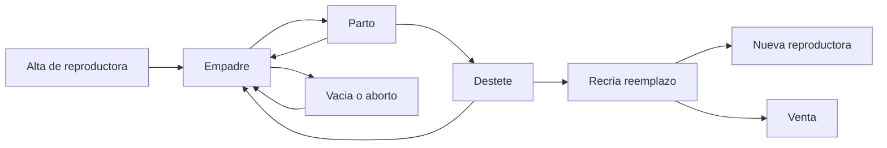

# Historias de usuario — Sistema de Control de Animales

**Facultad de Zootecnia — UNAS** · **65 historias** (41 núcleo + 24 cuyes)

Documento único con todas las historias de usuario y sus criterios de aceptación.

## Cómo leer este documento

| Parte | Alcance | IDs |
|---|---|---|
| [Parte 1 — Núcleo](#parte-1--núcleo-del-sistema) | Común a cualquier especie | NUC-01 a NUC-41 |
| [Parte 2 — Módulo Cuyes](#parte-2--módulo-cuyes) | Primer módulo de especie | CUY-01 a CUY-24 |

**Estructura del sistema:** especie → granja → área → jaula → animal. Cada granja maneja una sola especie. Ver [01-vision.md](01-vision.md).

**Formato de cada historia:** ID, como / quiero / para, criterios de aceptación, notas cuando aplica.

**Plantillas Excel:** [elicitacion/](elicitacion/)

Prefijos: `NUC-xx` (núcleo) y `CUY-xx` (cuyes). Los números están **agrupados por épica** (N1 = NUC-01 a NUC-08, N2 = NUC-09 a NUC-12, etc.). Si se agrega una historia nueva dentro de una épica, recibe el siguiente número libre de esa épica.

---

## Parte 1 — Núcleo del sistema

Aplica a **cualquier especie**. Un módulo (cuyes, conejos, chanchos) reutiliza estas historias y aporta su vocabulario, ciclo productivo y plantillas Excel.

---

## Épica N1 — Acceso y contexto de trabajo

### NUC-01 — Iniciar sesión
Como usuario del sistema, quiero iniciar sesión con mi usuario y contraseña para que solo personal autorizado registre o consulte los datos de la unidad.

Criterios de aceptación:
- Con credenciales correctas entro al sistema; con incorrectas veo un mensaje claro y no entro.
- El sistema me muestra únicamente las especies y granjas que tengo en mi alcance.
- Puedo cerrar sesión.
- La sesión caduca tras un tiempo de inactividad y pide volver a entrar.

### NUC-02 — Elegir especie y granja activa
Como usuario, quiero elegir primero el animal (especie) y luego la granja donde voy a trabajar, porque cada granja maneja un solo animal.

Criterios de aceptación:
- **Paso 1:** elijo la especie (cuyes, conejos, etc.) entre las que tengo granjas asignadas.
- **Paso 2:** elijo la granja entre las de esa especie que tengo en mi alcance.
- Puedo cambiar de especie o de granja sin cerrar sesión; al cambiar de especie, la lista de granjas se actualiza.
- Todo registro que cree queda asociado a la granja activa (y por tanto a su especie).
- Las áreas, jaulas y animales que veo son solo los de la granja activa.
- Si solo tengo una especie y una granja, el sistema las selecciona solas y no me pregunta.

### NUC-03 — Panel de la granja (dashboard)
Como encargado, quiero ver un panel con la situación actual de mi granja al entrar para saber de un vistazo cómo está el criadero sin abrir reportes.

Criterios de aceptación:
- Muestro población total de la granja y desglose por categoría (la especie viene dada por la granja).
- Muestro la ocupación por área y las jaulas que superan su capacidad.
- Muestro los movimientos del mes en curso: nacimientos, mortalidad y ventas.
- Muestro las alertas pendientes (ver épica N8).
- Ofrezco accesos directos a los registros más frecuentes del ciclo.
- Los números del panel coinciden con los del inventario (NUC-29).

Nota de módulo: las categorías y los accesos directos los define el módulo de especie.

### NUC-04 — Administrar granjas
Como superadmin, quiero crear granjas indicando la especie de cada una para que cada criadero maneje un solo animal con su propia población y reportes.

Criterios de aceptación:
- Registro nombre, **especie** (obligatoria e inmutable tras crear la granja), y ubicación geográfica (opcional).
- Una granja **no puede cambiar de especie** una vez creada; para otro animal se crea otra granja.
- Una granja se desactiva pero no se elimina si tiene registros; al desactivarla deja de admitir nuevos registros y sus datos siguen consultables.
- El nombre de la granja es único dentro de la institución y aparece en pantallas y reportes (por ejemplo "Granja Cuyes 1").
- Solo el superadmin crea o desactiva granjas; un admin consulta las de su alcance.

### NUC-05 — Asignar granjas a un usuario
Como quien administra cuentas, quiero asignar a cada usuario las granjas donde puede trabajar para que nadie registre ni consulte datos fuera de lo que le corresponde.

Criterios de aceptación:
- Asigno a un usuario una o varias granjas; la especie de cada una se deduce automáticamente.
- El usuario solo ve y opera dentro de esas granjas.
- Puedo quitar acceso a una granja sin borrar los registros que esa persona creó.
- Al asignar, el formulario muestra solo las granjas que **yo** tengo (regla de no escalada; ver NUC-08).

### NUC-06 — Superadmin crea cuentas de Admin
Como superadmin, quiero crear cuentas de administrador y asignarles granjas para delegar la gestión de cada criadero sin dar acceso total a todos.

Criterios de aceptación:
- Creo una cuenta con rol Admin indicando nombre, usuario, contraseña inicial y las granjas de su alcance.
- Un Admin solo ve y configura las granjas asignadas (cuyes, conejos, o ambas según las granjas que tenga).
- Puedo editar el alcance de un Admin (agregar o quitar granjas) o desactivar su cuenta.
- Solo el superadmin puede crear, editar o **desactivar** cuentas Admin (no se borran de la base de datos; quedan inactivas y sin login).

### NUC-07 — Admin crea cuentas operativas
Como admin, quiero crear cuentas de encargado, supervisor u otros roles operativos asignándoles granjas de mi alcance para que el personal de campo entre al sistema sin depender del superadmin.

Criterios de aceptación:
- Creo una cuenta eligiendo el rol operativo y las granjas donde puede trabajar.
- Solo puedo asignar granjas que **yo** tengo; el formulario no muestra granjas fuera de mi alcance.
- Puedo asignar una granja o varias, incluso de distintas especies si las tengo (por ejemplo Granja Cuyes 1 y Granja Conejos 1).
- Puedo editar o desactivar las cuentas que yo creé, pero no las de otro admin ni las del superadmin.
- No puedo crear cuentas Admin ni Superadmin.

### NUC-08 — Impedir que un usuario otorgue más permisos de los suyos
Como sistema, quiero bloquear cualquier intento de asignar granjas fuera del alcance de quien crea la cuenta para que nadie eleve sus propios permisos ni los de otro.

Criterios de aceptación:
- Al crear o editar un usuario, el sistema valida que las granjas asignadas sean un subconjunto de las del creador.
- Si intento asignar una granja que no tengo, el sistema lo rechaza con un mensaje claro.
- Un admin no puede modificarse a sí mismo para ampliar su alcance; solo el superadmin puede cambiar las granjas de un admin.
- El intento queda registrado en el log de auditoría (NUC-41).

---

## Épica N2 — Ficha de animal

### NUC-09 — Registrar un animal
Como encargado, quiero registrar un animal con su código, sexo, raza/línea, fecha de nacimiento, ubicación y particularidades para tener su ficha individual desde el inicio.

Criterios de aceptación:
- Campos obligatorios: código, sexo; la especie viene dada por la granja activa y no se elige aparte.
- El animal queda asignado a la granja activa y a una jaula; el área se deduce de la jaula.
- El código no se repite dentro de la granja (ver NUC-40).
- La raza/línea se elige de una lista, no se escribe libre.
- Al guardar, el animal aparece en el listado y en el inventario de esa granja.

Nota de módulo: la lista de razas/líneas y el nombre de la ubicación (jaula, poza, corral) los aporta el módulo.

### NUC-10 — Actualizar estado y particularidades sin perder historial
Como encargado, quiero cambiar el estado de un animal (por ejemplo dar de baja o marcar una particularidad) sin que se borren sus registros anteriores para conservar su historia completa.

Criterios de aceptación:
- El estado se elige de una lista cerrada (activo, baja por muerte, baja por venta, descarte, y los que agregue el módulo).
- Al dar de baja pido fecha y motivo, y el animal deja de contar en la población activa.
- Los eventos anteriores (partos, pesos, tratamientos) siguen visibles en la ficha.
- Puedo agregar una nota de particularidad con fecha, sin sobrescribir la anterior.

### NUC-11 — Buscar un animal por su código
Como encargado, quiero buscar un animal por su código y ver su historial completo para consultar su ficha sin buscar papeles.

Criterios de aceptación:
- Busco por código y encuentro el animal aunque escriba con o sin espacios y en mayúsculas o minúsculas.
- La ficha muestra los datos generales y la línea de tiempo de todos sus eventos ordenados por fecha.
- Si no hay coincidencia, el sistema lo dice claramente y ofrece registrar el animal.

### NUC-12 — Listar y filtrar animales
Como encargado, quiero ver la lista de animales con filtros por sexo, categoría, raza, área, jaula y estado para encontrar rápido el grupo con el que voy a trabajar.

Criterios de aceptación:
- Puedo combinar filtros y ver cuántos animales cumplen el resultado.
- Puedo filtrar por área y, dentro de ella, por jaula.
- Puedo ordenar por código, fecha de nacimiento o ubicación.
- Desde la lista entro a la ficha de cualquier animal.
- El resultado filtrado se puede exportar (ver NUC-36).

---

## Épica N3 — Áreas, jaulas y movimientos

Dentro de una granja el espacio se organiza en **áreas** (zonas con un propósito de manejo) y, dentro de cada área, en **jaulas**. El animal siempre está en una jaula.

### NUC-13 — Administrar las jaulas de la granja
Como admin de la granja, quiero definir las jaulas para registrar dónde está cada animal con un nombre uniforme.

Criterios de aceptación:
- Creo, edito y desactivo jaulas dentro de la granja.
- Cada jaula pertenece a un área (ver NUC-16) y no puede quedar sin área.
- El nombre es único dentro de la granja; el sistema evita duplicados por espacios o mayúsculas (hoy existen `Jaula: 47  `, `Jaula : 43` y `Jaula: 43` como si fueran distintas).
- Una jaula desactivada no se puede asignar, pero se conserva en el historial.
- Dos granjas distintas pueden tener una jaula con el mismo nombre sin que se confundan.

Nota de módulo: el módulo define cómo se llama la ubicación (jaula en cuyes, corral en chanchos).

### NUC-14 — Registrar un traslado dentro de la granja
Como encargado, quiero registrar el traslado de un animal o un grupo a otra jaula para saber siempre dónde está cada uno.

Criterios de aceptación:
- Registro fecha, jaula de origen (la actual), jaula de destino y motivo opcional.
- Puedo elegir la jaula de destino navegando por áreas.
- Puedo trasladar varios animales a la vez seleccionándolos de la lista, o mover una jaula completa a otra.
- Después del traslado, la ficha y los listados muestran la nueva jaula y su área.
- La fecha de traslado no puede ser anterior al nacimiento ni posterior a hoy.
- El traslado a otra granja no se hace aquí, sino con NUC-20.

### NUC-15 — Consultar historial de movimientos y ocupación
Como encargado, quiero ver el historial de traslados de un animal y qué animales hay en cada jaula para controlar el uso del espacio y rastrear un problema sanitario.

Criterios de aceptación:
- La ficha del animal muestra todos sus traslados con fecha, indicando jaula y área.
- Puedo abrir una jaula y ver los animales que están ahí hoy.
- Puedo ver qué animales estuvieron en una jaula en una fecha dada.
- Puedo ver el recorrido completo de un animal, incluidas las transferencias entre granjas.

### NUC-16 — Definir las áreas de una granja
Como admin de la granja, quiero agrupar las jaulas en áreas con un propósito para reflejar cómo está organizado realmente el criadero, por ejemplo que las jaulas 1, 2 y 3 sean el área de hembras.

Criterios de aceptación:
- Creo un área con nombre, propósito y, si corresponde, la especie a la que sirve.
- El propósito se elige de una lista que aporta el módulo de especie (por ejemplo empadre, recría, machos, cuarentena).
- Asigno jaulas al área y puedo mover una jaula de un área a otra sin perder su historial.
- Un área sin jaulas es válida (recién creada), pero una jaula sin área no.
- Puedo desactivar un área; sus jaulas deben reubicarse antes.

### NUC-17 — Ver la granja por áreas
Como encargado, quiero ver mi granja organizada por áreas y jaulas para ubicarme rápido y saber qué hay en cada zona.

Criterios de aceptación:
- Veo la lista de áreas con su propósito, cuántas jaulas tiene y cuántos animales hay en ellas.
- Al abrir un área veo sus jaulas con la cantidad de animales de cada una.
- Desde una jaula entro a la lista de animales que contiene.
- La vista distingue las jaulas vacías de las ocupadas.

### NUC-18 — Controlar la capacidad de las jaulas
Como encargado, quiero registrar la capacidad de cada jaula y ver su ocupación para no sobrecargarlas.

Criterios de aceptación:
- Cada jaula tiene una capacidad máxima de animales, configurable.
- Al asignar o trasladar animales, el sistema muestra la ocupación actual y avisa si se supera la capacidad.
- El aviso no bloquea el registro: puedo confirmarlo, y queda constancia de que se excedió.
- Puedo ver un listado de las jaulas que están por encima de su capacidad.
- Veo la ocupación total por área y por granja.

### NUC-19 — Avisar cuando un animal no corresponde al área
Como encargado, quiero que el sistema me avise si coloco un animal en un área destinada a otro tipo de animal para evitar errores de manejo, como dejar un macho en el área de hembras.

Criterios de aceptación:
- Si el sexo o la categoría del animal no corresponde al propósito del área, el sistema muestra un aviso claro antes de guardar.
- El aviso no bloquea: puedo confirmar indicando el motivo (por ejemplo, un empadre en curso).
- Puedo consultar el listado de animales que hoy están fuera del área que les corresponde.
- Las reglas de correspondencia entre categoría y propósito las define el módulo de especie.

### NUC-20 — Transferir animales entre granjas de la misma especie
Como encargado, quiero transferir animales de mi granja a otra granja del **mismo animal** para registrar movimientos entre criaderos sin volver a crear la ficha ni perder el historial.

Criterios de aceptación:
- Registro fecha, granja de destino (solo granjas de la **misma especie**), jaula de destino, animales incluidos y motivo.
- El sistema no permite transferir a una granja de otra especie (un cuy no va a una granja de conejos).
- El animal conserva su código, su historial de partos, pesos, sanidad y movimientos.
- La transferencia resta de la población de la granja de origen y suma a la de destino en la misma fecha; ninguna cantidad se pierde ni se duplica.
- La transferencia aparece en el inventario de ambas granjas como movimiento de entrada y de salida, separada de las ventas.
- Si el código del animal ya existe en la granja de destino, el sistema lo advierte y pide resolverlo antes de completar la transferencia.
- La transferencia requiere autorización de un supervisor o admin con alcance en ambas granjas.

---

## Épica N4 — Pesaje

### NUC-21 — Registrar el peso de un animal
Como encargado, quiero registrar el peso de un animal en una fecha para seguir su crecimiento y su condición.

Criterios de aceptación:
- Registro fecha y peso en gramos; ambos obligatorios.
- El sistema rechaza pesos negativos o fuera del rango válido de la especie y avisa si el valor parece un error de tipeo.
- La fecha no puede ser futura.
- El peso queda en la ficha y en el historial.

Nota de módulo: el rango válido de peso lo define cada especie.

### NUC-22 — Registrar un pesaje por lote
Como encargado, quiero pesar un grupo de animales en una sola pantalla para no crear un registro por vez cuando peso una jaula completa.

Criterios de aceptación:
- Elijo una fecha y una jaula, un área o un grupo, y el sistema lista los animales que contiene.
- Escribo los pesos uno tras otro sin recargar la pantalla.
- Puedo dejar animales sin peso y guardar solo los ingresados.
- Al guardar, el sistema informa cuántos pesos se registraron.

### NUC-23 — Ver la evolución del peso
Como encargado, quiero ver el historial de pesos de un animal o el promedio de un grupo para comparar crecimiento entre lotes o razas.

Criterios de aceptación:
- Veo la lista de pesos con su fecha y un gráfico simple de evolución.
- Veo la ganancia de peso entre dos pesajes consecutivos.
- Para un grupo, veo el peso promedio por fecha.

---

## Épica N5 — Sanidad

### NUC-24 — Registrar un tratamiento
Como encargado, quiero registrar un tratamiento aplicado a un animal o a un grupo (producto, dosis, vía, fecha de inicio y duración) para llevar el control sanitario de la unidad.

Criterios de aceptación:
- Registro tipo (preventivo o curativo), producto, dosis, vía de aplicación, fecha de inicio y duración en días.
- Puedo aplicarlo a un animal, a una jaula o área completa, o a un grupo seleccionado.
- Puedo anotar el diagnóstico o motivo y el responsable de la aplicación.
- El sistema calcula la fecha de término a partir del inicio y la duración.

### NUC-25 — Consultar el historial sanitario
Como encargado, quiero ver los tratamientos de un animal y los que están en curso en la granja para no repetir dosis ni olvidar un tratamiento a medias.

Criterios de aceptación:
- La ficha del animal muestra todos sus tratamientos con fecha y estado (en curso o terminado).
- Puedo ver la lista de tratamientos en curso en toda la granja y filtrarla por área.
- Puedo marcar un tratamiento como terminado antes de su fecha de término, indicando el motivo.

Nota: el Excel de inventario actual ya usa `Sanidad` como causa de mortalidad; esta épica permite relacionar tratamientos con las bajas registradas en NUC-26. Poder filtrar por área y jaula es lo que permite ubicar un brote en una zona concreta del criadero.

---

## Épica N6 — Mortalidad y ventas

### NUC-26 — Registrar una mortalidad
Como encargado, quiero registrar una mortalidad (fecha, raza/clasificación, categoría, cantidad y causa) sin que dependa de un parto o animal específico para reflejar las bajas tal como las anoto hoy.

Criterios de aceptación:
- Registro fecha, clasificación/raza, categoría, cantidad y causa opcional; la mortalidad pertenece a la granja activa.
- Puedo indicar el área o jaula donde ocurrió, para detectar zonas con problemas.
- Puedo registrar la muerte de un animal identificado (y entonces se da de baja su ficha) o una cantidad sin identificar.
- La cantidad debe ser mayor que cero y no puede superar la población de esa categoría en la granja.
- El registro se refleja de inmediato en la población actual y en el resumen mensual.
Nota de módulo: las categorías (por ejemplo gazapo, recría, reproductor) las define el módulo.

### NUC-27 — Registrar una venta
Como encargado, quiero registrar una venta (fecha, raza/clasificación, categoría, cantidad, comprador opcional) de forma independiente para llevar la salida de animales.

Criterios de aceptación:
- Registro fecha, clasificación/raza, categoría, cantidad y, si lo sé, comprador y precio; la venta pertenece a la granja activa.
- Puedo vender animales identificados (que quedan dados de baja por venta) o una cantidad por categoría.
- La cantidad no puede superar la población disponible de esa categoría en la granja.
- El traspaso de animales a otra granja de la institución no es una venta: se registra con NUC-20.
- La venta se refleja en la población actual y en el resumen mensual.
---

## Épica N7 — Inventario y población

### NUC-28 — Ver la población actual
Como encargado, quiero ver la población actual por raza y categoría, calculada automáticamente a partir de nacimientos, mortalidad y ventas, para no volver a contar a mano.

Criterios de aceptación:
- Veo una tabla de clasificación (raza/línea) por categoría con su cantidad y los totales de la granja.
- El cálculo parte de la población inicial y aplica nacimientos, mortalidad, ventas, transferencias entre granjas y cambios de categoría.
- Puedo ver la población a una fecha determinada, no solo la de hoy.
- Al abrir el detalle de una cifra, veo los registros que la componen.

### NUC-29 — Ver el resumen mensual
Como encargado, quiero ver el resumen mensual de nacimientos, mortalidad y ventas para tener el mismo cuadro que antes armaba a mano en el Excel de inventario.

Criterios de aceptación:
- Elijo mes y año y veo población inicial, nacimientos, mortalidad, ventas, transferencias y población final de la granja.
- El desglose respeta las categorías del Excel actual (reproductoras hembras, reproductores machos, gazapos, reemplazo hembras, reemplazo machos, venta hembras, venta machos, venta recría, descarte).
- Población final del mes es igual a población inicial del mes siguiente.
- Puedo exportar este cuadro (ver NUC-36).

### NUC-30 — Ver el consolidado por especie
Como supervisor o admin, quiero ver el total de todas las granjas de una especie para presentar el inventario completo de cuyes o de conejos, como ya lo hace el Excel actual con sus totales por animal.

Criterios de aceptación:
- Elijo una especie y veo la suma de todas sus granjas: población, nacimientos, mortalidad y ventas.
- Solo veo especies para las que tengo al menos una granja asignada.
- El consolidado suma granjas de la misma especie sin duplicar animales transferidos entre ellas.

### NUC-31 — Ver la población por área y por jaula
Como encargado, quiero ver cuántos animales hay en cada área y en cada jaula para revisar la distribución del criadero sin contar jaula por jaula.

Criterios de aceptación:
- Veo la población de la granja desglosada por área, y dentro de cada área por jaula.
- El desglose distingue por sexo y categoría.
- Al abrir una jaula veo la lista de animales que la componen.
- La suma de las áreas coincide con la población total de la granja (NUC-28).

### NUC-32 — Comparar granjas y ver el consolidado institucional
Como supervisor o superadmin, quiero ver todas las granjas juntas y compararlas para saber cómo va cada criadero y presentar el total de la facultad.

Criterios de aceptación:
- Veo una tabla con una fila por granja (indicando su especie): población, nacimientos, mortalidad y ventas del periodo elegido.
- Veo totales por especie (suma de granjas de cuyes, suma de granjas de conejos) y el total institucional.
- Puedo filtrar por especie antes de comparar granjas.
- Puedo abrir una granja desde el consolidado y ver su inventario detallado.
- Un admin ve solo las granjas de su alcance; el superadmin ve todas.

---

## Épica N8 — Alertas

### NUC-33 — Ver las alertas pendientes
Como encargado, quiero ver en el panel las tareas que se vienen o están vencidas para no perder una fecha clave del ciclo, que es justamente cuando uso el sistema.

Criterios de aceptación:
- Veo las alertas de la granja activa ordenadas por fecha, distinguiendo las próximas de las vencidas.
- Cada alerta indica el animal o grupo, su jaula, el tipo de tarea y la fecha prevista.
- Desde la alerta entro directo a la pantalla donde registro ese evento.
- Las alertas se calculan solas a partir de los eventos registrados; no las creo a mano.

Nota de módulo: los tipos de alerta y sus plazos los define el módulo de especie.

### NUC-34 — Atender o descartar una alerta
Como encargado, quiero marcar una alerta como atendida o descartarla para que la lista refleje lo que realmente falta hacer.

Criterios de aceptación:
- Al registrar el evento correspondiente, la alerta se cierra sola.
- Puedo descartar una alerta indicando el motivo.
- Una alerta cerrada o descartada sale de la lista de pendientes pero queda en el historial.

### NUC-35 — Configurar los plazos de las alertas
Como admin, quiero configurar los plazos que disparan cada alerta para ajustarlos al manejo real de cada granja y de cada especie de mi alcance.

Criterios de aceptación:
- Puedo cambiar los días de anticipación de cada tipo de alerta.
- Cada especie tiene sus propios plazos, y cada granja puede ajustarlos a su manejo.
- Puedo desactivar un tipo de alerta que la granja no use.
- Los cambios afectan al cálculo de alertas futuras, no al historial.

---

## Épica N9 — Reportes y exportación

### NUC-36 — Exportar a Excel con el formato de la facultad
Como encargado, quiero exportar los datos a Excel con el mismo formato que usa la facultad para entregar los reportes oficiales sin rehacerlos.

Criterios de aceptación:
- El archivo generado conserva encabezados, orden de columnas y títulos de la plantilla oficial de la facultad.
- El archivo se descarga listo para entregar, sin necesidad de retocarlo.
- La exportación incluye solo la granja, especie y periodo seleccionados.
- Si tengo acceso a varias granjas, puedo exportar una granja o el consolidado de todas.
- Si no hay datos en el periodo, el sistema avisa antes de generar el archivo.
Nota de módulo: cada módulo aporta sus plantillas; las de cuyes están en [Parte 2 — Módulo Cuyes](#parte-2--módulo-cuyes).

### NUC-37 — Elegir el alcance de la exportación
Como encargado, quiero elegir qué exporto (periodo, categoría, tipo de reporte) para entregar exactamente lo que me piden.

Criterios de aceptación:
- Elijo el tipo de reporte disponible para la granja activa (la especie viene dada por la granja).
- Elijo un rango de fechas o un mes cerrado.
- Puedo exportar el resultado de una lista filtrada (NUC-12), por ejemplo los animales de un área.
- El archivo indica en su encabezado la institución, la granja, la especie y el periodo exportado.

---

## Épica N10 — Confiabilidad de los datos

### NUC-38 — Guardado sin pérdida de información
Como encargado, quiero que lo que ingreso quede guardado sin depender de un botón que puedo olvidar para no perder información como pasaba con las hojas de papel.

Criterios de aceptación:
- El sistema conserva lo escrito en un formulario largo aunque cierre la pantalla o se corte la conexión, y me ofrece retomarlo.
- Cada registro guardado muestra confirmación visible.
- Si el guardado falla, el sistema lo dice y no da por registrado el dato.

### NUC-39 — Validar los datos obligatorios y sus formatos
Como encargado, quiero que el sistema valide los datos obligatorios y sus formatos para evitar los registros incompletos y erróneos que hoy aparecen en los Excel.

Criterios de aceptación:
- No puedo guardar un evento sin fecha ni sin los campos obligatorios de ese evento.
- Las fechas se ingresan con un selector y el sistema rechaza fechas imposibles; hoy existen en el Excel `27/20/2025`, `09/10/205`, `28/112025` y `29/2/2025`.
- Las cantidades y pesos aceptan solo números positivos dentro de un rango razonable.
- Los estados y categorías se eligen de una lista cerrada, no se escriben libres; hoy conviven `VACIA`, `Vacia`, `vacia` y `Vacía`.
- Los mensajes de error indican qué campo corregir.

### NUC-40 — Códigos únicos y sin variantes
Como encargado, quiero que el sistema controle los códigos de los animales para que no existan duplicados ni variantes del mismo código.

Criterios de aceptación:
- El código es único por granja; dos granjas distintas (incluso de la misma especie) pueden usar el mismo código sin conflicto, y los reportes indican la granja.
- El sistema normaliza espacios y mayúsculas antes de comparar; hoy existen `UM24` y `UM 24`, además de `Uum26` y `Uum01`.
- Al intentar repetir un código, el sistema lo impide y muestra el animal que ya lo usa.
- Puedo reutilizar el código de un animal dado de baja solo si lo confirmo expresamente.

### NUC-41 — Trazabilidad de los registros
Como supervisor o admin, quiero saber quién registró o modificó cada dato y cuándo para poder aclarar cualquier duda sobre la información entregada a la facultad.

Criterios de aceptación:
- Cada registro guarda autor y fecha de creación.
- Al editar o anular, se guarda autor, fecha y valor anterior.
- Los registros anulados no desaparecen: quedan marcados como anulados y dejan de contar en los cálculos.
- Puedo consultar el historial de cambios de un registro.

---

### Resumen — Núcleo

| Épica | Historias |
|---|---|
| N1 Acceso y contexto | NUC-01 a NUC-08 |
| N2 Ficha de animal | NUC-09 a NUC-12 |
| N3 Áreas, jaulas y movimientos | NUC-13 a NUC-20 |
| N4 Pesaje | NUC-21 a NUC-23 |
| N5 Sanidad | NUC-24 a NUC-25 |
| N6 Mortalidad y ventas | NUC-26 a NUC-27 |
| N7 Inventario | NUC-28 a NUC-32 |
| N8 Alertas | NUC-33 a NUC-35 |
| N9 Reportes | NUC-36 a NUC-37 |
| N10 Confiabilidad | NUC-38 a NUC-41 |

Total: **41 historias de núcleo** (NUC-01 a NUC-41).

---

## Parte 2 — Módulo Cuyes

Primer módulo de especie. Se apoya en la Parte 1 y agrega lo propio del cuy: categorías, áreas, ciclo empadre–parto–destete y exportación Excel.

Las historias funcionan dentro de una **granja de cuyes** (especie fijada al crear la granja).

---

## Ciclo productivo que cubre el módulo

---

## Épica C1 — Configuración del módulo

### CUY-01 — Catálogo de razas y líneas
Como administrador, quiero mantener la lista de razas y líneas de cuy para que el encargado las elija y no las escriba a mano.

Criterios de aceptación:
- La lista inicial es la que ya usa la unidad: Perú, Andina, Mantaro, Inti, Tipo 2, Tipo 3, Tipo 4 y Línea criolla negra.
- Puedo agregar o desactivar una raza sin afectar los registros anteriores.
- Al registrar un animal o un evento, la raza se elige de esta lista.
- Una raza desactivada no aparece para nuevos registros, pero sigue apareciendo en los reportes históricos.

### CUY-02 — Categorías del cuy
Como administrador, quiero que el módulo defina las categorías del cuy para que la población y los reportes usen los mismos grupos que la facultad.

Criterios de aceptación:
- Categorías definidas: gazapo, recría/reemplazo (hembra y macho), reproductora, reproductor y descarte.
- El sistema propone el cambio de categoría según la edad y el evento (por ejemplo, de gazapo a recría al destete), y el encargado lo confirma.
- Estas categorías son las que usan mortalidad (NUC-26), ventas (NUC-27) e inventario (NUC-28).
- Los plazos de cada transición son configurables.

### CUY-03 — Jaulas como ubicación
Como encargado, quiero que la ubicación del módulo cuyes sea la jaula para registrar dónde está cada animal igual que en el registro actual.

Criterios de aceptación:
- La ubicación se llama "Jaula" en todas las pantallas del módulo.
- Las jaulas se numeran de forma uniforme (el Excel actual tiene desde `Jaula: 01` hasta `Jaula: 116`).
- Cada jaula pertenece a un área de la granja (NUC-16) y al abrirla veo qué animales hay dentro (NUC-15).
- Una jaula no admite dos nombres equivalentes con distinto espaciado.

### CUY-04 — Áreas del criadero de cuyes
Como administrador, quiero que el módulo proponga los propósitos de área propios del criadero de cuyes para organizar las jaulas según el manejo real, por ejemplo que un grupo de jaulas sea el área de hembras.

Criterios de aceptación:
- El módulo ofrece esta lista de propósitos al crear un área: empadre, gestación y maternidad, recría de hembras, recría de machos, reproductores machos, engorde y descarte, y cuarentena o enfermería.
- Cada granja arma sus áreas con los propósitos que use; no está obligada a tenerlas todas.
- Puedo agregar un propósito propio si la granja maneja el criadero de otra forma.
- Al crear el área indico qué jaulas la componen (por ejemplo, jaulas 1, 2 y 3 en el área de recría de hembras).

### CUY-05 — Correspondencia entre categoría del cuy y propósito del área
Como encargado, quiero que el sistema conozca qué categoría de cuy corresponde a cada propósito de área para que me avise cuando un animal queda donde no debe.

Criterios de aceptación:
- El módulo define la correspondencia: hembras reproductoras en empadre, gestación y maternidad; recría hembra y recría macho en sus áreas; reproductores en el área de machos; descarte en engorde.
- Al mover un animal a un área que no le corresponde, el sistema aplica el aviso de NUC-19 sin bloquear el registro.
- El área de empadre admite un macho junto a las hembras sin generar aviso, porque ese es su propósito.
- Puedo ver el listado de cuyes que hoy están fuera del área que les corresponde.

---

## Épica C2 — Reproductoras (hembras)

### CUY-06 — Registrar una hembra reproductora
Como encargado del criadero, quiero registrar una nueva hembra reproductora (código, jaula, raza, fecha de nacimiento, particularidades) para tener su ficha individual desde el inicio.

Criterios de aceptación:
- Registro código de reproductora, jaula, raza, fecha de nacimiento y particularidades; el área se deduce de la jaula elegida.
- El código es único dentro de la granja (formato usado hoy: `U01`, `U102`, `U490`).
- Al guardar, la hembra queda en categoría reproductora y suma a la población.
- Su ficha queda lista para recibir empadres y partos.

### CUY-07 — Registrar el empadre de una hembra
Como encargado, quiero registrar un empadre de una hembra (macho asignado, fecha de empadre) para llevar el control de cruces.

Criterios de aceptación:
- Registro el código del macho de empadre y la fecha.
- El macho se elige de los reproductores activos; el sistema muestra su código.
- La fecha de empadre no puede ser futura ni anterior al último parto registrado.
- El empadre abre un ciclo abierto en la ficha de la hembra y genera la alerta de parto próximo (CUY-18).

### CUY-08 — Registrar el parto
Como encargado, quiero registrar el parto de una hembra (fecha de nacimiento de las crías, tamaño de camada, muertos al nacimiento, peso individual por cría separado por sexo M/H) para calcular los indicadores reproductivos.

Criterios de aceptación:
- Registro fecha de nacimiento, tamaño de camada al nacimiento y muertos al nacimiento.
- Ingreso el peso en gramos de cada cría, indicando si es macho o hembra.
- El sistema calcula solo el **peso promedio al nacimiento** (hoy es una fórmula del Excel que se corrompe al editar a mano).
- Los muertos al nacimiento no pueden superar el tamaño de camada.
- El parto se asocia al empadre abierto de la hembra y suma nacimientos al resumen mensual.
- Las crías vivas ingresan a la población como gazapos.

### CUY-09 — Registrar el destete
Como encargado, quiero registrar el destete de una camada (fecha, tamaño de camada al destete, muertos al destete, peso individual por cría) para completar el ciclo del parto.

Criterios de aceptación:
- Registro fecha de destete, tamaño de camada al destete, muertos al destete y peso en gramos de cada cría.
- El sistema calcula el **peso promedio al destete**.
- El tamaño de camada al destete no puede superar las crías vivas al nacimiento.
- La fecha de destete debe ser posterior a la del parto.
- Al destetar, las crías pasan de gazapo a recría/reemplazo (CUY-02).
- Desde el mismo destete puedo trasladar las crías a las jaulas de recría que corresponden a su sexo, sin registrar el traslado aparte.

### CUY-10 — Registrar hembra vacía, aborto u otra particularidad
Como encargado, quiero marcar una hembra como "vacía" (empadre sin preñez), con aborto o con otra particularidad (por ejemplo "murió") para mantener su historial actualizado sin perder los datos anteriores.

Criterios de aceptación:
- Elijo el resultado del ciclo de una lista cerrada: vacía, aborto, murió, u otra particularidad registrada.
- El resultado se guarda con su fecha y cierra el ciclo de empadre abierto, dejando la hembra lista para un nuevo empadre (salvo baja).
- Los partos y datos anteriores de la hembra se conservan íntegros.
- Si el resultado es "murió", la hembra se da de baja y se registra la mortalidad correspondiente (NUC-26).
- En el Excel actual aparecen estados como `VACIA`, `ABORTO`, `MURIO`, `vendido descarte`, `Resulto ser macho`, `con cria`; el sistema los unifica en la lista cerrada.

### CUY-11 — Ver la ficha completa de una reproductora
Como encargado, quiero ver la ficha de una hembra con todos sus partos en una sola vista para consultarla igual que la hoja de "Registro Individual" pero sin papeles.

Criterios de aceptación:
- La ficha muestra los datos generales (código, jaula, raza, nacimiento, particularidades) y la lista de partos.
- Cada parto muestra macho de empadre, fecha de empadre, fecha de nacimiento, camada y muertos al nacimiento, pesos y promedio, y los datos del destete.
- Veo los indicadores acumulados de la hembra: número de partos, promedio de camada y crías destetadas.
- Desde la ficha puedo exportar su registro individual (CUY-22).

---

## Épica C3 — Reproductores (machos)

### CUY-12 — Registrar un macho reproductor
Como encargado, quiero registrar un nuevo macho reproductor (código, raza, fecha de nacimiento, particularidades) para tener su ficha individual.

Criterios de aceptación:
- Registro código de reproductor, raza, fecha de nacimiento y particularidades.
- El código es único (formato usado hoy: `UM01`, `UM24`, `UM47`).
- Al guardar, queda en categoría reproductor y disponible para asignarlo a empadres.

### CUY-13 — Registrar un evento de empadre de un macho
Como encargado, quiero registrar un evento de empadre de un macho (fecha, hembras empadradas, cantidad de hembras, cantidad preñadas, peso antes y después) para llevar su historial reproductivo.

Criterios de aceptación:
- Registro fecha de empadre, los códigos de las hembras empadradas, cantidad de hembras, cantidad de preñadas y peso antes y después del empadre en gramos.
- Puedo seleccionar las hembras eligiendo la jaula de empadre (CUY-15) en lugar de escribir cada código.
- La cantidad de hembras se calcula sola a partir de los códigos seleccionados y puedo corregirla.
- La cantidad de preñadas no puede superar la cantidad de hembras.
- El empadre queda reflejado tanto en la ficha del macho como en la de cada hembra (CUY-07), sin doble digitación.

### CUY-14 — Ver los resultados reproductivos del macho
Como encargado, quiero ver los nacimientos que resultaron de los empadres de un macho (tamaño de camada, crías macho y hembra) para evaluar su desempeño.

Criterios de aceptación:
- La ficha del macho lista sus empadres y, por cada uno, el tamaño de camada al nacimiento y el número de crías macho y hembra.
- Los datos provienen de los partos ya registrados; no se digitan otra vez.
- Veo el porcentaje de preñez del macho y el promedio de camada de su descendencia.

### CUY-15 — Empadre por jaula
Como encargado, quiero registrar el empadre eligiendo la jaula donde puse al macho con sus hembras para no digitar una por una las hembras que ya están ahí.

Criterios de aceptación:
- Al registrar un empadre elijo una jaula del área de empadre y el sistema propone las hembras que están en ella.
- Puedo quitar o agregar hembras a la propuesta antes de guardar.
- El sistema completa solo la cantidad de hembras a partir de la selección (CUY-13).
- El empadre queda registrado en la ficha del macho y en la de cada hembra a la vez.
- Al cerrar el empadre puedo devolver el macho a su área de reproductores en un solo paso.

---

## Épica C4 — Pesos y alertas propios del cuy

### CUY-16 — Rangos y controles de peso del cuy
Como encargado, quiero que el sistema conozca los rangos de peso normales del cuy para que avise cuando un peso ingresado sea imposible o esté fuera de lo esperado.

Criterios de aceptación:
- El pesaje del núcleo (NUC-21) usa gramos como unidad en todo el módulo.
- El sistema avisa si un peso está fuera del rango esperado para la categoría (cría al nacimiento, destete, recría, reproductor) y me deja confirmarlo si es correcto.
- Los pesos registrados en parto, destete y empadre aparecen también en el historial de pesos del animal.
- Los rangos son configurables por la unidad.

### CUY-17 — Plazos del ciclo del cuy
Como administrador, quiero configurar los plazos del ciclo del cuy para que las alertas y las transiciones de categoría se ajusten al manejo de la unidad.

Criterios de aceptación:
- Configuro la duración de gestación, los días hasta el destete, la edad de paso a recría y la edad mínima de empadre.
- Los valores iniciales se proponen según el manejo habitual del cuy (gestación cercana a 67 días, destete alrededor de los 14 días) y deben confirmarse con el encargado antes de implementarlos.
- Cambiar un plazo recalcula las alertas pendientes, no los eventos ya registrados.

### CUY-18 — Alertas del ciclo del cuy
Como encargado, quiero recibir avisos de las fechas clave del cuy para entrar al sistema justo cuando toca registrar algo, ya que no lo uso a diario.

Criterios de aceptación:
- El sistema genera alertas de: parto próximo (según fecha de empadre y gestación), destete pendiente, empadre disponible tras el destete, y revisión de hembra sin preñez confirmada.
- Cada alerta indica la hembra y su jaula, y me lleva a la pantalla de registro correspondiente.
- La alerta se cierra al registrar el evento (NUC-34).

---

## Épica C5 — Reproductores élite

### CUY-19 — Ranking de reproductores
Como jefe de unidad, quiero ver un ranking de las reproductoras y los reproductores según su desempeño para decidir cuáles conservo y cuáles descarto.

Criterios de aceptación:
- El ranking usa datos ya registrados: número de partos, tamaño promedio de camada, crías destetadas, mortalidad de la camada, peso promedio al nacimiento y al destete y, en machos, porcentaje de preñez.
- Puedo filtrar el ranking por raza y por categoría.
- Cada fila muestra los indicadores que sustentan la posición, no solo un puntaje.
- Los animales con muy pocos eventos se marcan como "datos insuficientes" en lugar de aparecer arriba por azar.

### CUY-20 — Configurar la ponderación del ranking
Como jefe de unidad, quiero definir cuánto pesa cada indicador en el ranking para que refleje el criterio de mejoramiento de la unidad y no una fórmula fija.

Criterios de aceptación:
- Asigno un peso a cada indicador y el ranking se recalcula.
- Puedo guardar la configuración para que se use siempre.
- El sistema muestra qué ponderación se aplicó al generar el ranking.

### CUY-21 — Marcar para descarte o reemplazo desde el ranking
Como encargado, quiero marcar desde el ranking los animales a descartar o a promover como reemplazo para llevar esa decisión al registro sin anotarla aparte.

Criterios de aceptación:
- Desde el ranking marco un animal como descarte o como reemplazo.
- El cambio actualiza su categoría (CUY-02) y queda registrado con fecha y responsable.
- Los marcados como descarte aparecen agrupados para la próxima venta (NUC-27).

---

## Épica C6 — Exportación a Excel de la unidad

Las tres plantillas están en [elicitacion/](elicitacion/) y deben respetarse tal como las recibe la facultad.

### CUY-22 — Exportar el Registro Individual de Hembras
Como encargado, quiero exportar el registro individual de las hembras con el formato actual para entregarlo sin rehacerlo.

Criterios de aceptación:
- El archivo respeta el encabezado "UNIDAD DE CUYES Y CONEJOS - FACULTAD DE ZOOTECNIA - UNAS / Registro Individual de Cuyes".
- Por cada hembra incluye código de reproductora, jaula, raza, fecha de nacimiento y particularidades.
- Por cada parto incluye las columnas actuales: código de macho de empadre, fecha de empadre, fecha de nacimiento, tamaño de camada al nacimiento, muertos al nacimiento, peso al nacimiento por cría (gr) separado en M y H, peso promedio de nacimiento, fecha de destete, tamaño de camada al destete, muertos al destete, peso en gramos al destete y peso promedio al destete.
- Los promedios salen calculados como valores correctos, sin fórmulas rotas.
- Puedo exportar una hembra o todas.

### CUY-23 — Exportar el Registro Individual de Machos
Como encargado, quiero exportar el registro individual de los machos con su formato actual.

Criterios de aceptación:
- Incluye datos del reproductor: código, raza, fecha de nacimiento y particularidades.
- Por cada empadre incluye fecha de empadre, códigos de hembras, cantidad de hembras, cantidad de preñadas, peso antes del empadre y peso después del empadre.
- Incluye el bloque de nacimientos con tamaño de camada al nacimiento y crías M y H.
- Puedo exportar un macho o todos.

### CUY-24 — Exportar el Inventario mensual
Como encargado, quiero exportar el registro de mortalidad, ventas y población mensual con el formato del Excel de inventario para el reporte anual de la unidad.

Criterios de aceptación:
- El archivo mantiene el encabezado "REGISTRO DE MORTALIDAD Y VENTA MENSUAL" con la unidad y el año.
- Incluye los meses del año con nacimientos, mortalidad y ventas, y las filas de población inicial, mortalidad y población final.
- Mantiene la clasificación por raza y las categorías actuales: reproductoras hembras, reproductores machos, gazapos, reemplazo hembras, reemplazo machos, venta hembras, venta machos, venta recría, descarte y recría.
- Mantiene la separación entre cuyes y conejos con sus totales, como el archivo histórico de la unidad. Hoy cada especie vive en **su propia granja**; el export es por granja de cuyes, y el consolidado institucional (NUC-30) suma todas las granjas de cuyes o de conejos.
- Elijo el año a exportar.

---

### Resumen — Cuyes

| Épica | Historias |
|---|---|
| C1 Configuración del módulo | CUY-01 a CUY-05 |
| C2 Reproductoras | CUY-06 a CUY-11 |
| C3 Reproductores | CUY-12 a CUY-15 |
| C4 Pesos y alertas del cuy | CUY-16 a CUY-18 |
| C5 Reproductores élite | CUY-19 a CUY-21 |
| C6 Exportación a Excel | CUY-22 a CUY-24 |

Total: **24 historias del módulo cuyes** (CUY-01 a CUY-24).

---

## Resumen general

| Parte | Épicas | Total |
|---|---|---|
| Núcleo | N1 a N10 | 41 historias |
| Cuyes | C1 a C6 | 24 historias |
| **Total** | | **65 historias** |

Documentos relacionados: [01-vision.md](01-vision.md) · [02-actores.md](02-actores.md) · [05-modulos-futuros.md](05-modulos-futuros.md) · [06-backlog.md](06-backlog.md)
