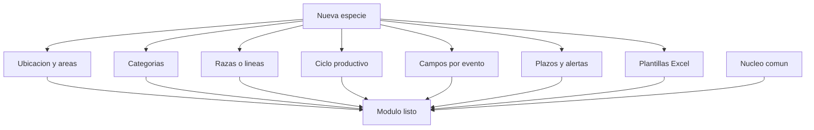

# Módulos futuros y extensión del sistema

Este documento explica **cómo se agrega una especie nueva** al sistema y qué quedó deliberadamente fuera de la fase actual. No contiene historias detalladas: esas se escriben cuando la unidad correspondiente entre al proyecto. Las historias del núcleo y del módulo cuyes están en [historias-de-usuario.md](historias-de-usuario.md).

---

## 1. Qué aporta el núcleo y qué aporta cada módulo

El núcleo ya resuelve lo que es igual para cualquier animal. Un módulo nuevo **no reimplementa** nada de esto:

| Ya resuelto por el núcleo | Historia |
|---|---|
| Acceso, dashboard, granjas, roles y alcance | NUC-01 a NUC-08 |
| Ficha, búsqueda y listados | NUC-09 a NUC-12 |
| Áreas, jaulas, traslados y transferencias | NUC-13 a NUC-20 |
| Pesaje individual y por lote | NUC-21 a NUC-23 |
| Sanidad y tratamientos | NUC-24 a NUC-25 |
| Mortalidad y ventas | NUC-26 a NUC-27 |
| Inventario, resumen mensual y consolidado | NUC-28 a NUC-32 |
| Alertas | NUC-33 a NUC-35 |
| Exportación a Excel | NUC-36 a NUC-37 |
| Guardado, validación y trazabilidad | NUC-38 a NUC-41 |

La estructura **granja → área → jaula** también es del núcleo: una especie nueva no la vuelve a construir, solo le pone nombre y propósitos propios.

## 2. Lista de comprobación para agregar una especie

Para incorporar un animal nuevo hay que definir estos siete puntos, y solo estos:

1. **Nombre de la ubicación y propósitos de área** — cómo se llama la jaula (poza, corral, galpón, potrero) y qué áreas tiene el criadero de esa especie.
2. **Categorías del animal** — los grupos que usa la granja para contar la población y reportar, y a qué área corresponde cada uno.
3. **Razas o líneas** — el catálogo que se elige al registrar.
4. **Ciclo productivo** — los eventos propios y su orden (en cuyes: empadre, parto, destete).
5. **Campos propios de cada evento** — lo que se anota en cada uno y sus validaciones.
6. **Plazos del ciclo** — gestación, destete, edad de empadre, cambios de categoría; alimentan las alertas.
7. **Plantillas de Excel** — los formatos que esa unidad entrega a la facultad.

Cómo se ve la misma lista aplicada a cuyes, que es el módulo ya escrito:

| Punto | En el módulo Cuyes |
|---|---|
| Ubicación y áreas | Jaula (CUY-03); áreas de empadre, maternidad, recría, machos, engorde y cuarentena (CUY-04) |
| Categorías | Gazapo, recría/reemplazo, reproductora, reproductor, descarte (CUY-02), con su área correspondiente (CUY-05) |
| Razas | Perú, Andina, Mantaro, Inti, Tipo 2/3/4, Línea criolla negra (CUY-01) |
| Ciclo | Empadre, parto, destete, vacía/aborto (CUY-07 a CUY-10) |
| Campos por evento | Camada, muertos, peso por cría M/H, pesos antes/después del empadre |
| Plazos | Gestación, destete, edad de empadre (CUY-17) |
| Excel | Registro de hembras, de machos e inventario (CUY-22 a CUY-24) |

## 3. Módulo Conejos (el más cercano)

Es el candidato natural: la unidad se llama **"Unidad de Cuyes y Conejos"** y el Excel de inventario **ya tiene columnas de conejos** con sus totales (`TOTAL CONEJOS`, `Conejos`).

Diferencias previsibles frente a cuyes:

- Ciclo similar (empadre, parto, destete) pero con plazos distintos y palpación de gestación.
- Categorías propias: gazapo, engorde, reproductora, reproductor.
- El inventario conjunto del Excel actual (cuyes + conejos en una hoja) se obtiene en el **consolidado por especie** (NUC-30): suma todas las granjas de cuyes y, aparte, todas las de conejos.
- Si los conejos ocupan otra instalación, se modelan como **Granja Conejos** (especie conejos), no como otra especie dentro de la granja de cuyes.

Trabajo pendiente antes de escribir sus historias: revisar si la unidad lleva registro individual de conejos o solo el conteo mensual que aparece hoy en el inventario.

## 4. Módulo Chanchos (porcinos)

Diferencias previsibles frente a cuyes:

- Ubicación: **corral**, con manejo por lotes, agrupado en áreas de gestación, maternidad, recría y engorde.
- Categorías: lechón, destete/recría, engorde, marrana, verraco, reemplazo.
- Ciclo: servicio o inseminación, confirmación de preñez, parto con nacidos vivos, nacidos muertos y momias, destete por camada.
- Identificación individual más estricta (aretes, tatuajes) y control de peso mucho más frecuente que en cuyes.
- Reportes propios de la unidad porcina.

Trabajo pendiente antes de escribir sus historias: elicitación con el encargado de la unidad porcina y sus formatos de registro actuales.

## 5. Fuera de alcance de la fase actual

Están registrados aquí para no perderlos, con el motivo por el que no entran ahora:

| Tema | Motivo |
|---|---|
| **Beneficio / faena** (peso de carcasa, rendimiento) | No lo solicitó la unidad en la elicitación y se excluyó al definir el alcance |
| **Reportes en PDF** | El entregable oficial de la facultad es Excel |
| **Aplicación móvil y notificaciones push** | El sistema es web; el uso es en fechas clave, desde la unidad |
| **Módulo económico** (costos, alimentación, rentabilidad) | Ninguna historia de la elicitación lo pide |
| **Trabajo sin conexión** | Requiere sincronización; se evaluará si el criadero tiene mala señal |
| **Genealogía multigeneracional** | El registro actual solo relaciona padres y camada; se puede construir después sobre los mismos datos |
| **Importación del Excel histórico** | Depende de decidir cuánto historial se migra; ver nota abajo |

## 6. Nota sobre la migración del historial

Los Excel actuales tienen cientos de reproductoras (`U01` a `U490`) y varios años de inventario. Antes de implementar hay que decidir con la unidad:

- Si se carga todo el historial, solo la población activa, o se arranca desde una fecha de corte.
- Qué hacer con los registros que hoy están mal escritos (fechas imposibles, códigos duplicados como `UM24` y `UM 24`), ya que el sistema no los aceptará tal cual.

Esta decisión es previa al desarrollo y conviene resolverla en la siguiente fase.
