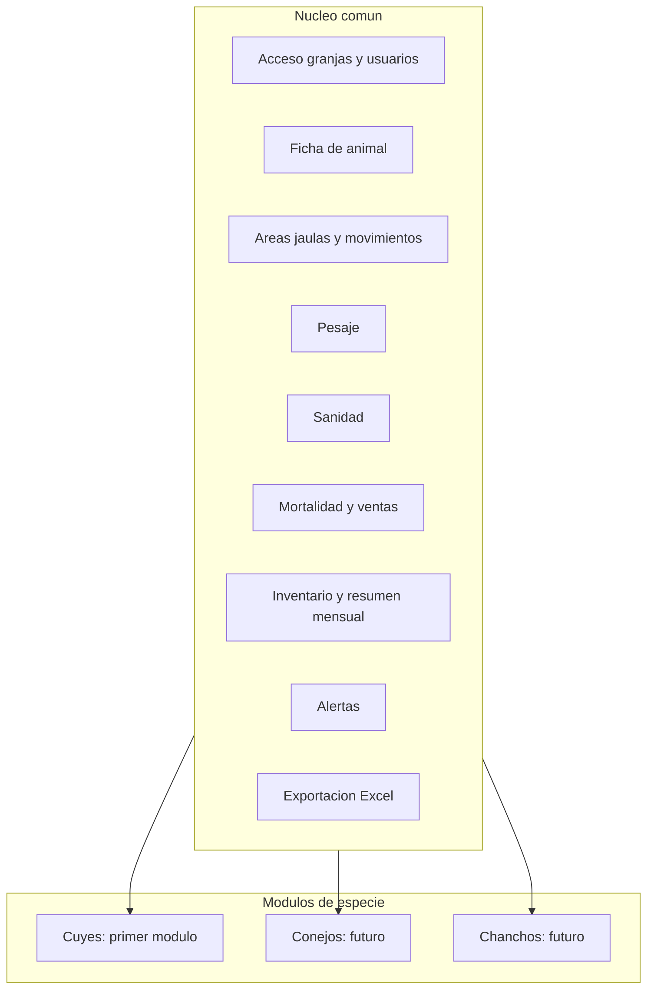
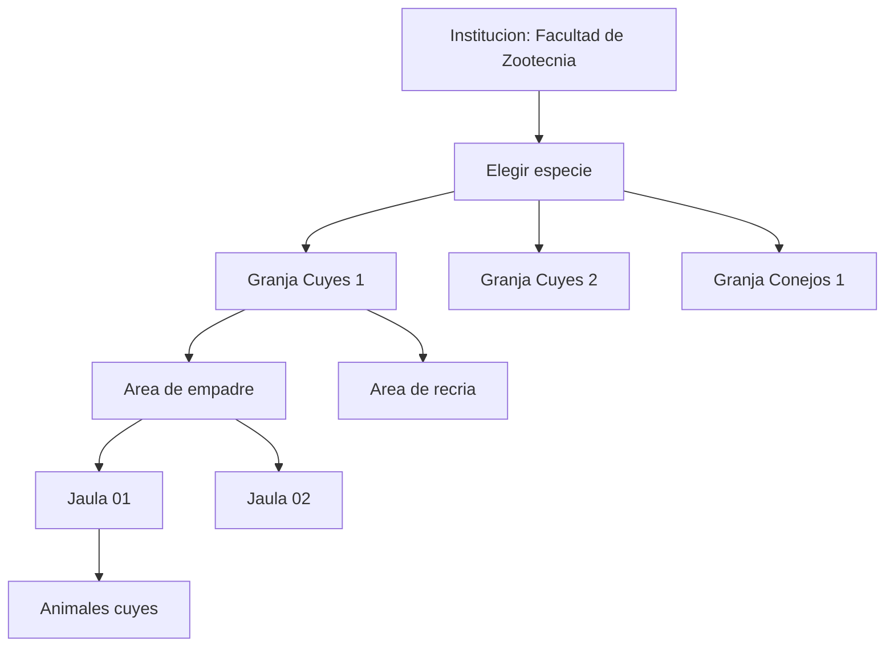

# Visión del producto — Sistema de Control de Animales

**Facultad de Zootecnia — UNAS**
Fase actual: **Ingeniería de requisitos (historias de usuario)**. No se escribe código en esta fase.

---

## 1. Problema

El registro de los criaderos se hace **primero a mano en hojas de papel y luego se transcribe a Excel**. Eso genera doble trabajo, demoras y errores de transcripción.

La revisión de los archivos actuales ([elicitacion/](elicitacion/)) confirma el problema con evidencia real:

| Evidencia encontrada en los Excel | Qué demuestra |
|---|---|
| Fechas inválidas: `09/10/205`, `27/20/2025`, `28/112025`, `04/0182026`, `29/2/2025` | No hay validación de fecha |
| Códigos con variantes: `UM24` y `UM 24`, `Uum26`, `Uum01` | No hay control de unicidad ni formato de código |
| Estados escritos de distinta forma: `VACIA`, `Vacia`, `vacia`, `Vacía`, `Vacio` | Texto libre donde debería haber una lista cerrada |
| Celdas dañadas: `Peso en gr+Q89:V90amos al destete`, `Jaula: D211:W21` | Fórmulas y encabezados corrompidos al editar a mano |
| Espacios sobrantes: `Jaula: 47  `, `Jaula : 43` | Los mismos datos no agrupan bien al totalizar |

Estos errores no son hipotéticos: están hoy en los archivos oficiales de la unidad.

## 2. Producto

Un **sistema web único de control de animales**, no un sistema por especie.

- Un **núcleo** común, válido para cualquier animal: acceso, fichas, ubicaciones, pesos, sanidad, mortalidad, ventas, inventario, alertas y exportación a Excel.
- **Módulos por especie**, que agregan el ciclo productivo y el vocabulario propio de cada animal.
- El **primer módulo** es **Cuyes** (Unidad de Cuyes y Conejos).
- **Multigranja:** el sistema administra varias granjas, cada una con su propia población, sus áreas y sus reportes.
- **Permisos jerárquicos:** un Superadmin crea Admins con alcance por especie y granjas; cada Admin crea Encargados y Supervisores solo dentro de su alcance.
- **Granja monoespecie:** cada granja maneja un solo animal; el flujo de trabajo es elegir especie y luego granja.
- A futuro se agregan módulos (chanchos, conejos, otros) **sin construir otro sistema**.

**Regla de diseño:** si un dato o proceso sirve para cualquier animal, va al núcleo. Si depende de la biología o del manejo de una especie (gazapo, camada, jaula, empadre), va al módulo.

## 3. Estructura: granjas, áreas y jaulas

El sistema no maneja un solo criadero. Trabaja con **varias granjas**, y **cada granja pertenece a una sola especie** (cuyes, conejos, chanchos…). No hay dos especies en la misma granja.

Dentro de cada granja el espacio se organiza en **áreas** (zonas con un propósito) y **jaulas** (el lugar concreto donde está el animal).

**Flujo al entrar:** primero eliges el **animal (especie)**, luego la **granja** de esa especie. No al revés.

Qué significa cada nivel:

| Nivel | Qué es | Ejemplo |
|---|---|---|
| **Institución** | La facultad. Agrupa todas las granjas y ve el consolidado | Facultad de Zootecnia, UNAS |
| **Especie / módulo** | El animal que se elige primero al entrar | Cuyes, conejos |
| **Granja** | Instalación de **una sola especie**, con población, áreas y reportes propios | Granja Cuyes 1, Granja Conejos 1 |
| **Área** | Zona de la granja con un propósito de manejo | Empadre, recría de hembras, machos |
| **Jaula** | Ubicación física donde está el animal | Jaula 01, Jaula 02 |
| **Animal** | La ficha individual o el grupo contado | `U102`, `UM24` |

Reglas del modelo:

- **Una granja = una especie.** Para manejar cuyes y conejos hay que crear al menos dos granjas.
- Al entrar: **especie → granja** (no granja → especie).
- Un animal está en **una jaula**; la jaula pertenece a **un área**; el área pertenece a **una granja**; la granja tiene **una especie**.
- El **área tiene un propósito** (por ejemplo, "las jaulas 1, 2 y 3 son de hembras"), y el sistema avisa cuando se coloca un animal que no corresponde.
- La **población, el inventario y los reportes se calculan por granja**, y el consolidado por especie suma todas las granjas de esa especie.
- Mover un animal dentro de la granja es un **traslado**; moverlo a otra granja **de la misma especie** es una **transferencia** (conserva historial). No se transfiere entre especies distintas.

Hoy la Unidad de Cuyes y Conejos del Excel se modela como **dos granjas** (una de cuyes, otra de conejos) o como granja de cuyes si los conejos aún no tienen registro individual.

## 4. Usuario y uso

- **Usuario principal:** encargado(a) de la granja.
- **Frecuencia:** no diaria. Se usa en las **fechas clave del ciclo** (empadre, parto, destete, venta, mortalidad) y en el cierre mensual.
- **Entregable oficial:** reportes en **Excel** con el formato que ya usa la facultad.

## 5. Alcance de esta fase

Incluido como historias de usuario:

- Núcleo completo (ver [historias-de-usuario.md](historias-de-usuario.md), Parte 1)
- Módulo Cuyes completo (ver [historias-de-usuario.md](historias-de-usuario.md), Parte 2)
- Gestión multigranja con áreas y jaulas, y transferencias entre granjas
- Pesos, sanidad, alertas, movimientos y ranking de reproductores
- Exportación a Excel según las tres plantillas reales de la unidad

Fuera de alcance por ahora (ver [05-modulos-futuros.md](05-modulos-futuros.md)):

- Beneficio / faena / rendimiento de carcasa
- Reportes en PDF
- Aplicación móvil y notificaciones push
- Módulos de chanchos y conejos con historias detalladas
- Módulo económico (costos, alimentación, rentabilidad)

## 6. Referencia de mercado: Quwi

Se usó [Quwi](https://quwi.pe/#modulos), app peruana de gestión de cuyes, **como guía para completar el mapa de módulos**, no como producto a copiar.

| Módulo de Quwi | En nuestro sistema |
|---|---|
| Dashboard | Núcleo — panel de la unidad |
| Gestión de cuyes | Núcleo (ficha) + módulo cuyes (categorías) |
| Celos y cruces | Módulo cuyes — empadre de hembra y de macho |
| Nacimientos y destete | Módulo cuyes — parto y destete |
| Historial de pesos | Núcleo — pesaje individual y por lote |
| Ventas | Núcleo — venta con categoría y comprador |
| Sanidad y tratamientos | Núcleo — tratamiento con dosis y duración |
| Estadísticas | Núcleo — inventario y resumen mensual |
| Reportes PDF | Reemplazado por **exportación a Excel** de la facultad |
| Alertas | Núcleo — alertas en el panel web |
| Movimientos | Núcleo — traslados entre ubicaciones |
| Reproductores élite | Módulo cuyes — ranking con ponderación configurable |
| Beneficio | Fuera de alcance |

Diferencias deliberadas con Quwi:

- Somos **web y multiespecie**; Quwi es app Android solo de cuyes.
- Nuestro reporte oficial es **Excel para la facultad**, no PDF por WhatsApp.
- Nuestro modelo de ubicación es **jaula** (el usado en los registros de la unidad), no galpón/poza comercial.
- No hay planes de pago, cobro por animal ni funciones premium.

Aportes propios que Quwi no cubre igual: **mortalidad y venta como eventos independientes** (no ligados a un animal individual), el estado **"vacía"** tras un empadre sin preñez, y el **inventario conjunto cuyes + conejos** que ya existe en el Excel de la unidad.

## 7. Restricciones técnicas acordadas

Se registran como restricción de la solución; **no se implementan en esta fase**.

- Frontend: **React**
- Backend: **Node.js**
- Base de datos: **PostgreSQL**
- Empaquetado y despliegue: **Docker** (Docker Compose), al final del proyecto

## 8. Criterio de éxito

1. El encargado registra directamente en el sistema y **deja de usar el papel como paso previo**.
2. El Excel entregado a la facultad **sale del sistema**, no se arma a mano.
3. Los errores de la tabla de la sección 1 **ya no pueden ocurrir** (validación y listas cerradas).
4. Agregar la especie siguiente **no requiere un sistema nuevo**, solo un módulo.
5. Agregar una **granja nueva** es configuración, no desarrollo: se crea la granja, sus áreas y sus jaulas.

## 9. Documentos de esta fase

- [01-vision.md](01-vision.md) — este documento
- [02-actores.md](02-actores.md) — roles jerárquicos, alcance por granja/especie y permisos
- [historias-de-usuario.md](historias-de-usuario.md) — todas las historias (NUC + CUY)
- [05-modulos-futuros.md](05-modulos-futuros.md) — cómo se añade una especie nueva
- [06-backlog.md](06-backlog.md) — backlog priorizado

Insumos de origen: plantillas Excel en [elicitacion/](elicitacion/) — [INVENTARIO CUYES.xlsx](elicitacion/INVENTARIO%20CUYES.xlsx), [HEMBRAS REGISTRO INDIVIDUAL.xlsx](elicitacion/HEMBRAS%20REGISTRO%20INDIVIDUAL.xlsx), [MACHOS REGISTRO INDIVIDUAL.xlsx](elicitacion/MACHOS%20REGISTRO%20INDIVIDUAL.xlsx).
